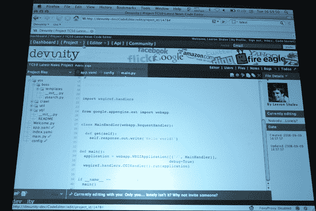

# TC50: Devunity 提供基于浏览器的协作编码| TechCrunch

> 原文：<https://web.archive.org/web/https://techcrunch.com/2008/09/10/tc50-devunity-offers-browser-based-collaborative-coding/>

[Devunity](https://web.archive.org/web/20230307040437/http://www.devunity.com/) 是一个协作编码平台，允许开发者在浏览器上同时查看和修改代码，而无需下载客户端。该服务内置了对许多流行 API 的支持，允许用户只需点击其中一个选项，就可以在代码中生成相关的框架。

在 Devunity 上开发了一个程序后，该平台将建议部署一些基于云的服务，如谷歌的应用引擎(尽管用户可以自由使用自己的服务器)。Devunity 将对开源项目免费，但计划对私人程序收费(该公司希望通过这种方式吸引开发者)。

用户可以使用内置的评论系统来注释他们的项目，该网站计划引入聊天室进行实时对话。没有必要立即跟踪版本，但是如果用户愿意，他们可以选择使用 SVN。

在其 [TechCrunch50](https://web.archive.org/web/20230307040437/http://www.techcrunch50.com/) 演示期间([看这里](https://web.archive.org/web/20230307040437/http://www.techcrunch50.com/2008/conference/presenter.php?presenter=55#video))，Devunity 使用其软件展示了生成 TC50 最新新闻聚合器是多么简单。

**专家小组成员**

乔什·科佩尔曼——你们是做什么的？

蒂姆·奥莱利——我不得不说我很难理解..我知道这是一个使用 API 的在线开发工具。你如何把它变成一个公司？

dev unity——这是一个协作编码环境，不需要下载任何使用云服务在线完成的东西。这不只是为了云，我们鼓励部署到云，但我们支持 ftp 服务器…

可以称之为“开发者的谷歌文档”

蒂姆·奥莱利——你想象过 37signals 商业模式吗？

dev unity–是的，如果他们想使用他们的 API 来提供，我们也将采用白标平台，例如移动公司可以使用这种定制的开发环境来编写部署到其服务中的应用程序。

蒂姆·奥莱利——回到 37 个信号..很明显，他们用 Ruby On Rails 赢得了这场公关战..得到他们的压力，你如何得到这种可见性，让开发商的大门？

devunity——你可以使用这项服务，它对开源社区是免费的。免费开源让他们着迷。

杰森·卡拉卡尼斯——你解决的首要问题是什么？做开发人员有什么不好？

dev unity–你不与其他 dev 联系..你可以问隔壁的家伙在做什么..他们没有围绕代码的任何协作

伊万·威廉姆斯——我有一些问题，但是很复杂。您说您不必处理版本控制，但这是有原因的..你有分枝吗？你只是写代码，生产到生产吗？

dev unity——我们使用 svn，有版本跟踪，你不必签入代码。

伊万·威廉姆斯——在部署到服务器之前，您有运行的开发环境吗

Devunity 我们上传到谷歌应用引擎，这是我们的开发服务器。我们正在考虑做谷歌齿轮..

om Malik–你会使用这样的东西吗？

伊万·威廉姆斯—我对此表示怀疑。很难改变。好处可能是对于更分散的团队