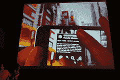

# TC50:用于 iPhone 上社交标签的 Sekai 摄像头 TechCrunch

> 原文：<https://web.archive.org/web/https://techcrunch.com/2008/09/09/tc50-sekai-camera-for-social-tagging-on-the-iphone/>

# TC50:用于 iPhone 社交标签的 Sekai 摄像头

【YouTube http://www.youtube.com/watch?v=KgTwSXK_5dg&hl=en&fs=1]

Sekai Camera (日语为 World Camera)是由东京移动应用提供商 Tonchidot 开发的 iPhone 专属社交标签服务。由于语言障碍，该公司的 [TechCrunch50](https://web.archive.org/web/20230101063900/http://www.techcrunch50.com/) 演示(以及随后的 Q & A)很难理解，但 Sekai Camera 还是很受欢迎。

关键的想法是将 iPhone 作为一个移动信息终端，将现实世界与 Sekai Camera 用户生成的标签、Tonchidot 本身以及从其他网络服务中搜集的信息联系起来。用户在镇上走来走去，看着 iPhone 的显示屏获取他们周围的信息。例如，如果你走过一个商场，Sekai 相机标签会告诉你在哪里可以找到吃的东西，关于之前标记的某个产品的附加信息，或者一块巧克力的卡路里含量。

该视频展示了 Sekai Camera 的其他功能示例。当被问及 Tonchidot 实际使用的是哪种技术时，营销总监 Peter Anshin 表示，该公司目前不想谈论细节。但它显然使用了 GPS 或手机信号塔三角测量，iPhone 的加速度计似乎在测量视野中的角度。Anshin 说没有使用图像识别技术。

Sekai Camera 肯定是粉丝的最爱，首席执行官 Takahito Iguchi 发表了一个有趣的演讲，反复恳求观众“向上看，不要向下看！”但他留下了许多问题:小组成员批评说，他们没有听到任何关于底层技术的信息，以及从战略角度来看，Tonchidot 打算如何为所有 iPhone 用户标记整个世界，这是该公司的最终目标。

[点击此处观看 Tonchidot 的演示。](https://web.archive.org/web/20230101063900/http://www.techcrunch50.com/2008/conference/presenter.php?presenter=71#video)

[在 VentureBeat](https://web.archive.org/web/20230101063900/http://venturebeat.com/2008/09/09/sekai-camera-tag-real-world-objects-with-this-iphone-tool-from-the-future/) 查看更多关于 Sekai 相机的信息。