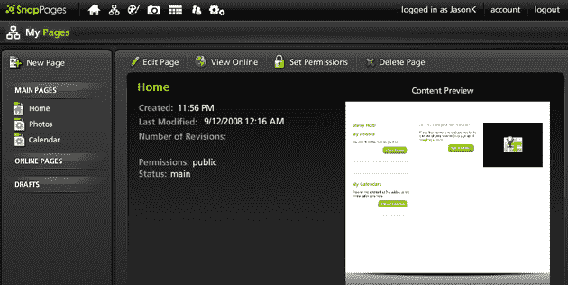
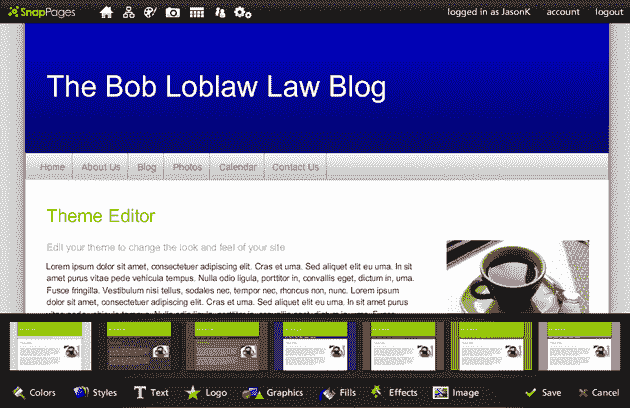

# TC50(DemoPit): SnapPages，一个苹果应该羡慕(或购买)的基本网页设计器 TechCrunch

> 原文：<https://web.archive.org/web/https://techcrunch.com/2008/09/12/tc50demopit-snappages-a-basic-webpage-designer-that-apple-should-envy-or-buy/>

# TC50(DemoPit): SnapPages，一个苹果应该羡慕(或购买)的基础网页设计器

在过去的十年里，我们看到许多互联网门户、软件公司和创业公司开发了解决同一个问题的解决方案:每个人都想要一个网页，但很少有人知道如何实际制作一个。早期，像 Angelfire 这样的网站提供模板，但用户得到的保证是一个通用的设计，即使以 1999 年的标准来看也是丑陋的。从那以后，我们取得了进步——现代所见即所得编辑器可以在几分钟内制作出高质量的网页，并且很容易找到负担得起的网页设计师。然而，不知何故，鉴于这些强大的资源，许多人仍然设法工艺眼中钉。

根据 [SnapPages](https://web.archive.org/web/20230209010405/http://www.snappages.com/) 创始人(也是唯一的雇员)史蒂夫·特斯通的说法，问题在于我们给了这些用户太多的选择。他说，设计师经常会创建非常合适的网页，但当他们的客户开始添加冲突的颜色和不规则间隔的图像时，他们就毁了这些网页。客户不可避免地开始抱怨他们的网站不知何故变得“丑陋”，但他们不知道自己哪里出了问题。

SnapPages 是一项设计华丽的服务，旨在通过从最终用户手中夺走一些选择权来解决这个问题。该网站提供了许多可定制的模板，允许用户指定颜色以及列、文本框和小部件的位置，但仅限于有限的程度。例如，用户只能选择三种颜色在整个模板中重复使用，这有助于保持一致性(他们仍然可以自由上传自己的徽标，并从少量图案中进行选择)。

这并不是说编辑器不能创建丰富的多媒体网页。相反，用户可以自由地将文本框、小工具(包括谷歌地图)和照片拖放到他们的网站中。SnapPages 还包括一个功能全面的集成日历和相册查看器。所有网页都是用符合标准的 CSS/HTML 构建的，并且是 SEO 友好的。

SnapPages 有很多优势。界面时尚而直观，像苹果设计的一样容易上手。它可能不像其他 WYSIWYG 编辑器那样可调整，但它可以快速产生专业的结果，这对大多数人来说都很重要。全功能的高级服务每年收费 50 美元(有 30 天的免费试用期)，还有一个免费的限量版。在这个拥挤的空间中的其他创业公司包括 [SynthaSite](https://web.archive.org/web/20230209010405/http://www.synthasite.com/) 、 [Wix](https://web.archive.org/web/20230209010405/http://www.wix.com/) 和 [Weebly](https://web.archive.org/web/20230209010405/http://www.weebly.com/) 。

欲了解更多关于 SnapPages 的信息，请查看 [CenterNetworks](https://web.archive.org/web/20230209010405/http://www.centernetworks.com/snappages-website-creation) 和[解决方案观察](https://web.archive.org/web/20230209010405/http://www.solutionwatch.com/590/intuitive-organization-and-sharing-with-snappages/)。

[http://blip.tv/play/AcvuQo+ZIA 电视台]

