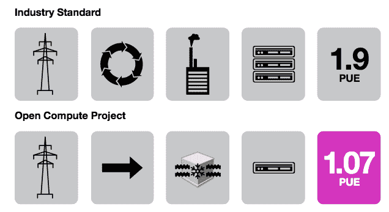
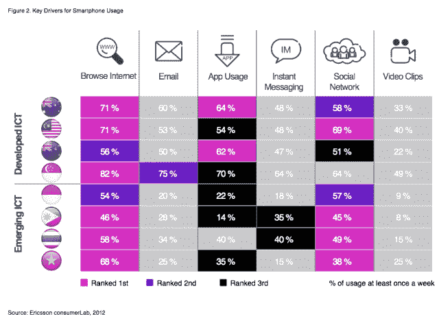

# Internet.org 和脸书详细介绍了他们希望能让地球上网的“1000 倍”技术

> 原文：<https://web.archive.org/web/https://techcrunch.com/2013/09/16/tech-to-connect-the-world/>

空中交通管制、HipHop、WebP 和补充下行链路是脸书及其 Internet.org 合作伙伴将部署的一些未来技术，以将互联网带给仍未联网的 50 亿人。Internet.org 合作伙伴脸书、高通和爱立信今天发布了一份 70 页的白皮书[，详细说明了频谱必须如何改变才能适应 1000 倍的网络流量，以及 Facebook Home 作为数据效率实验的作用。](https://web.archive.org/web/20230404054340/http://newsroom.fb.com/News/720/Focusing-on-Efficiency)

上个月，脸书、高通、爱立信、三星、联发科、诺基亚和 Opera [推出了 Internet.org](https://web.archive.org/web/20230404054340/https://techcrunch.com/2013/08/20/facebook-internet-org/)，这是一个旨在让地球上的每个人都能用得起互联网的合作项目。当时，它简要讨论了如何将网络、数据压缩和应用效率技术结合起来，让网络变得足够便宜，以连接整个世界。

今天，脸书和高通更进一步，发布了这份详细的白皮书，概述了他们已经在测试的特定可访问性技术，以及他们计划构建的技术。然后，爱立信向移动行业提供了一些提示，以了解其客户真正想要的是什么。

你可以读读[《注重效率》。PDF 在这里](https://web.archive.org/web/20230404054340/https://fbcdn-dragon-a.akamaihd.net/hphotos-ak-prn1/851575_520797877991079_393255490_n.pdf)，或者查看我们下面的嵌入。

### 脸书对效率的痴迷

早在 Internet.org 发布之前，脸书就开始认真对待无障碍倡议。

随着该公司从最初推出的 85 美元服务器发展壮大，它一直在寻找提高服务效率的方法。几年前，它推出了 HipHop translator for PHP，这样员工可以用简单的语言编写代码，但他们的工作可以转换成更高效的 C++语言。这让每台服务器多运行了 50%流量，但这还不够。它构建并开源了 HipHop 虚拟机执行引擎，并实现了服务器吞吐量 500%的增长。

与此同时，它启动了开放计算项目，以帮助每个人建立更环保的服务器和数据中心，重点是冷却、电力转换和“无虚荣心”的 DIY 服务器设计。开放式计算技术使脸书的瑞典 Lule 数据中心成为世界上最高效的数据中心之一。脸书现在拥有 2500 亿张照片(这是 1/4 万亿——一个新的统计数据)，超过 250 Pb 的数据，每天不间断地接收超过 0.5 Pb 的新数据。

但是，白皮书最有新闻价值和最吸引人的是深入了解脸书目前如何试验未来的数据效率。

为了更方便地测试全球各种连接类型的数据效率和稳定性，脸书创建了空中交通管制。这个系统旨在“帮助工程师在脸书的办公室里模拟不同的网络条件。可以控制的方面包括带宽、延迟、数据包丢失、损坏的数据包和数据包排序。”

脸书解释说，空中交通管制让它通过 wi-fi 测试不同的移动无线电技术，如@G、EDGE、3G 和 4G；模拟在印度等国家的网络条件下使用脸书的应用程序是什么样的，看看不同的网络容量和拥塞在高峰使用时会如何影响用户体验和数据连接。

脸书也在部分过渡到谷歌的 WebP 高效数字图像格式。照片是脸书数据使用的头号来源，削减这一来源可以让它更有利可图，同时允许它为数据预算有限的人提供一些照片。脸书说:“目前，我们的大部分图像都被转换成了 Android 应用程序的 WebP，我们的目标是将 WebP 也推广到其他平台。当图像转换为 WebP 时，这将节省超过 20%的总网络流量，而不会损失质量。”

虽然我们计划在 2015 年看到更多的智能手机而不是功能手机，但淘汰每个人的更笨的设备仍需要很长时间。因此，脸书一直在为每部手机开发脸书，这是一个精简的应用程序，运行在目前 50 亿希望连接到网络的人中的许多人手中的设备上。

由于功能手机的处理能力非常有限，脸书一直致力于在服务器端处理尽可能多的计算。它还为每部手机建立了脸书，以最大限度地减少来自服务器的传输，并尽可能多地重复使用缓存内容。

#### Facebook 主页，伪装的无障碍实验室

脸书还一直在使用它 4 月份在安卓系统上推出的家用“感知系统”，作为互联网相关技术的试验品。虽然 Home 未能获得太多的关注，首席执行官马克·扎克伯格表示他对此感到失望，但至少它帮助了脸书研究和开发无障碍技术。

例如，由于 Home 试图总是在锁屏封面中等待新的照片内容，脸书努力避免为用户悄悄增加巨额数据账单。

因此，Home 会检测用户是否在使用 wifi 或移动连接，并决定是否下载分辨率更高或更低的照片。当它发现设备连接到 wifi 时，“脸书开始积极预取和缓存图像。这意味着当数据不再丰富时，设备会建立一个可以依赖的照片清单。”脸书还会根据用户的连接来调整获取文本数据的频率。

这些改进已经在家庭中发挥作用，脸书说它们“有望很快被带到脸书的其他应用中”有一天，这些技术可以让发展中国家的人们通过 wifi 免费获取大量数据，从而获得更丰富的体验。

Facebook Home 使用智能缓存来避免冗余的图像下载，并支持将缓存导出到可移动 SD 卡，以释放设备内部内存的空间。这可能是无障碍倡议的一个胜利，因为发展中国家的许多手机几乎没有内存。

Home 还对总数据使用量设置了虚拟上限，这样，如果用户没有意识到他们正在做一些数据密集型的事情，他们就不会突然花费大量的金钱。类似的上限可以确保发展中国家的用户仍有数据用于通信等最关键的服务，而不会浪费在下载照片上。

电池寿命也可能是一个可及性问题，因为世界上有些地方没有方便、廉价、可靠的电力来充电。由于 wifi 比移动连接耗电更少，它可以帮助世界各地的人们保持手机不死机。

目前，避免后台权力过度使用是推出脸书主页的一大优先事项。它试图尽可能从 wifi 获取新闻报道，并通过批量数据下拉来最小化“无线电唤醒”。脸书解释说，唤醒设备的网络连接无线电可能会消耗设备总电池的 0.02%至 0.1%，即使是在运行冰淇淋三明治或更新操作系统的设备上。这就是为什么当它与 HTC 合作开发 HTC 首款预装 home 的“脸书手机”时，它实施了更短的网络超时，以便收音机更快地进入省电待机模式。

在其他硬件创新中，脸书与 GPU 供应商合作“调整工作负载，以便功耗使应用处理器保持最佳功耗模式，同时不影响设备体验。”例如，与 GPU 合成聊天标题以便聊天功能可以覆盖在其他应用程序上不同，后端硬件可以更有效地进行合成

脸书也有一个电力测量测试实验室，对不同情况下的电力消耗进行实验。这使它能够捕捉并排除可能导致设备无法正常睡眠的回归。

通过努力让家庭获得更多数据和电池效率，Internet.org 正在为脸书创造一个移动生态系统奠定基础，在这个生态系统中，每个人都拥有一个拥有廉价数据和充足电量的设备，无论他们住在哪里，也无论他们有多少钱。

### 高通要求重新分配频谱

在白皮书的后面，高通概述了它所谓的“1000 倍挑战”。如果数据使用量每年翻一番，十年后我们将需要比现在多 1000 倍的流量。高通正在挑战自己，建设实现这一能力所必需的技术。

据称它正在进行的一些创新包括:

*   载波聚合和补充下行链路将不同的频段结合在一起，为消费者提供更大的容量和更快的数据速度
*   LTE-在许多人希望看到相同内容的地方进行视频和数据的多播广播
*   LTE-Direct 允许急救人员和其他人进行设备到设备的通信，即使蜂窝网络出现故障
*   802.11ac 和 ad 用于更快的 Wi-Fi 和其他未经许可的应用
*   DSRC，它使汽车能够相互通信以避免碰撞；以及为飞机乘客提供宽带的下一代系统

另一项关键技术将是获得许可的“小蜂窝”或低功率无线电接入节点，其范围约为 10 米。这些可以集成到无线网络中，并放置在室内，以创建一个“hetnet”，或不同大小的蜂窝异构网络。

但是，要在 1000 倍挑战中取得成功，最重要的基石将是无线频谱的重新分配。该行业将需要更多的频谱来适应这个世界。高通建议清理和拍卖新频段，供行业使用。其中一个频段可以专门用于分配给美国政府的 3.5GHz 频段。它可以支持小型细胞，但仍有一部分保留给政府在需要时使用。

爱立信在白皮书的结尾引用了一项关于人们对无线连接的期望的大型调查。它支持一致的互联网连接，快速的速度，以及很少的崩溃，这种服务用户不需要了解任何关于云的知识。

虽然脸书和高通描述的技术可能需要几年时间才能渗透到地球上不相连的角落，但重要的是，他们现在已经开始了发展进程。如果他们没有用户注册，没有人能负担得起数据连接，他们的业务就会停滞不前。但是，尽管 Internet.org 使命承认它正试图创建更多盈利的移动公司，但这并不是该项目的定义。

Internet.org 的动力来自于互联互通是一项人权的信念。随着互联网带来的知识而来的是授权、同情和财务稳定。Internet.org 的合作伙伴尚未详细说明这些因素将如何提振世界经济，而不仅仅是他们自己的底线。但这个想法是，互联网接入带来了生产力，增加了每个人的产出。

如果科技巨头现在能够关注每个人的可访问性，有一天我们可能会实现一个繁荣、互联的全球社会，这是前几代人无法想象的。