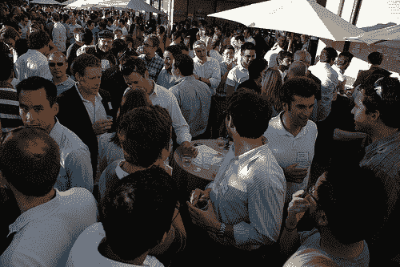
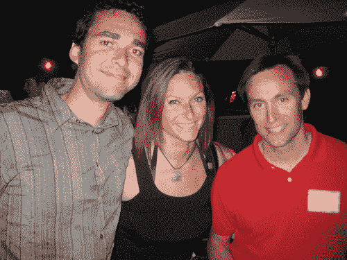
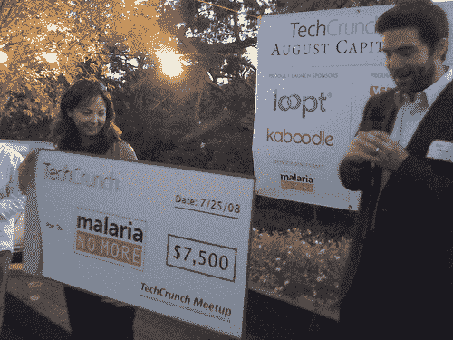
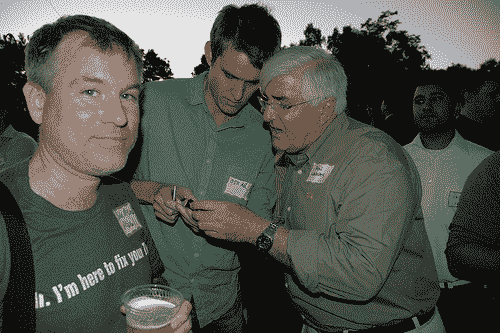
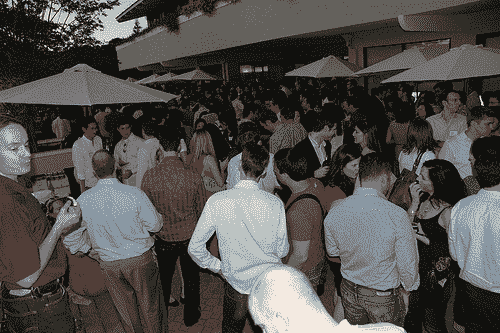
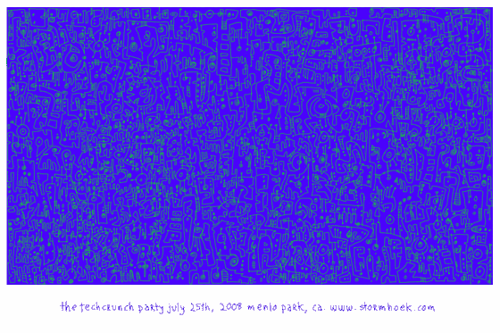

# TechCrunch 8 月资本活动总结

> 原文：<https://web.archive.org/web/https://techcrunch.com/2008/07/26/techcrunch-august-capital-event-wrapup/>

感谢近 1，100 名观众来到 Quadras 会议中心参加我们的[移动网络大战](https://web.archive.org/web/20221209125129/http://www.beta.techcrunch.com/2008/07/25/mobile-web-wars-live-stream/)活动以及随后在八月之都举办的[派对。我们向](https://web.archive.org/web/20221209125129/http://www.beta.techcrunch.com/2008/07/25/details-for-tonightss-3rd-annual-techcrunch-meet-up-at-august-capital/)[不再有疟疾](https://web.archive.org/web/20221209125129/http://www.malarianomore.org/)捐赠了 7500 美元，这将在五年内保护至少 750 名儿童免受疟疾之苦。

这是我们在 [August Capital](https://web.archive.org/web/20221209125129/http://www.augustcap.com/) 举办的第三次年度派对，他们继续在他们的办公室与我们共同举办这项活动，其中包括一个巨大的室外平台。这是我们在同一地点对 2007 年[和 2006 年](https://web.archive.org/web/20221209125129/http://www.beta.techcrunch.com/2007/07/28/techcrunch-9-at-august-capital-thank-you-for-coming/)[和](https://web.archive.org/web/20221209125129/http://www.beta.techcrunch.com/2006/08/19/thank-you-for-coming-to-techcrunch-7/)聚会的总结。特别要感谢大卫·霍尼克，他继续说服他的合伙人，让一千多名喝得醉醺醺的企业家、风险投资家和记者在他们的走廊里闲逛是个好主意。

如果你不能参加这次活动，你可以在这里看到官方照片流[和更多的](https://web.archive.org/web/20221209125129/http://www.kaboodle.com/groups/techcrunch-runway-2008)[在这里](https://web.archive.org/web/20221209125129/http://flickr.com/photos/tags/tcaugust2008/)和[在这里](https://web.archive.org/web/20221209125129/http://startupnewz.com/a/silicon_valley/)——一些也包括在下面。

正如我在活动舞台上的短暂时刻所说，真实世界的活动是硅谷社区非常重要的一部分。我们通过互联网和电话与如此多的人见面和互动，却从来没有机会见到他们本人。有机会花几分钟时间边喝啤酒边面对面交谈会让这些关系变得真实。小型、私密的活动总是最好的，但有时让一大堆极客聚在一起也很有趣，看看[会发生什么](https://web.archive.org/web/20221209125129/http://flickr.com/photos/michaelarrington/2703667446/) [会发生什么](https://web.archive.org/web/20221209125129/http://farm4.static.flickr.com/3250/2703468212_61ff1f29c5_o.jpg)。

真正让这个派对与众不同的一点是:[休·麦克劳德](https://web.archive.org/web/20221209125129/http://www.gapingvoid.com/)为三个活动中的每一个都制作了一幅石版画插图，并亲自为每个参与者签名和编号。今年的石版画在下面。非常感谢你做的这些，休。我们把每一幅画都裱起来，骄傲地挂在我们的办公室里。

活动期间还有 20 场产品演示。Webware 的 Rafe Needleman 将 Plista 评为最有趣的，我们很快会看到更多关于他们的文章。

如果你已经写下了你在活动中的经历，请在下面的评论中留下链接，我们将在这里添加:[移动平台拔河](https://web.archive.org/web/20221209125129/http://news.cnet.com/8301-13953_3-9999991-80.html)、 [TechCrunch 移动网络战争圆桌会议](https://web.archive.org/web/20221209125129/http://www.kyte.com/blog/a_mobile_week_for_kyte_mobilebeat_2008_and_techcrunch_mobile_web_wars_round)、[TechCrunch 2008 年 8 月:定义文化](https://web.archive.org/web/20221209125129/http://entrecard.com/blog/?p=480)、 [Techcrunch 派对:为了胜利](https://web.archive.org/web/20221209125129/http://12seconds.tv/channel/drs650/5598)、[在 TechCrunch 派对上](https://web.archive.org/web/20221209125129/http://chris.typepad.com/blog/2008/07/at-the-techcrunch-party.html)、 [TechCrunch 第三次夏季聚会](https://web.archive.org/web/20221209125129/http://mike-mcgrath.wordpress.com/2008/07/25/techcrunch-3rd-summer-meetup/)、[我的新白色 iPhone 是](https://web.archive.org/web/20221209125129/http://meghan.nonsociety.com/post/43598689/my-new-white-iphone-is-now-property-of-techcrunch)、 [NYC 崩溃 Techcrunch Party](https://web.archive.org/web/20221209125129/http://www.nycfounder.com/2008/07/nyc-crashes-techcrunch-party.html) 、 [TechCrunch 八月资本 3](https://web.archive.org/web/20221209125129/http://bub.blicio.us/?p=1114) 、 [TechCrunched for Time](https://web.archive.org/web/20221209125129/http://sfbaystyle.typepad.com/blog/2008/07/techcrunched-fo.html) 和 [TechCrunch 八月资本 2008](https://web.archive.org/web/20221209125129/http://blog.thingfo.com/index.php/2008/07/27/techcrunch-august-capital-2008-%e2%80%94-serious-fun/)——严肃有趣(还有更多精彩)。

感谢我们的赞助商，他们支付所有的食物和饮料以及其他费用。没有你我们做不到:

[Affinity Circles](https://web.archive.org/web/20221209125129/http://www.affinitycircles.com/) 是一家领先的独家社交网络提供商，致力于为寻求促进其成员职业发展机会的专业组织提供服务。

Blurb 是一个公司和社区，他们热情地相信书籍的力量:制作、阅读、分享和销售书籍。

[炮弹葡萄酒公司](https://web.archive.org/web/20221209125129/http://www.drinkcannonball.com/)是我们最喜欢的葡萄酒供应商之一，以优惠的价格生产优质葡萄酒。

[Center d](https://web.archive.org/web/20221209125129/http://www.centerd.com/)帮助人们计划任何简单或复杂的事件或活动，并根据信任的朋友的意见发现新的去处和要做的事情。

[Engine Yard](https://web.archive.org/web/20221209125129/http://engineyard.com/) 专注于 Ruby on Rails 应用部署和运营支持，因此您可以专注于开发您的应用和业务。客户在开发过程中就开始了，并且毫无压力地成长到数百万用户。

[Etchstar.com](https://web.archive.org/web/20221209125129/http://www.etchstar.com/)提供交钥匙按需定制产品解决方案，与领先的原始设备制造商和零售商合作，通过雕刻和直接成衣印刷为在线购物者提供具有定制艺术和文字的优质产品。Etchstar 的大规模但严格管理的授权艺术图书馆包括平克·弗洛伊德，吴唐帮，教父，家庭盖伊，中央情报局，海绵宝宝，加州大学洛杉矶分校，只有最好的用户上传艺术和标志。

[EventBrite](https://web.archive.org/web/20221209125129/http://www.eventbrite.com/) 是全球最大的在线活动管理和自助售票网站。EventBrite 以其易用性和成本效益而闻名，已帮助数以万计的公司、组织和非营利组织利用互联网来推广和销售他们的活动。

[未来作品](https://web.archive.org/web/20221209125129/http://www.future-works.com/)和未来作品工作室作为八月首都媒体官方赞助商加入我们。谢谢各位。

[Helpstream](https://web.archive.org/web/20221209125129/http://www.helpstream.biz/) 是一个全新的客户服务应用程序，使用创新的 SaaS 技术构建，为致力于卓越客户支持的组织提供引人入胜的服务驱动社区。

Gapingvoid.com 背后的人休·麦克劳德因他谦虚地称之为“画在名片背面的漫画”而闻名。当休不做他的简洁漫画时，他与一些财富 100 强企业密切合作，寻找新的方法来更好地讲述他们的故事。

[IDrive.com](https://web.archive.org/web/20221209125129/http://www.idrive.com/)是由 Pro Softnet Corp .提供的面向消费者和小型企业的在线备份服务。IBackup.com 是另一个变体，它特别强调具有 Exchange、SQL Server 和灾难恢复功能的中小型企业市场。这两项服务的用户超过 250，000 人，我们是在线备份领域的领先企业。

Jaduka 使公司能够利用通信来创造更有效的运营。利用 Jaduka 的 Web 服务 API，应用程序可以触发个人或群组调用；提供自动警报；管理调查；激活数字内容；并管理各种解决方案的帐户和交易信息。

[Kaboodle](https://web.archive.org/web/20221209125129/http://www.kaboodle.com/) 是人们发现、推荐和分享产品的头号社交购物网站。Kaboodle 的核心是一个有趣且吸引人的社区，由热爱购物的人们组成，每月有超过 800 万的独立访客。

[Kontagent](https://web.archive.org/web/20221209125129/http://www.kontagent.com/) 是一款与脸书等平台紧密集成的应用，为小工具和应用开发者提供高水平的分析数据。开发人员可以使用该工具来跟踪应用程序的使用和采用率，以及更多基本分析程序无法提供的许多其他细节。

Kosmix 搜索网络，自动生成从勒柯布西耶到火人节的任何主题的主页，并将消费者与改变他们生活的信息联系起来。在 www.kosmix.com 少花点时间搜索，多花点时间探索、发现和学习。

Limbo 是美国最大的移动社区，拥有超过 250 万会员。我们所有的服务对我们的会员都是免费的。Limbo 扩大了你的社交生活——让你快速方便地接触更多的活动、人和地方。Limbo 总部位于加州伯林盖姆，由 Azure Capital、DFJ 和 NEA 提供支持。

总部位于硅谷的 Loopt 利用定位技术来改善人们在现实世界中联系、分享和探索的方式。Loopt 的可互操作和可访问的社交地图服务可用于多个运营商网络，并在 80 多种移动设备上得到支持。

[消灭疟疾](https://web.archive.org/web/20221209125129/http://www.malarianomore.org/)的使命很简单:终结疟疾造成的死亡。一个多世纪以来，世界已经知道如何战胜这种疾病，但它仍然是非洲五岁以下儿童的头号杀手，每年夺走 100 多万人的生命。

[Media Temple](https://web.archive.org/web/20221209125129/http://mediatemple.net/) 是加利福尼亚州一家行业领先的 500 强私营盈利网站托管和软件应用服务提供商。自 1998 年以来，(mt)一直为全球企业提供专业级网络环境，用于 web、电子邮件、应用程序和富媒体内容。

Mixx 是一个品牌社交媒体网站和活跃的在线社区，致力于通过社区和标签连接用户和出版商。Mixx 于 2007 年 10 月推出，拥有超过 200 万用户，是 CNN、洛杉矶时报、USATODAY、纽约时报和数千博客等主要出版商的首选社交媒体平台。

[Mobissimo](https://web.archive.org/web/20221209125129/http://www.mobissimo.com/search_airfare.php) 同时搜索五大洲 30 个国家的 200 多个不同的旅游网站，包括主要的全球航空公司、低成本航空公司、运输公司和酒店/汽车租赁网站，在线查找最优惠的票价和价格。

[Mo'Jiva](https://web.archive.org/web/20221209125129/http://www.mojiva.com/) 灵活的移动网络广告平台允许代理商、出版商、广告商和销售代表通过提供全面管理移动营销战略的扩展来利用和增加现有关系和内容合作伙伴关系的价值。

Pandora 是一项个性化的广播服务，可以随时随地在个人电脑、家中和移动设备上使用，包括苹果 iPhone。只需输入一首喜爱的歌曲或艺术家，听众就可以立即进入个性化的聆听体验，Pandora 探索音乐世界中他们最喜爱的部分时充满了发现。

[Plista](https://web.archive.org/web/20221209125129/http://www.plista.com/) 是基于协同过滤的以用户为中心的实时个性化推荐网络。它允许通过推荐更相关的内容、产品和广告来增强最终用户体验。它可以通过各种渠道处理任何项目:作为一个小部件、每个 API 或浏览器插件。

[ScanDigital](https://web.archive.org/web/20221209125129/http://www.scandigital.com/) 将旧照片转换成数字格式。顾客们寄来他们松散的快照或相册，公司对它们进行扫描和色彩校正。这些照片在该公司的照片分享网站上有一个永久的在线主页，顾客可以上传更多的照片。

SezWho 提供了一个通用的分布式配置文件，允许网站访问者基于人来发现优质内容。此外，SezWho 还提供了对内容进行评级的功能，我们可以从中获得特定于上下文的作者声誉。

Snap 是一个分布式媒体网络，每月以 48 种语言覆盖 10%的美国观众和 3500 万不同的全球用户(2008 年 6 月)。Snap 的产品名为 Snap Shots，在超过 200 万个网站和博客上使用，通过揭示用户想要的内容并在他们所在的地方提供给他们，而不是强迫他们点击链接或进行搜索，来改善用户体验。

Socialmedia.com 是 T2 最大的独立社交广告网络。来自脸书、MySpace、Bebo 和 Hi5 的 5000 多个应用程序参与了 socialmedia.com 的网络，吸引了全球每月超过 3000 万独立用户的受众。

[Stormhoek](https://web.archive.org/web/20221209125129/http://www.stormhoek.com/) 是一家南非小酒厂，通过使用社交软件建立了全球知名度。位于南非斯泰伦博斯的 Stormhoek 认为葡萄酒是关于爱、激情、自发性、梦想、庆祝和改变世界的。

Tapulous 正在为 iPhone 开发一系列有趣的社交应用。该公司的第一个版本 Tap Tap Revenge 目前是 App Store 上下载量排名第一的软件

TokBox 是一项首创的视频通信服务，它让任何人都可以毫不费力地拨打视频电话、发送视频邮件或将视频通信嵌入任何网站——而且是免费的！TokBox 位于加利福尼亚州旧金山，是一家私人控股公司。

[Topix](https://web.archive.org/web/20221209125129/http://www.topix.com/) 是领先的网络新闻社区，将美国每个城镇的人们与对他们重要的信息和讨论联系起来。Topix 还帮助媒体公司通过联合论坛、超本地平台、RSS 提要等方式吸引在线受众。

[vSNAX Videos](https://web.archive.org/web/20221209125129/http://www.vsnax.com/) 是一款免费应用，可向 iPhone 和 iPod touch 用户提供超过 35 家优质媒体合作伙伴的移动视频剪辑，包括 AccuWeather.com、CBS、福特 Models、Ripe TV 和 MTV Networks 的 VH1、斯派克和游戏预告片。

Zivity 为 18 岁以上的观众提供基于订阅的现实娱乐和社交网络。Zivity 最初的重点是一个由社区推动的专业品质摄影展示，促进女性的美丽和表达。