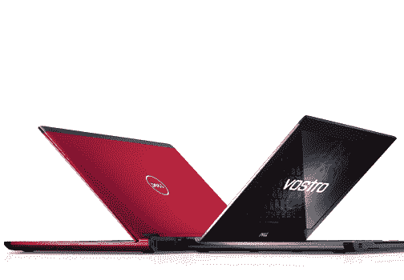

# TechCrunch 赠品:一台 Dell Vostro V130 笔记本电脑# TechCrunch 

> 原文：<https://web.archive.org/web/http://techcrunch.com/2011/02/04/techcrunch-giveaway-a-dell-vostro-v130-laptop-techcrunch/>

# TechCrunch 赠品:一台 Dell Vostro V130 笔记本电脑#

你可能听说过上周 TechCrunch 上的一则广告。你自己可能也注意到了这一点，你*可能*对此有点恼火。插播广告是一款戴尔 Vostro V130 笔记本电脑的广告。这些笔记本电脑通常价格约为 429 美元，具有获奖的设计，重量非常轻，只有 3.5 磅。我们想说，我们很抱歉戴尔[喊出了他们的广告](https://web.archive.org/web/20230203041212/https://techcrunch.com/2011/01/25/real-blogs-dont-have-interstitial-ads/)，所以今天我们将赠送其中一台笔记本电脑给一位幸运的读者！

如果你想要这台 [Dell Vostro V130 笔记本电脑](https://web.archive.org/web/20230203041212/http://www.dell.com/us/business/p/vostro-v130/pd)，只需按照以下步骤进入。

1) **成为我们 TechCrunch 脸书页面的粉丝:**

2) **然后执行以下操作之一:**

–转发这篇文章(确保包含#TechCrunch 标签)
–或者在下面给我们留言，解释为什么这台笔记本电脑应该是你的

比赛现在开始，明天结束，太平洋时间 2 月 4 日下午 7:30。

请只发一次信息，否则你将被取消资格。我们将随机选择，并在本周末联系获胜者，了解更多细节。世界上任何人都有资格，只要你能收到递送的包裹。祝你好运！

更新:赠品现在结束了。一旦我们有了获胜者，我们将更新这个帖子。

更新:恭喜布伦特科尔比！