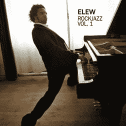

# TechCrunch 赠品:2010 年嘎吱嘎吱的门票#嘎吱嘎吱

> 原文：<https://web.archive.org/web/http://techcrunch.com/2011/01/14/techcrunch-giveaway-crunchie/>

# TechCrunch 赠品:2010 年脆饼干#脆饼干的门票

2010 年嘎吱嘎吱嘎吱嘎吱嘎吱嘎吱嘎吱嘎吱嘎吱嘎吱嘎吱嘎吱嘎吱嘎吱嘎吱嘎吱嘎吱嘎吱嘎吱嘎吱嘎吱嘎吱嘎吱嘎吱嘎吱嘎吱嘎吱嘎吱嘎吱嘎吱嘎吱嘎吱嘎吱嘎吱嘎吱嘎吱嘎吱嘎吱嘎吱嘎吱嘎吱嘎吱嘎吱嘎吱嘎吱嘎吱嘎吱嘎吱嘎吱嘎吱嘎吱嘎吱嘎吱嘎吱嘎吱嘎吱嘎吱嘎吱嘎吱嘎吱嘎吱嘎吱嘎吱嘎吱嘎吱嘎吱嘎吱嘎吱嘎吱嘎吱嘎吱嘎吱嘎吱嘎吱嘎吱嘎吱嘎吱嘎吱嘎吱嘎吱嘎吱嘎吱但是我们会多送两对票。昨天，我们还[宣布](https://web.archive.org/web/20230202232925/https://techcrunch.com/2011/01/12/more-crunchies-tix-get-em-while-theyre-hot-plus-a-special-musical-guest/)一位非常特别的音乐嘉宾将加入我们。他在 DisruptNY 震惊了我们，现在，由于 [MailChimp](https://web.archive.org/web/20230202232925/http://www.mailchimp.com/) , [ELEW](https://web.archive.org/web/20230202232925/http://elewrockjazz.com/) 将在今年的 Crunchies 上表演！他的摇滚爵士乐演绎了酷玩乐队、杀手乐队和涅槃乐队等艺术家的热门歌曲，将在整个颁奖典礼以及会后派对上为我们演唱。

颁奖典礼将于 2011 年 1 月 21 日晚上 7:30 在旧金山的[艺术宫剧院](https://web.archive.org/web/20230202232925/http://www.palaceoffinearts.org/)举行，随后的派对将紧接着在[探索博物馆](https://web.archive.org/web/20230202232925/http://www.exploratorium.edu/)举行，直到晚上 11:30。我们将有音乐、食物、饮料、游戏和许多其他有趣的惊喜！

我们将在明天 1 月 15 日下午 5:30(太平洋标准时间)选出两名获奖者。

如果你想加入 TechCrunch、 [GigaOm](https://web.archive.org/web/20230202232925/http://gigaom.com/) 和 [VentureBeat](https://web.archive.org/web/20230202232925/http://venturebeat.com/) 角逐 2010 年的 Crunchies 大奖，你只需要做以下事情。**扇动一下 [TechCrunch 脸书页面](https://web.archive.org/web/20230202232925/http://www.facebook.com/techcrunch)，然后做以下两件事之一:**

–转发这篇文章(确保包含#Crunchies 标签)
–或者在下面留言告诉我们为什么你认为这些票应该是你的。

请只发一次信息，否则你将被取消资格。我们会仔细查看评论和推文，确保你已经成为我们脸书页面的粉丝，如果你被选中，我们会在本周末联系你并提供详细信息。世界上任何人都可以参加，但请注意，这只是门票的赠品，不包括机票。

你真的不想错过这个激动人心的机会来参加今年的嘎吱嘎吱奖。祝大家好运！

更新:已经选出了两个获胜者。一旦我们确认，我们将与获奖者更新。