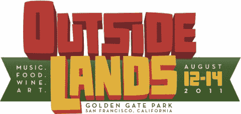

# TechCrunch 赠品:Outside Lands Festival 和夏季派对的门票#SongkickApp

> 原文：<https://web.archive.org/web/http://techcrunch.com/2011/07/08/techcrunch-giveaway-tickets-to-outside-lands-festival-and-summer-party-songkickapp/>

# TechCrunch 赠品:户外土地节和夏季派对#SongkickApp 的门票

三藩市海外音乐节是一年中最大的音乐、美食、葡萄酒和艺术活动之一。像费西合唱团、缪斯、拱廊之火、MGMT、辛斯等音乐家将在三天内表演。你可以在这里看看[的音乐人阵容。该节日将于 8 月 12 日至 14 日在金门公园举行。感谢](https://web.archive.org/web/20230203043348/http://www.sfoutsidelands.com/lineup/) [Songkick](https://web.archive.org/web/20230203043348/http://www.songkick.com/) ，我们有两张票可以送人。将有两名获胜者，他们都将赢得一张旧金山户外音乐节的门票，以及一张 7 月 29 日在八月之都举行的第六届年度夏季派对的门票。如果你想有机会赢得这些票，你所要做的就是遵循下面的步骤。

1) **成为我们 [TechCrunch 脸书页面](https://web.archive.org/web/20230203043348/http://www.facebook.com/techcrunch) :** 的粉丝

**2)从 App store** 下载 [Songkick 移动应用](https://web.archive.org/web/20230203043348/http://itunes.apple.com/us/app/songkick-concerts/id438690886?mt=8)(使用您的 iPhone、iPad 或 iPod)

3) **然后执行以下操作:**

*   转发这篇文章(确保包含#SongkickApp 标签)
*   告诉我们你最喜欢的夏天记忆之一

比赛从现在开始**到 7 月 10 日下午 7:30 结束。**

请只发一次信息，否则你将被取消资格。我们将随机选择，并联系更多细节的赢家。世界上任何人都有资格。请注意，这不包括机票或酒店。

祝你好运！

更新:祝贺泰勒伯顿和特拉维斯韦伯！