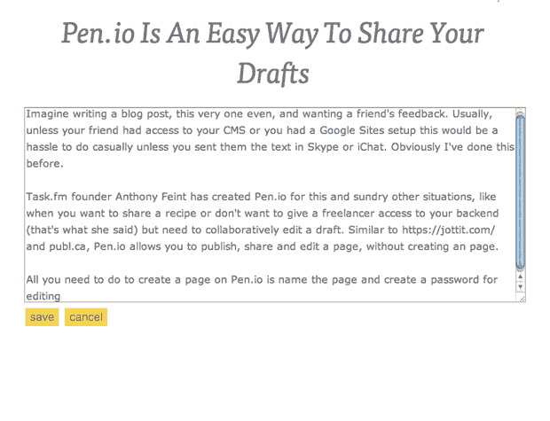

# Pen.io 是分享草稿的简单方式 TechCrunch

> 原文：<https://web.archive.org/web/http://techcrunch.com/2011/02/10/techcrunch-pen-io/>

# Pen.io 是一种分享草稿的简单方式

想象一下，写一篇博文，甚至是这篇，并希望得到朋友的反馈。通常情况下，除非你的朋友可以访问你的 CMS 或者你有谷歌网站设置，否则这样做很麻烦——除非你用 Skype 或 iChat 给他们发短信。显然我以前做过这个。

Task.fm 创始人 Anthony Feint 为这种情况和其他各种情况创造了 [Pen.io](https://web.archive.org/web/20230203000951/http://www.pen.io/) (是的，这是一个有趣的名字选择)，比如当你想分享一个食谱或不想让自由职业者访问你的 CMS 后端(她是这么说的)但需要合作编辑草稿时。与[Wix.com](https://web.archive.org/web/20230203000951/https://wix.com/)、 [Jottit](https://web.archive.org/web/20230203000951/https://jottit.com/) 和[publil . ca](https://web.archive.org/web/20230203000951/http://publ.ca/)类似，Pen.io 可以让你发布、分享和编辑页面，无需创建账户。

在 Pen.io 上创建页面所需要做的就是为页面选择一个名称，并包含一个用于编辑的密码。然后你会看到一个网址，你可以把这个网址和密码一起给你的朋友，进行协作编辑。更高级的可以使用“video”标签包含一个视频，并使用“page”标签添加另一个页面。

佯攻说:

*“与 Pen.io 的一大区别是，关注点完全在内容上。对于这个应用程序，我专注于速度和简单性。没有用户帐户，没有复杂的编辑器，最终结果是一个美丽的，基于标准的页面。”*

费恩特说，他未来的计划包括建立拖放任何。医生。pdf 或。txt 文件放到主页上，以便创建一个文档和一个 API，总体目标是使在线发布尽可能简单。