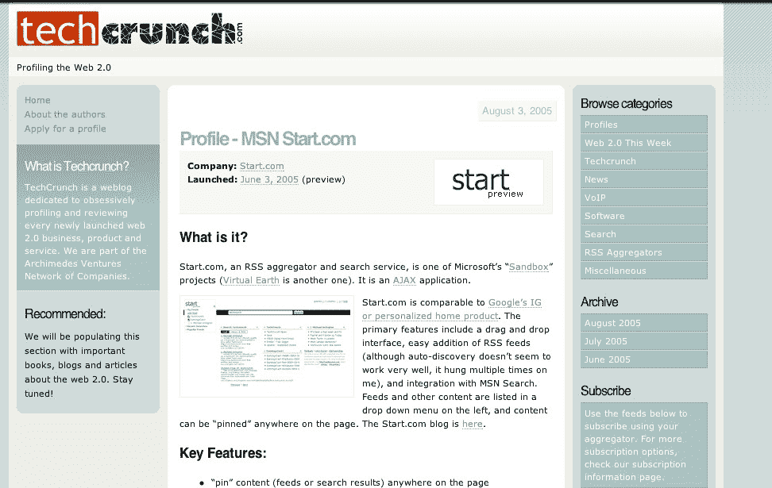
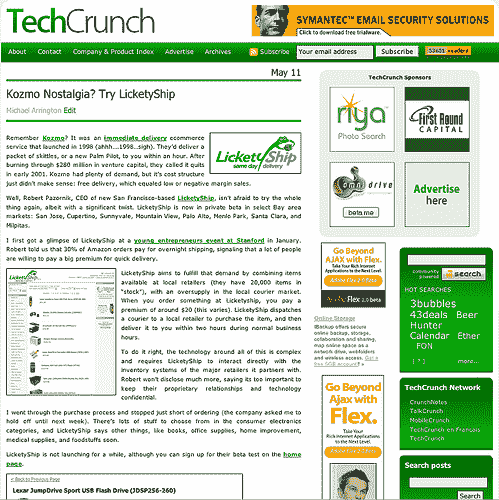
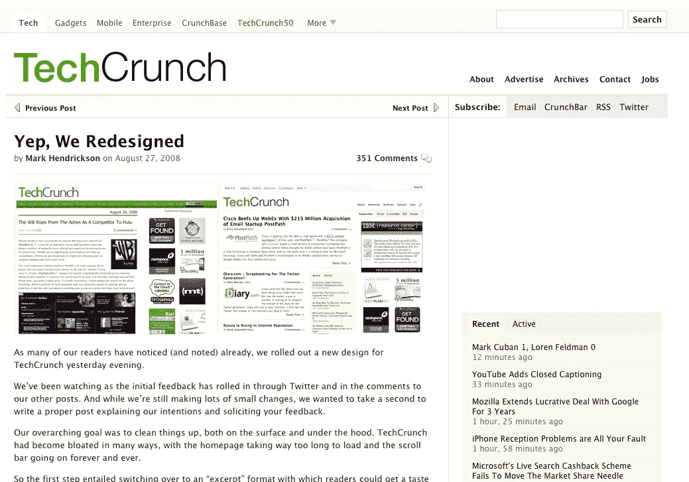

# 重新设计:早期评论

> 原文：<https://web.archive.org/web/http://techcrunch.com/2011/07/13/techcrunch-redesign-the-early-reviews/>

# TechCrunch 重新设计:早期评论

自从我们[推出](https://web.archive.org/web/20230205025328/https://techcrunch.com/2011/07/11/redesigning-techcrunch-we-picked-this-logo-just-to-piss-you-off/)新的 TechCrunch 改版以来，我们已经收到了很多读者的反馈。我们甚至提供了一个方便的[复制粘贴模板](https://web.archive.org/web/20230205025328/https://techcrunch.com/2011/07/11/the-techcrunch-redesign-a-copy-and-paste-hatemail-template/)供你评论。有些人喜欢它，有些人真的讨厌它。这个标志已经变成了一款[俄罗斯方块游戏](https://web.archive.org/web/20230205025328/https://techcrunch.com/2011/07/12/tc-logo-tetris/)。就连[希特勒也加入了](https://web.archive.org/web/20230205025328/https://techcrunch.com/2011/07/13/hitler-also-hates-our-redesign/)。

TechCrunch 团队正忙于跟进评论和批评。虽然我们得到了很多积极的反馈，但下面是我们收到的一些典型的负面评论:

*   上帝啊，新的 techcrunch 看起来糟透了！哇，我真不敢相信他们会以这种方式发布它。呃。！

*   我真的很讨厌重新设计，这让我远离了 Techcrunch。这是我最喜欢的网站之一，我试着用它工作，但是自从改变后，在这里花的时间真的少了。

*   一个字退订

*   绝对可怕。真正的内容现在已经很模糊了。我会小心不要用这个设计激怒一些忠实的读者。

*   多么垃圾的网站重新设计，TechCrunch 的布局比这个新垃圾更好，请返回

*   TechCrunch 的声誉岌岌可危，如果我是一个每月支付 7500 美元的广告客户，我会问为什么我做广告的网站现在成了设计和技术界的害群之马。

*   我真的不明白为什么需要重新设计。我更喜欢旧的设计，也习惯了。有时候，公司进行重新设计只是因为一些内部沮丧的艺术总监想要“做一些新的东西”。我想知道如果他们决定重新设计口味，有多少人会喝一种新的重新设计的可乐。说真的，之前有什么问题吗？有人抱怨过网站的外观吗？我个人之前喜欢的多。

*   可能是因为习惯了老设计，但是一打主页，眼睛就不知道往哪里看了。有点沮丧。

*   旧的设计展示了一个网站可以看起来有多棒，这看起来很普通

*   爱死阿林顿在现场测试的方式了

*   很抱歉，但我想从现在开始我只会阅读提要

*   太恶心了…看起来像是我会做的事，而不是你雇专业设计师做的事

*   违背了许多传统的可用性

*   当我看了每个人的评论(我确实看了，每一条)，这让我讨厌那个叫 techcrunch 的家伙。我是说，真的，真的恨他。

*   对我来说，TechCruch 是关于写作，标题背后的观点和洞察力，而最初的格式似乎加强了这一点。

*   拜托，我求你们把旧的设计放回去，干净又不忙

*   设计很难看。你们之前有一个很棒的格式

*   我非常怀念旧的格式——那种直接简单地阅读文章的轻松感被深深地错过了。

这个标志也遭到了严厉的批评:

*   喜欢新的设计，但不喜欢标志中使用的新字体，请将旧字体带回来！

*   不幸的是，第一个标志类型要优雅得多。

*   请回到旧的设计。我不知道你为什么也换了你的标志

*   对我的口味来说有点太白了(诅咒你谷歌！)，而且我有点想念旧的 TechCrunch 标志(不过我越来越喜欢新的标志，所以忽略这个抱怨)。

*   唯一不喜欢的变化:logo。

事实上，所有这些评论都不是关于最新的 TechCrunch 重新设计。它们是 2008 年[和 2006 年](https://web.archive.org/web/20230205025328/https://techcrunch.com/2008/08/27/yep-we-redesigned/)[对 TechCrunch 重新设计的早期评论。五年前的批评如此严厉，以至于设计师辞职了，阿灵顿写了一篇名为“](https://web.archive.org/web/20230205025328/http://www.crunchnotes.com/2006/05/12/new-techcrunch-site-launched/)[我是个混蛋，其他突发新闻](https://web.archive.org/web/20230205025328/http://www.crunchnotes.com/2006/05/16/im-an-asshole-and-other-news/)”的帖子([戴夫](https://web.archive.org/web/20230205025328/http://www.crunchbase.com/person/dave-feldman)，请和我们在一起！)与那些重新设计相比，对这个的反应似乎相当温和。

一些评论者 3 年前非常讨厌的网站重新设计，结果却是他们今天可悲地错过的相同设计。一些 STFU 是有序的。我预感历史会在最新的设计中重演。每当我们有下一个变化时，评论者都会天真地怀念今天的版本。

ZURB 的人一直在回顾 TechCrunch 过去和现在的重新设计。这是他们对新装修的网站的看法。

注:截至目前，在 [2008 改版帖](https://web.archive.org/web/20230205025328/https://techcrunch.com/2008/08/27/yep-we-redesigned/)中已经看不到老评论了。但是，我们已经救了他们，希望他们很快会重新出现。

这是我们过去的设计。
2005

2006 年

2008
