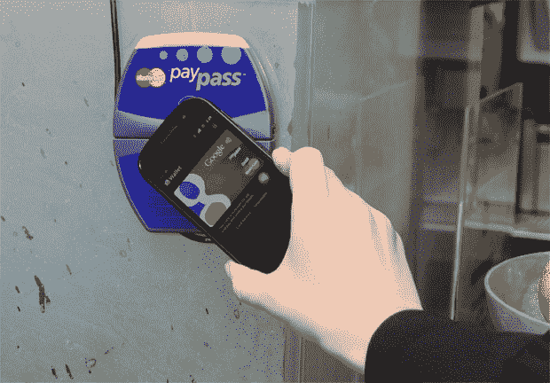
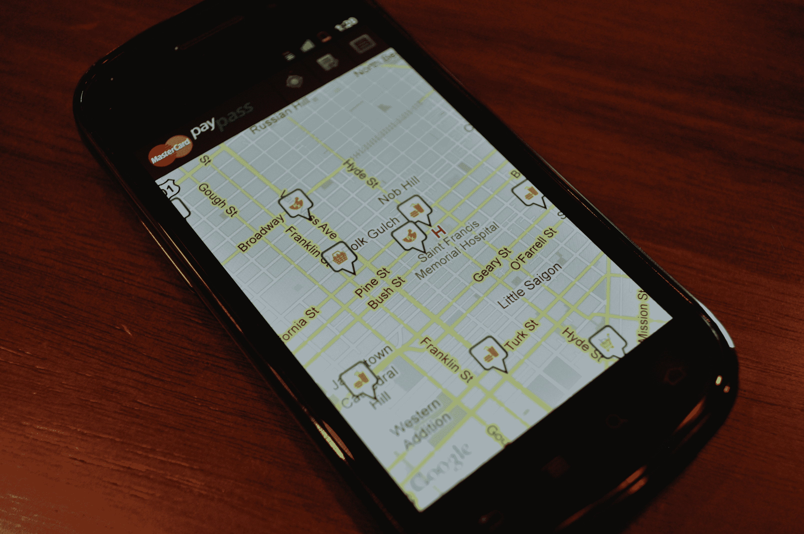
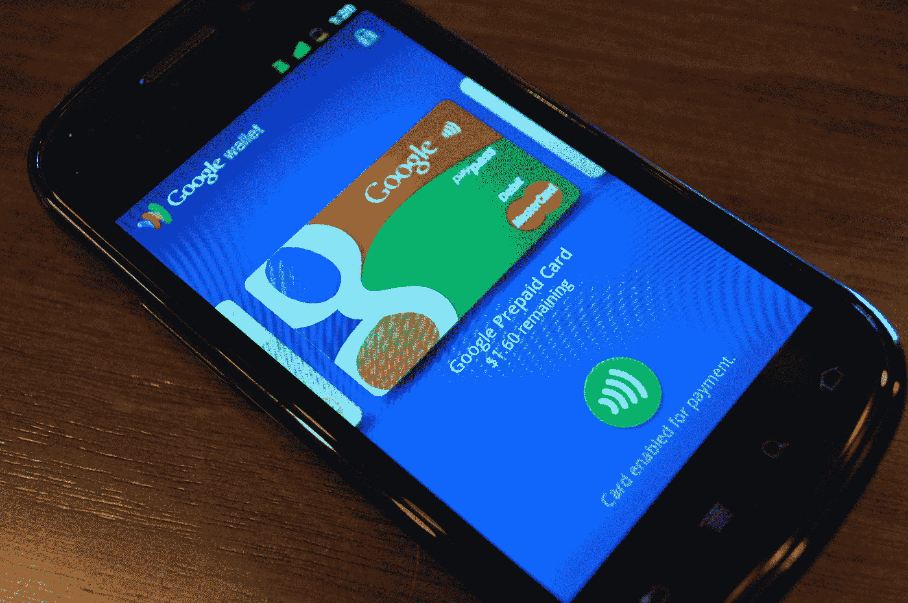
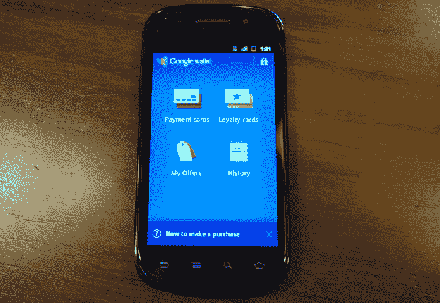

# TechCrunch 评论:谷歌钱包

> 原文：<https://web.archive.org/web/https://techcrunch.com/2011/09/19/techcrunch-review-google-wallet/>

我已经看到了未来，它叫做谷歌钱包。

然而，请注意，这个未来仅仅是:未来。比如说，某个不是现在的东西。在过去一周左右的时间里，我一直与谷歌钱包生活在一起，离开时留下了深刻的印象——但尽管谷歌钱包[可能会在今天](https://web.archive.org/web/20230203131030/https://techcrunch.com/2011/09/19/google-wallet-sprint/)推出，但不要指望它会很快从你的口袋里掏出真正的钱包。

## 工作原理:

[回到五月](https://web.archive.org/web/20230203131030/https://techcrunch.com/2011/05/26/google-wallet-offers/)，谷歌宣布他们的使命是杀死你的钱包。

谷歌钱包与特定 Android 手机内置的近场通信(NFC)系统相结合，可以让你的手机充当你的信用卡。通过将您的 Android 手机与特定零售商提供的兼容读卡器进行轻触，您的支付凭证将传输到商家，无需任何刷卡或实体卡。

虽然将手机和信用卡结合起来的想法可能会吓到一些人，但谷歌钱包(至少在理论上)比现实世界中的塑料钱包更安全。如果你的手机屏幕关闭，发射器芯片就不能供电，也不存储任何数据(从而防止路过的黑客在路过时窃取你的卡)。如果您在过去 30 分钟左右没有使用 Wallet(或者如果您手动锁定了它)，则在任何人可以使用您的卡甚至查看您的钱包包含哪些卡之前，都需要 PIN。

## 我的经历:

*“什么？等等，再来一次。”*

*“那合法吗？”*

*“谁啊啊啊啊啊啊啊啊。”*

每次我使用谷歌钱包时，收银台另一边的人看着我，就好像我是马蒂·小飞侠，手里拿着悬浮滑板，刚从德洛尔车里出来。不止一次，当我提到上面的内容时，他们大声地想知道我是否在他们的系统上放了一些技术巫术(尽管我最喜欢的反应是“哦，我的上帝！iPhone 5！”)

当钱包工作时(我在兼容的 NFC 阅读器上尝试的几乎所有交易都是如此)，它工作得非常非常好。这是闪电般的速度，超直观(打开显示器，点击手机阅读器。如果您最近没有输入 PIN，请输入并再次点击电话。你永远不需要手动启动应用程序。)商户只需像其他卡一样，将它通过他们的销售点机器，收据就会打印出来，你就可以上路了。

当它不起作用时，事情会变得有点…尴尬。有一次系统失败了，商人没有办法找出原因。我的手机屏幕显示“已发送！”他们的读卡器做了所有适当的标记，然后..没什么。我试了一下手边的一张支持 NFC 的美国运通卡，使用起来没有任何问题。这是我以前用过钱包的地方。当然，这些同样神秘的问题可能会出现在任何信用卡支付系统中——但是随着 NFC 的出现和一些人传达的谨慎态度，你可能应该准备好解释自己。

## 工作环境:

谷歌钱包不会在你的信用卡能工作的任何地方工作。它也不能在任何有 NFC 读卡器的地方工作。钱包需要一个基于新规范的 NFC 阅读器，只有少数零售商开始着手更新。

也就是说:即使在技术相对落后的加州东湾，我也毫不费力地找到了至少可以测试的地方。附带的 *MasterCard PayPass* 应用程序使这一努力变得更加容易，它可以找到并显示您当前位置或您手动输入的任何位置附近的所有兼容零售商。在我家 5 英里半径范围内，兼容零售商的名单大约有 12 种商品，几乎全部由盒子里的杰克、CVS 和 7-11 组成。

这是谷歌面临的最大挑战之一:让这些读卡器*无处不在*。阅读器绝不是谷歌钱包特有的(如上所述，阅读器只需要基于相对较新的规范，但与 Visa/AmEx/Mastercard 已经使用的 tap-to-pay 阅读器相同)，卡供应商自己也一直在推动这一发展——但在这些东西几乎无处不在之前，你的钱包(或至少一张你放在触手可及的地方的实体信用卡)不会去任何地方。

## 支付方式:

第一天，Wallet 只支持一种第三方卡:花旗万事达卡。

我没有，也很难找到有这样的人。

幸运的是，谷歌很清楚这一点。对于我们这些有其他银行和其他卡的人来说，他们已经创建了谷歌预付卡。你可以从你的任何一张信用卡中向这张预付卡中添加资金，然后每当你购物时就可以进入这张预付卡。这不是最方便的额外步骤，但它至少向几乎所有拥有信用卡的人开放了钱包。谷歌刚刚宣布，他们计划在未来的版本中支持 Visa、Discover 和 AmEx 卡——唉，没有给出时间表，也不清楚是否会逐个银行推出支持。

## 该应用程序

谷歌钱包应用程序执行得近乎完美。这是华丽的，精心设计的，非常直观。该应用程序由四个部分组成:支付卡、积分卡、我的优惠和历史记录。

**支付卡**在一个水平滚动的转盘上显示你所有的钱包认证信用卡。每张卡下面的一个小开关允许你将你的电子塑料军械库中的任何东西设置为默认值。你也可以在你的收藏中添加特定零售商的礼品卡，尽管推出时唯一支持的零售商是 American Eagle(谷歌承诺更多的还在路上。我相信赛百味是为了未来而存在的。)

**忠诚卡**看起来和支付卡几乎一样，但是它意味着你无数的“买十个三明治，送一个！”-打字卡。不过，与礼券一样，唯一推出的零售商是 American Eagle(但同样，据说更多零售商也在路上。)

**我的优惠**让您可以查看您通过谷歌的每日/本地交易应用程序 Google Shopper 购买的任何附近的促销活动。

第一天的**历史**部分有点简单。它目前只能显示你最近交易的时间戳([这里有一个截图](https://web.archive.org/web/20230203131030/https://techcrunch.com/2011/09/19/techcrunch-review-google-wallet/history/))，而忽略了任何关于它在哪里使用甚至花了多少钱的细节。谷歌告诉我，他们计划尽快解决这个问题，但他们无法在发布前完成。

## 结论:

谷歌钱包是伟大的，神奇的，令人印象深刻的，以及其他各种积极的形容词。但是今天的发布只是一个小的，但是有意义的第一步。通过移动设备进行基于 NFC 的支付是世界长期以来一致认同的令人敬畏的事情，但几乎所有的进展(至少在美国)都是在幕后进行的。这是公众第一次真正开始玩它——虽然这需要几年时间(至少)。想想有多少店铺还在坚持“只收现金”。)在它无处不在、足以扼杀你的钱包之前，谷歌似乎会做长期打算。

(…现在，谁能告诉我，当电池没电了，而我又把钱包忘在家里时，我该怎么办？)

**这里有一个我在汽车餐厅使用谷歌钱包购买食物的快速演示:**