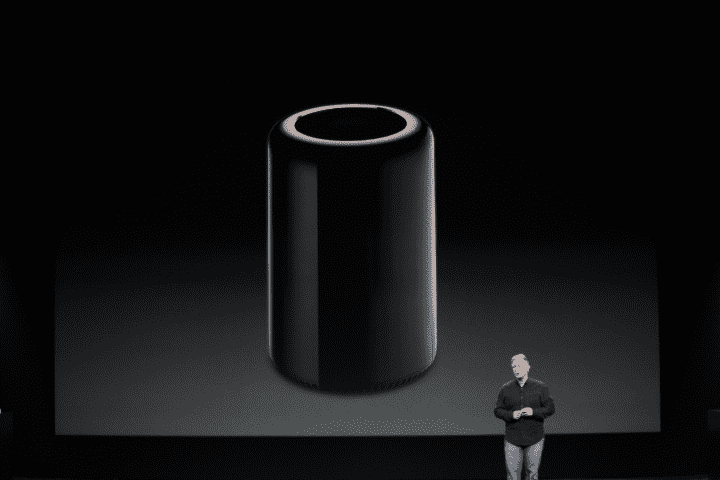
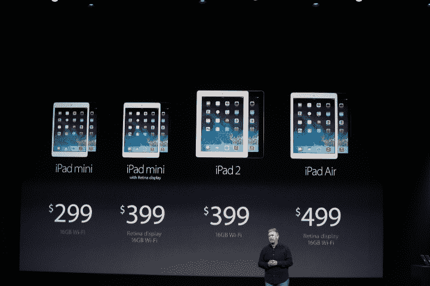
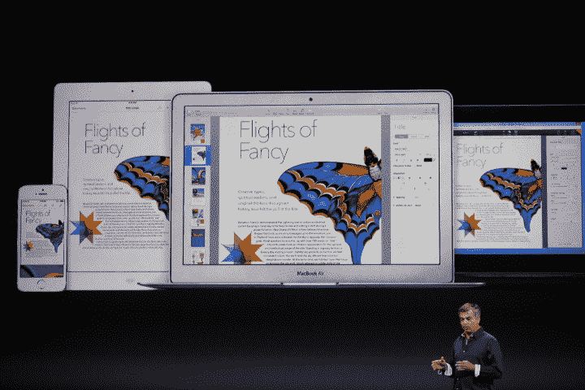

# TechCrunch TL 大卫:苹果公司 10 月份的主题演讲简而言之

> 原文：<https://web.archive.org/web/https://techcrunch.com/2013/10/22/techcrunch-tldr-apples-october-keynote-in-a-nutshell/>

今天早些时候，苹果在旧金山芳草地中心结束了它的 [十月活动](https://web.archive.org/web/20221207123734/https://beta.techcrunch.com/2013/10/22/apple-unveils-cheaper-macbook-pro-retina-with-intel-haswell-processors-slimmer-designs/)，正如承诺的那样，有很多东西可以挖掘。我们已经抽出了[大量的故事剖析苹果的无数公告](https://web.archive.org/web/20221207123734/https://beta.techcrunch.com/tag/ipad-2013)，但如果你正在寻找各种各样的亮点，我们已经把苹果拉开帷幕的一切快速概述在一起。

## 硬件

新 MacBook Pros: 是的，人们往往会对新的 iGadgets 着迷，但该公司新推出的一批 [Retina Macbook Pros](https://web.archive.org/web/20221207123734/https://beta.techcrunch.com/2013/10/22/apple-unveils-cheaper-macbook-pro-retina-with-intel-haswell-processors-slimmer-designs/) 也不容小觑。苹果展示了更薄的 13 英寸和 15 英寸版本，配备了英特尔最新的 Haswell 芯片组和更大的电池，并预装了 OS X Mavericks。

如果这些东西引起了你的兴趣，你可以从今天开始在苹果商店认领你的东西。以下是达雷尔·埃瑟林顿根据最初印象对他们如何与过去的版本进行比较的想法。

许多书呆子都对苹果好奇的 Mac Pro 重新设计垂涎三尺，今天我们更好地看看引擎盖下到底发生了什么。长话短说，背面为您提供了您想要的所有输入/输出/可扩展性，否则完整光滑的圆柱体会让人想起“达斯·维德”的氛围。

它有双工作站 GPU(专利设计，但有可能升级)和一个惊人的英特尔处理器，使它成为一个非常强大的机器，容纳在一个非常漂亮的身体里。

新的 Mac Pro 将于 12 月上市[，起价 2999 美元，你可以在这里](https://web.archive.org/web/20221207123734/https://beta.techcrunch.com/2013/10/22/apple-releases-the-new-mac-pro-a-4k-video-editing-super-fast-powerhouse-available-in-december-for-2999/)看到我们对这个计算强国的第一手印象(由 Matthew Panzarino 提供)[。](https://web.archive.org/web/20221207123734/https://beta.techcrunch.com/2013/10/22/hands-on-apples-new-mac-pro-is-an-insanely-quiet-thermal-wizard/)

**iPad:**谁会忘记 iPad——苹果拉开了两款新机型的帷幕，分别是 [iPad Air](https://web.archive.org/web/20221207123734/https://beta.techcrunch.com/2013/10/22/hands-on-apples-new-ipad-air-makes-the-tablet-a-one-handed-device/) 和[配备视网膜显示屏的 iPad mini](https://web.archive.org/web/20221207123734/https://beta.techcrunch.com/2013/10/22/hands-on-with-the-new-ipad-mini-with-retina-display/)。

两者实际上有很多共同点:两者都配备了最近在 iPhone 5s 中首次亮相的 64 位 A7 芯片，两者都有 2048 x 1536 分辨率的屏幕(尽管 mini 上较小的屏幕会产生更清晰的图像)，两者都将于 11 月开始上架。它们甚至在某种程度上彼此相似 Air 本质上看起来像 10 英寸的 iPad mini，这使得它比之前的型号更薄更轻。

不过，如果你不想花太多钱，苹果会保留一些老款机型，以确保任何想加入 iPad 潮流的人都能做到。(非视网膜)iPad 2 仍在运行，它将花费你 399 美元。

## 软件

今天，这个游戏的名字似乎是“免费”。苹果宣布，其两个最著名的软件套件——用于内容创作的[**iLife**](https://web.archive.org/web/20221207123734/https://beta.techcrunch.com/2013/10/22/apple-ilife-free/)和用于工作的**iWork**——现在可以免费购买任何新的 Mac 或 iOS 设备。

 但这还不是全部。苹果的下一个重大 OS X 更新，OS X Mavericks 也是免费的，现在所有人都可以下载。这应该有助于显著提高用户更新软件的速度，这对安全性和开发者都有好处。

考虑到苹果从 OS X 时代开始就对这些年度更新收费，这是一个意想不到的(尽管非常受欢迎)变化。诚然，该公司一直在降低每个新版本的更新成本，但完全免费是一个几乎没有人看到的举动。

苹果公司也发布了一份关于人们接受 iOS 7 速度的更新报告，数据也不算太差。自更新上线并开始在全球范围内推广以来，已经过去了一个多月，到目前为止，64%的苹果设备现在运行 iOS 7 。

这是关于苹果秋季大事件的所有信息，不要太深入细节。可以肯定地说，苹果有很多新东西让人们对即将到来的假日购物季感到兴奋。

