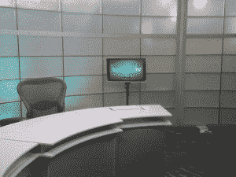
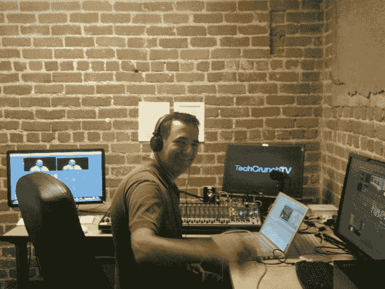

# TechCrunch 电视发布...现在。

> 原文：<https://web.archive.org/web/https://techcrunch.com/2010/06/28/techcrunch-tv-launch/>

# TechCrunch 电视发布…现在。

终于来了。经过几个月的规划、建设、学习、修复、招聘和支出，TechCrunch TV 现在正式上线了。

【T2

TechCrunch TV 每天从我们功能齐全的旧金山演播室播出，将汇集一些科技界最知名和最鼓舞人心的面孔。企业家、投资者、开发者——实际上是每一个正在帮助改变世界的人，一次一个初创企业。

我们还将在全国(和世界)旅行，直播重大事件，参观初创公司的办公室，并把我们的相机伸向科技世界的每个角落。

TechCrunch 电视将充斥着熟悉的 TC 面孔——迈克·阿林顿、莎拉·莱西、MG·西格勒、杰森·金凯德——要么是节目主持人，要么是常客，此外，我们很高兴与 TC 以外的一些令人惊叹的名字签约主持他们自己的节目，包括作家[安德鲁·基恩](https://web.archive.org/web/20221005180525/http://www.crunchbase.com/person/andrew-keen)(他的辩论节目 Keen On，每周一播出)和企业家/投资者 [Cyan Banister](https://web.archive.org/web/20221005180525/http://www.crunchbase.com/person/cyan-banister) (她的访谈节目《说到……》的第一集于周四播出)。

在幕后，TechCrunch 在这个项目上投入了大量资金，反映了迈克和 T2 对多平台 TechCrunch 的愿景。我们不仅建立了一个令人敬畏的工作室——与我们的发行合作伙伴 [Brightcove](https://web.archive.org/web/20221005180525/http://www.brightcove.com/) 和[Ustream](https://web.archive.org/web/20221005180525/http://www.ustream.com/)——而且我们还聘请了 [Jon Orlin](https://web.archive.org/web/20221005180525/http://www.crunchbase.com/person/jon-orlin) (下图，右)担任制作总监，他之前在 CNN 和雅虎工作(欢迎 Jon！).乔恩加入了一个团队，该团队包括作为突发新闻主播/制片人的伊芙琳·鲁斯里、制片人索菲亚·基特勒和 TCTV 实习生希林·加法瑞。 

(就个人而言:整个团队——以及 TC 首席开发人员安迪·布雷特(Andy Brett)——一直在夜以继日地工作，为发布做准备——他们对 TCTV 的奉献精神既鼓舞人心又令人害怕。谢谢伙计们。)

我的正式角色是创意总监，这意味着，除了负责将各种元素整合到一个连贯的频道中，我还会寻找新的节目创意和方法来改善我们目前的阵容。你的[建议](https://web.archive.org/web/20221005180525/mailto://beta.techcrunch.com/)一如既往，非常欢迎。

在真正的初创企业风格中，我们推出了有限的测试服务:每天大约 40 分钟的原创节目，由大量以前录制的节目支持，因此在 TechCrunch.tv 总有一些有趣的东西可以观看。“直播”频道也可以在手机上看到，这里是。

当然，我们所有的节目——以及 TechCrunch 制作的几乎所有视频——都可以在[点播](https://web.archive.org/web/20221005180525/http://www.techcrunch.tv/)；完全可嵌入和共享。现在，我们的点播目录包括来自 TechCrunch Disrupt 和 TechCrunch 50 的[精彩内容](https://web.archive.org/web/20221005180525/http://techcrunch.tv/events/)，以及各种主题访谈和简介，每天都会添加更多内容，包括新节目一经播出。

关于 TechCrunch TV 还有很多要说的，但如果视频真的是未来，那么博客帖子似乎不是正确的方式。相反，我与 TCTV 自己的 Evelyn Rusli(她主持我们的每日新闻讨论节目，并制作各种特别专题节目)一起坐在我们全新的演播室里，解释了 TCTV 背后的一些想法，然后参观了我们的新演播室，解释了这一切是如何工作的。

尽情享受吧！别忘了给我们发送您的反馈:[onair@beta.techcrunch.com](https://web.archive.org/web/20221005180525/mailto://beta.techcrunch.com/)，或者通过 Twitter-[@ techcrunchtv](https://web.archive.org/web/20221005180525/http://www.twitter.com/techcrunchtv)。

欢迎来到未来。

(**更新**:一些潜在观众已经发邮件询问我们的 iPad 版播放器。它将在大约一周内上线)