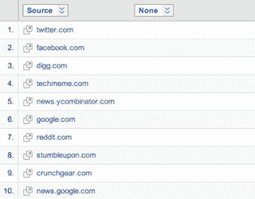

# Twitter 和脸书真的正在扼杀 RSS(至少对 TechCrunch 的访问者来说)

> 原文：<https://web.archive.org/web/http://techcrunch.com/2011/01/03/techcrunch-twitter-facebook-rss/>

今天早些时候，我们发表了一篇“ [TechCrunch 2010 回顾](https://web.archive.org/web/20230203023558/https://techcrunch.com/2011/01/03/techcrunch-2010-in-review-care-of-wordpress/)”的文章，重点介绍了 WordPress.com 发给我们的 2010 年的一些关键数据。到处都是有趣的东西。然而，正如一些人注意到的，在我们今年的顶级推荐者中，脸书却不见踪影。此外，RSS 阅读器 Google Reader 排名第三！

脸书要死了吗？RSS [是否重生](https://web.archive.org/web/20230203023558/http://www.techcrunchit.com/2009/05/05/rest-in-peace-rss/)？ [Nah](https://web.archive.org/web/20230203023558/https://techcrunch.com/2010/09/13/rss-is-not-not-not-not-not-dead/) 。看起来推荐人的数据有点扭曲。

我将这些数据与直接来自谷歌分析的我们自己的数据进行了对比。从那里看到的景色相当不同，也很有趣。

根据谷歌分析，2010 年我们的 10 大推荐人如下:

1.  twitter.com
2.  facebook.com
3.  digg.com
4.  techmeme.com
5.  news.ycombinator.com
6.  google.com
7.  reddit.com
8.  stumbleupon.com
9.  crunchgear.com
10.  news.google.com

正如你所看到的，像 WordPress.com 的数据一样，Twitter 是第一名，但是其他的都被调换了位置。脸书将 Digg 挤到了第三位。黑客新闻(news.ycombinator.com)与 Techmeme 进行了交换。与此同时，谷歌阅读器在谷歌分析数据中找不到。实际上，它是——它是 google.com 流量的一个子集(不包括搜索流量，搜索流量远远高于这些推荐网站)。

再往下看，谷歌阅读器实际上是 2010 年 TechCrunch 排名第 11 的推荐者。此外，这比 2009 年下降了很多，接近 50%。换句话说，是的，RSS 正在慢慢消亡。至少在最受欢迎的阅读器向 TechCrunch 发送流量时是这样。

那么，读者的立场是什么呢？根据谷歌分析，以下是 2009 年 TechCrunch 的 10 大推荐者:

1.  digg.com
2.  google.com
3.  twitter.com
4.  techmeme.com
5.  facebook.com
6.  news.ycombinator.com
7.  stumbleupon.com
8.  reddit.com
9.  crunchgear.com
10.  crunchbase.com

同样，谷歌阅读器是 google.com 数据的一个子集。往下看,《读者》本身就排在第六位，排在《黑客新闻》(还是 news.ycombinator.com)之前，脸书之后。在所有排名前十的房产中，Reader 的跌幅最大。

与此同时，推特和脸书在 2010 年出现了最大的增长。这是有道理的，因为这两个是最常与 RSS 缓慢消亡联系在一起的。与 2009 年相比，两者都大幅上升。Twitter 作为 TechCrunch 和脸书的引荐者几乎翻了一番，其发送的流量也翻了一番多。

Techmeme、Hacker News、StumbleUpon 和 Reddit 都给我们带来了流量。Digg 下跌了不少，虽然没有 Reader 跌得多。

现在，所有这些问题的一部分仅仅是因为与 2009 年相比，TechCrunch 在 2010 年有了更多的内容。但这让谷歌阅读器的下降变得更加有趣。当然，人们可以在不点击的情况下通过阅读器阅读 TechCrunch，但为什么会出现大幅下降，除非真正以这种方式阅读的人越来越少？

我们联系了 WordPress，看看为什么他们的数据似乎高估了 Reader，却大大低估了脸书(在 WordPress 的列表中排在第 20 位)。

几个其他有趣的数据点:

*   就 TechCrunch 的新访客而言，StumbleUpon 发送的信息最多(按百分比计算)，其次是谷歌新闻。Techmeme 发的最少，其次是黑客新闻。后两者似乎和我们有许多共同的读者——这并不奇怪。
*   但就平均停留时间而言，Techmeme 占据主导地位，其次是脸书和 Twitter。StumbleUpon 是这里最差的，其次是 Reddit 和 Digg。换句话说，从 Techmeme、脸书和 Twitter 上访问的人实际上似乎在阅读内容。