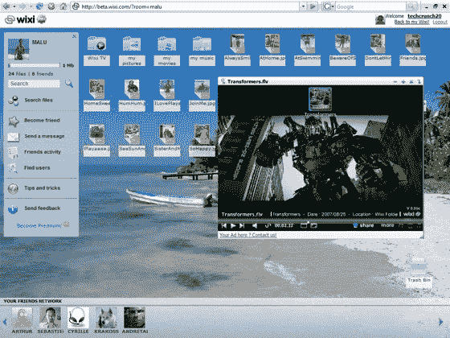

# TechCrunch40 第 7 场会议:富媒体和混搭

> 原文：<https://web.archive.org/web/https://techcrunch.com/2007/09/18/techcrunch40-session-7-rich-media-mash-ups/>

*我们正在直播每场会议，从 TechCrunch 40 会场直接添加对每家公司的总结。单击刷新查看。*

**XRT3D**

XTR3D 开发软件，让用户使用 3D 人体动作与电脑和游戏机互动。他们的实时软件只用一个简单的网络摄像头就能分析 3D 人体运动。它将允许用户使用自然的人类动作而不是键盘、鼠标和操纵杆在虚拟世界中玩游戏和互动。他们称他们的技术为“3D 人机界面”

通过网络摄像头在空中移动鼠标…真他妈的酷。

演示包括用手移动谷歌地球。

如可用于虚拟世界、游戏。

演示包括拳击，效果很好。绝对是会议上最好的产品/演示之一。

更多关于嘎吱嘎吱齿轮[这里](https://web.archive.org/web/20230206025647/http://crunchgear.com/2007/09/18/xrt3d-holy-crap/)。

**宽剪辑**

 [ BroadClip 的](https://web.archive.org/web/20230206025647/http://www.crunchbase.com/company/broadclip) MediaCatcher for 脸书提供了一种搜索和收听无 DRM 的音乐的方法，该方法经过优化，可将音乐传送到便携式媒体播放器，如 iPods 和手机。用户所要做的就是“剪辑”流媒体音乐，然后他们就可以以合法的方式将录音传输到他们的便携式媒体播放器上，就像 TiVo、vcr 和磁带录音机等其他“时移”技术一样。诡异的星球大战试玩…WTF？一句台词是这很糟糕…他是对的，虽然很遗憾，但我喜欢这个想法，即使版权方面是一个很大的问号…他们声称这是合法的，但 RIAA 要求网络广播公司在版税谈判中安装流媒体拦截软件…Broadclip 是一种易于使用的流媒体播放服务。没有人在舞台上…一些流演示，不知道他们是否在大楼里。不好意思消极了，这不是什么好效果。

**mEgo**

 [mEgo](https://web.archive.org/web/20230206025647/http://www.crunchbase.com/company/mego) 让用户创建个性化的头像，这些头像带有他们的在线网络聚合档案，可以集成到用户的博客、社交网络、网站和即时消息客户端中。在线个人资料显示用户选择的内容，如个人资料详情、视频、照片、订阅源和小工具。

几只咯咯笑的小鸡…杰森·卡拉卡尼斯注意到有人在舞台上表演是一件很棒的事情。

用效果良好的演示文稿标记团队。

互动小工具，样本显示在脸书。

许多功能，提供社会聚合，包括拉进 RSS，Twitter 等..可以是基于矢量的任何大小。

网站将在下午 4 点直播

**Wixi**

 [Wixi](https://web.archive.org/web/20230206025647/http://www.crunchbase.com/company/wixi) 是一个专注于媒体的社交网络，用户通过私下观看、发布和分享所有媒体类型的内容(包括照片、音频和视频)来相互交流。该网站提供了一个独特的界面，可以像管理计算机桌面上的文件一样管理媒体，创造出真正的“拖放”和“点击播放”体验。

看起来像 Web OS，闻起来像 Web OS…但它是一个“媒体共享平台”:-)

使用 code tech40access 访问 main.wixi.com，享受免费无限存储空间。

Zat waz ok..我想。

  [BeFunky](https://web.archive.org/web/20230206025647/http://www.crunchbase.com/company/befunky) 为用户提供在线工具，用于在他们的博客、网站和 MySpace 等社交网络上创建自己的数字在线表示。他们的在线工具 Uvatar 和 Cartoonizer 使用户能够将自己变成化身、卡通、数字绘画或漫画。

我讨厌这个名字，但政治正确意味着我可以说出我对它的想法。:-)

这是一个 pic 到卡通/头像的工具。不错，演示效果不错。

也能处理照片，他们在迈克尔·阿灵顿的一张照片上演示了这一过程，并“让他减掉了 20 磅”

也做视频，在《黑客帝国》的场景中演示。印象深刻…非常深刻。

Avator 软件包创建像头像一样的卡通，起初免费，后来每张 5 美元。

**专家小组**

MC 锤喜欢 Mego，BeFunky。布拉德·加林豪斯(雅虎)喜欢 Mego，BeFunky 也很酷。莎拉·莱西喜欢 XTR8。Caterina Fake 对小部件供应商持怀疑态度。

Loic 为 Broadclip 感到遗憾。

关于 XTR8 的讨论:Brad 说这让他想起了旧的英特尔产品，他不相信鼠标或遥控器有任何问题

Wixi 讨论:mashups、syndication

Broadclip 谈论他们的产品…大约 15 分钟后，他们应该在舞台上做非常的事情。解释说这是网络电台的 TiVo。可以转到 iPod。

观众提问:Broadclip 的版权问题。答:我们正在增加唱片公司的收入，但并没有完全回答这个问题，尽管我是一名知识产权律师。MC 锤劈头盖脸的进了公司，钱不管用。这个不能碰！:-)

观众中的 Don Dodge，Broadclip 是错误的，他们没有增加收入，不管他们说什么，他们都会有麻烦。