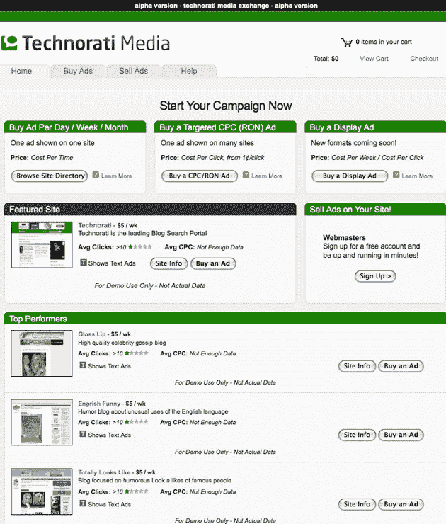

# Technorati 收购 AdEngage 广告网络

> 原文：<https://web.archive.org/web/https://techcrunch.com/2008/10/15/technorati-acquires-adengage-advertising-network/>

# Technorati 收购 AdEngage 广告网络

总部位于旧金山的 Technorati 以全股票交易的方式收购了总部位于洛杉矶的十二人广告网络[。AdEngage 平台将仍然是一个独立的品牌服务，Technorati 也将推出一个以其新的 Technorati 媒体品牌](https://web.archive.org/web/20230324093018/http://www.adengage.com/)命名的平台版本。交易的规模尚未披露。

此前，Technorati 于 8 月[收购了博客内容网络 blogcritis](https://web.archive.org/web/20230324093018/https://techcrunch.com/2008/08/26/technorati-acquires-blogcritics-gets-into-content-game/)。

Technorati 首席执行官理查德·贾利钱德拉说，AdEngage 成立于 2004 年，为 4000 个网站销售广告，每月有 130 亿次广告展示。这些网站中有许多是面向成人的，所以 Technorati 没有将其与核心服务合并。相反，他们将在几周内以 Technorati Media 品牌推出一个独立版本。下面的屏幕截图显示了该网站当前受密码保护的版本。

目前，该网络以每周成本为基础出售自助文本和 pho-text(带文本的缩略图)广告。很快将增加其他广告类型(开始是 125×125 显示广告)，以及 CPC 和 CPM 支付选项。

目前的 Technorati 媒体服务是面向与 Technorati 合作的大型网站。当 AdEngage 平台推出时，较小的博客也可以注册，并有望通过在 Jalichandra 所说的基于标记和链接行为的“影响范围”内与类似的博客分组来获得相对较高的广告费率。

