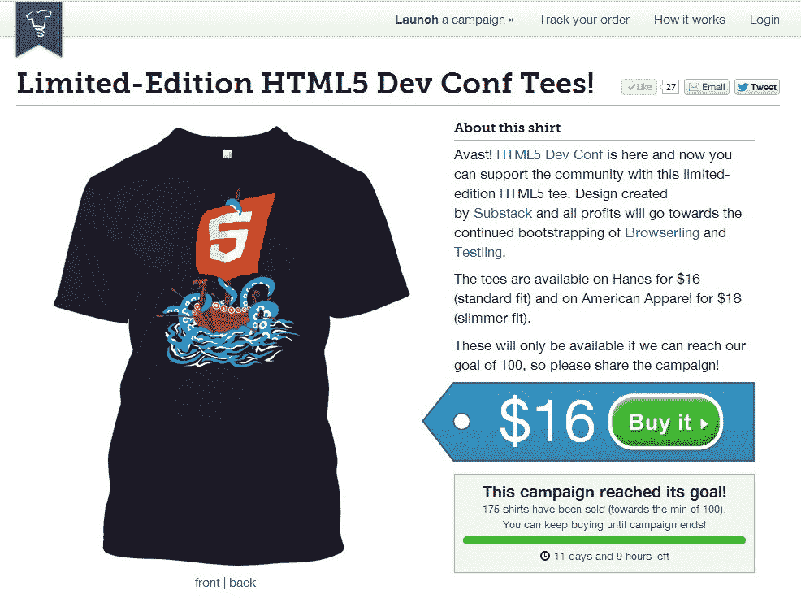
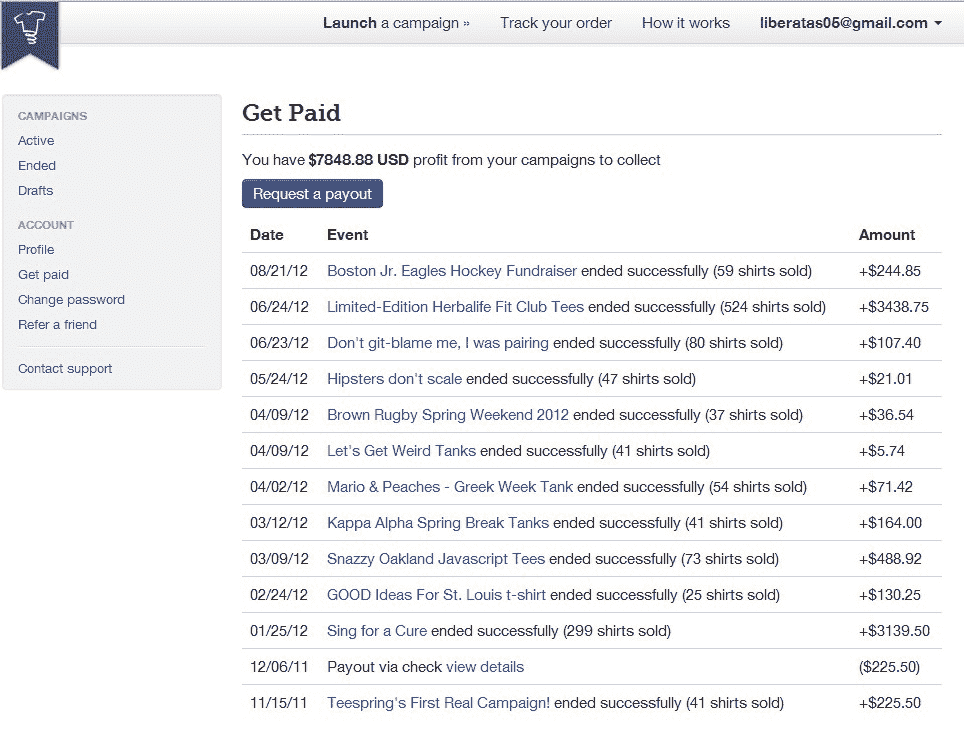

# Teespring 希望成为一个可以众筹任何东西的地方，从 t 恤开始 TechCrunch

> 原文：<https://web.archive.org/web/https://techcrunch.com/2012/10/11/teespring-wants-to-be-the-place-where-you-can-crowdfund-anything-is-starting-with-t-shirts/>

乍一看， [Teespring](https://web.archive.org/web/20221207170320/http://teespring.com/) 似乎正试图成为 t 恤的 Kickstarter，其最近推出的网站允许任何人设计定制 t 恤，然后众筹投入生产。但正如联合创始人沃克·威廉姆斯解释的那样，这两种商业模式并不完全相同。虽然 Kickstarter 也是一个众筹平台，但被推广的产品的生产取决于那些筹集资金的人。然而，在 Teespring，所有的生产和运输都由公司自己处理。

威廉姆斯和联合创始人埃文·斯蒂茨-克莱顿是最近从布朗大学毕业的学生，住在罗德岛的普罗维登斯，他们在试图挽救当地一家濒临倒闭的酒吧时，首先想到了这个主意。在这次创业之前，威廉姆斯是一名设计师，他创建了一个网站，推出了一款“拯救酒吧”类型的 t 恤，引起了想购买 t 恤的学生的极大兴趣。但是当他向丝网印刷机询价时，价格高得惊人(1500 美元对一个学生来说太多了！)周转时间是两周。他也不确定自己需要多少衬衫和多大尺码。

就在那时，他有了现在成为 [Teespring](https://web.archive.org/web/20221207170320/http://teespring.com/) 的想法。他和朋友兼程序员斯蒂茨-克莱顿坐在一起，五六个小时后，他们就有了一个网站，学生可以通过 PayPal 预订衬衫。他们的目标是卖出 200 件衬衫，但他们只卖出了 450 件，网站在几个小时内就看到了 3000 个 uniques。更重要的是，询问开始通过电子邮件滚滚而来。校园和其他地方的其他组织想知道:*你也能为我们建一个网站吗*？

两位创始人于 2011 年 8 月开始全职工作于 Teespring，1 月发起了他们的第一次活动，并于 4 月下旬开放测试。这家初创公司一直不为人知，但尽管缺乏营销，它还是成长了不少。1673 名组织者现在已经使用该网站设计定制衬衫，自 7 月以来，他们开始每月结算超过 10 万美元。“我们已经完成了超过 50 万美元的销售额，并向 40 个不同的国家运送了 27，000 件 t 恤，”Williams 说。“每个月都是我们最大的一个月。”

以这种方式销售衬衫的优势不仅在于节约成本，还在于质量。“以前，如果你想打印 t 恤，你有两个选择，”威廉姆斯解释说。“要么你不得不忍气吞声，支付 1000 美元的账单，猜测你需要多少件衬衫，然后通过屏幕打印机或 [CustomInk](https://web.archive.org/web/20221207170320/http://www.customink.com/) 解决所有这些麻烦，要么你可以去 CafePress，而且没有前期费用。”但他说，CafePress 衬衫起价 20 美元，而且是数码印刷的。“数码照片是一种低质量的照片，颜色不够鲜艳，洗 20 次后就会褪色——这不是零售质量。”

Teespring 与一个丝网印刷网络合作生产衬衫，将顾客的订单发送到离他们最近的地方。该公司的商业模式包括收取每件衬衫的固定利润，顾客可以转而以他们想要的价格出售这些衬衫。事实证明，该网站特别受非营利组织的欢迎，除了寻求捐款，它还在寻找其他筹款方式。Teespring 的销售额中有 15 万美元来自非营利组织，甚至包括一些更大的组织，如[美国计划](https://web.archive.org/web/20221207170320/http://www.planusa.org/)。

Teespring 现在是一个七人团队，再过一个月就要发布一个 API 和小工具，允许衬衫创作者在自己的网站上嵌入广告。他们还在讨论进行一轮风险投资，以便进一步发展:威廉姆斯表示，他可以看到公司扩张到任何可以控制生产和履行的领域——不仅仅是 t 恤和其他促销品。事实上，他们已经试验了像水瓶、帽衫甚至雪球这样的东西。他们甚至收到了一些更疯狂的请求——比如想要冲浪板和书。

“最终，我们希望成为一个人们可以众筹任何东西而不用担心后端的地方，”威廉姆斯说。

如今，该公司几乎实现了盈利。它从当地天使比尔·凯撒和 T2·马克·韦纳那里获得了 60 万美元的天使投资，他们负责奥巴马的商品销售。