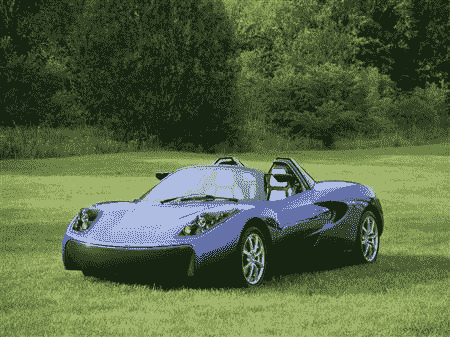
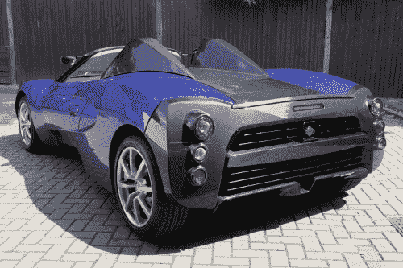

# TEEWave AR1:日本获得新型电动跑车 

> 原文：<https://web.archive.org/web/http://techcrunch.com/2011/09/12/teewave-ar1-japan-gets-new-electric-sports-car/>

# TEEWave AR1:日本获得新的电动跑车

特斯拉正面临来自日本的一些竞争:总部位于东京的化学品巨头东丽(Toray)在周末发布了一款双座跑车 Teewave AR1(东丽 Eco Efficient Advanced Roadstar 1 的缩写)。

该公司共投资 380 万美元开发这种电动汽车，其主要卖点是重量轻:东丽在汽车的地板、框架和其他部分使用了碳纤维增强塑料，以尽可能减轻重量。

【T2

据该公司称，原型车重量仅为 846 公斤(包括电池)，比同类车辆轻约三分之一，能耗更低(11.6 公里/千瓦时)。它的最高时速可达 147 公里，行程可达 185 公里。

东丽与英国汽车设计机构戈登·默里合作开发 Teewave AR1。该计划是到 2015 年将使用碳纤维增强塑料的汽车部件商业化。

Via [产经新闻](https://web.archive.org/web/20230203135854/http://sankei.jp.msn.com/economy/news/110909/biz11090918370026-n1.htm) [JP]