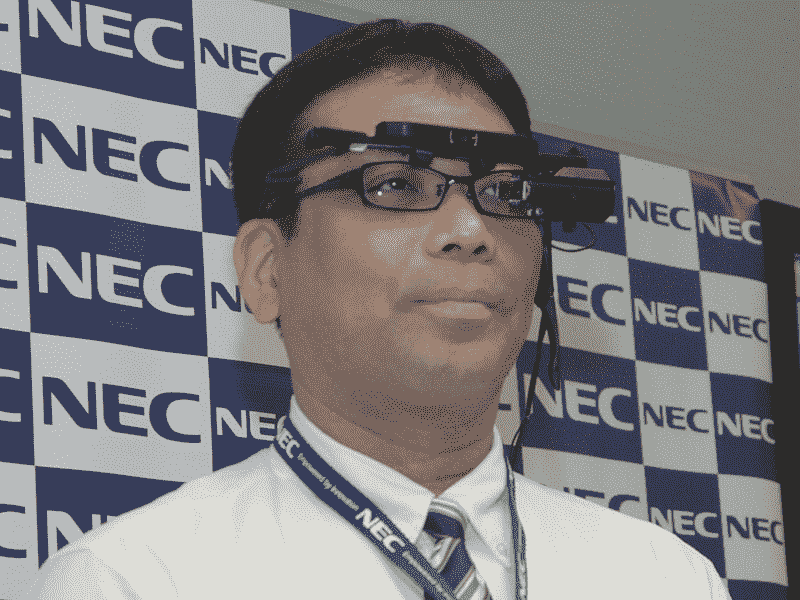
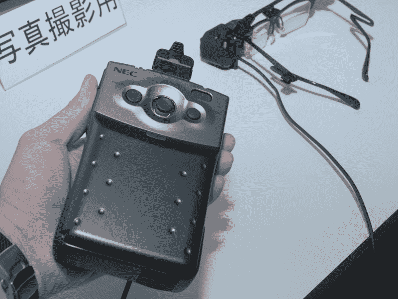

# Tele Scouter: NEC 发布透明头盔显示器 TechCrunch

> 原文：<https://web.archive.org/web/http://techcrunch.com/2011/10/20/tele-scouter-nec-announces-transparent-head-mounted-display/>

# 远程侦察员:NEC 宣布透明头戴显示器

NEC 在日本宣布了所谓的 [Tele Scouter](https://web.archive.org/web/20230205022805/http://www.nec.co.jp/press/ja/1110/1701.html) [JP]，这是一款未来主义的透明头盔显示器(HMD)，用于增强现实应用。该设备基于 AiRScouter，这是 Brother 多年来一直在研究的东西(我们已经讨论过这里的、这里的和这里的)。

NEC 称之为“可穿戴计算机”的 Tele Scouter 大小为 75×40×35mm，重量为 64g。它由配备 Windows Embedded CE 6.0 的(便携式)终端驱动，可以生成分辨率为 800×600 的图片，可以叠加到现实世界中。

 

该终端(如下图)采用 ARM 500MHz CPU，IEEE 802.11a/b/g Wi-Fi，蓝牙 Ver2.0+EDR，microSD 插槽，麦克风，尺寸为 140×90×55，重量为 360 克。

NEC 表示，当佩戴时，Tele Scouter 会给人一种 16 英寸屏幕的感觉，距离用户的眼睛大约一米远。该公司将该设备用于设备组装、零件挑选和选择，以及工厂中的远程操作(电池寿命:4 小时)。

目前还没有关于可能的国际发行的消息，但是这款远程侦察器在日本的售价将为 5200 美元。该软件售价为 24，000 美元(发布日期:12 月 26 日)。

Via [AV 手表](https://web.archive.org/web/20230205022805/http://av.watch.impress.co.jp/docs/news/20111017_484363.html) [JP]