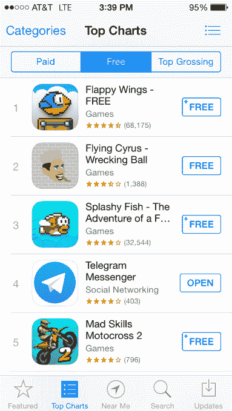

# WhatsApp 被收购后，Telegram 的下载量达到 800 万次

> 原文：<https://web.archive.org/web/https://techcrunch.com/2014/02/24/telegram-saw-8m-downloads-after-whatsapp-got-acquired/>

App Store 是一个奇怪而异想天开的伙伴。它是一个拥王者，但随之而来的是受膏者的眼泪、流离失所者的眼泪和永不满足者的眼泪。

作为商店善变本质的一个例子，Flappy Bird 占据免费应用程序的优势如此之久，以至于它[无法应对成功](https://web.archive.org/web/20230302010532/https://techcrunch.com/2014/02/09/flappy-bird-remove-from-app-store/)，犯下[切腹](https://web.archive.org/web/20230302010532/http://en.wikipedia.org/wiki/Seppuku)。几乎立即出现了三个克隆体来取代它，包括“飞行赛勒斯”，一个麦莉赛勒斯主题的克隆体。

世界上最大的消息应用程序 WhatsApp 于 2 月 19 日被世界上最大的社交网络[收购的消息也诞生了一个新的应用程序商店明星。就在脸书收购的消息传出五天后，出身卑微的消息应用 Telegram 已经在应用商店排名中超过了 WhatsApp。TigerText 和 Confide 等其他通讯应用也可能出现相关的增长。](https://web.archive.org/web/20230302010532/https://techcrunch.com/2014/02/24/whatsapp-is-actually-worth-more-than-19b-says-facebooks-zuckerberg/)

人们很容易将这种流失归因于对脸书的不信任，他自己的移动应用并不特别受欢迎，在应用商店的评分表中排名低于 Telegram、WhatsApp 甚至 Snapchat。但这也可能是对大型科技平台的普遍不信任，这是爱德华·斯诺登爆料苹果和脸书等大公司配合美国国家安全局追踪用户数据的结果。

Telegram 是由俄罗斯脸书竞争对手 VKontakte 的创始人帕维尔·杜罗夫创建的，他希望成为世界上最安全的——也是最防 NSA 攻击的——信息应用。杜罗夫告诉我，在 WhatsApp 的炸弹上周落下之前，这项服务每天的下载量增长了 30 万到 40 万次。

Durov 表示，新闻发布后，该应用的增长率增加了约 3 倍，达到每天 80 万-100 万次新下载，涵盖 iOS、Android 和 Windows。WhatsApp[宕机](https://web.archive.org/web/20230302010532/https://techcrunch.com/2014/02/22/whatsapp-is-down-facebooks-new-acquisition-confirms/)当天，新增 180 万用户。昨天，它增加了 490 万用户，目前在 iOS 中排名第四，仅次于三个，是的，三个受 Flappy Bird 启发的应用程序。

“我支持和帮助推出 Telegram 的首要原因是建立一种俄罗斯安全机构无法访问的通信手段，这样我就可以谈论它几个小时，”杜罗夫告诉我，并补充说，他支持该应用程序的声明，即其加密是最高级的，尽管[黑客新闻线索](https://web.archive.org/web/20230302010532/http://paulmillr.com/posts/the-story-of-telegram/)与此相反。

像 Secret 一样，它也依赖于用户的信任，自举产品[有 20 万美元的奖金给那些能够破解它的人。“到目前为止还没有人获奖，但是一个来自俄罗斯的家伙在 12 月发现了一个严重的问题，并从我这里获得了 10 万美元，”杜罗夫说。](https://web.archive.org/web/20230302010532/https://core.telegram.org/techfaq)

Telegram 最酷的地方是它结合了 Snapchat 和 WhatsApp 的元素，允许你设置一个计时器来“秘密”(额外加密)聊天。要开始秘密聊天，点击用户的头像并选择“秘密聊天”要在聊天上设置自毁计时器，再次点击他们的头像，并将到期时间设置为两秒到一周之间的任何时间。然后坐下来，看着你们的聊天自动消失。

Telegram 第二个最酷的事情是，这位创始人似乎对这款应用的新成功非常不满意。当被问及如何击败所有三个 Flappy Bird 克隆体登上榜首时，他开玩笑地回答说:“我不喜欢击败鸟类的想法。我吃素。”

*[披露:](https://web.archive.org/web/20230302010532/http://www.crunchbase.com/person/alexia-tsotsis)我在脸书拥有股份。*