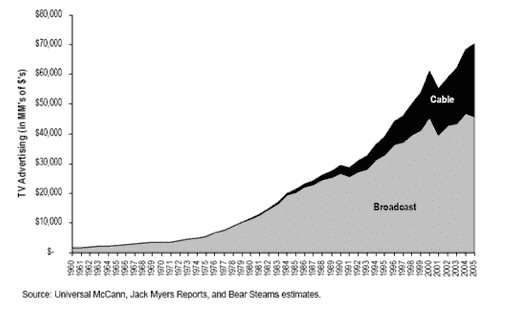
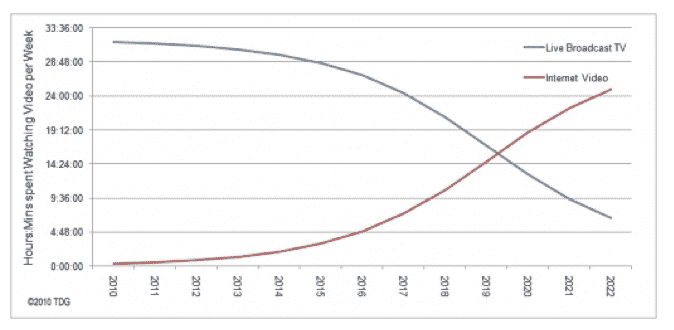

# 为什么电视公司不关心原创在线视频 

> 原文：<https://web.archive.org/web/http://techcrunch.com/2011/07/17/television-online-video-programming/>

**编者按:** *以下客座博文由 [WatchMojo](https://web.archive.org/web/20230203143603/http://www.watchmojo.com/index.php?id=1) 创始人兼首席执行官阿什坎·卡尔巴斯弗罗山(Ashkan Karbasfrooshan)撰写。*

有线电视的兴起和扩散扩大了电视的总蛋糕，使得电视网拥有更大的业务，即使他们的蛋糕份额缩小了。

虽然网络到有线电视的转变是渐进的，但电视到网络的转变是革命性的。尽管如此，电视的传统媒体公司(TMC)认为，网络只是另一个分销渠道，可以增加其资产的覆盖范围和潜在收入，并在尘埃落定时增长业务。

这种策略是否会有回报还有待观察。毕竟，网络让音乐行业变得更有效率，但就收入和利润而言,[行业萎缩了](https://web.archive.org/web/20230203143603/http://www.watchmojo.com/blog/business/2011/05/03/product-placement-in-music-videos-and-the-future-of-advertising-in-the-music-industry/)。无论如何，虽然 TMC 一直在与为网络制作的节目(我称之为“优质内容”)调情，但它们总是被吸引回为电视和戏剧制作的内容(我称之为“超级优质内容”)。

例如，维亚康姆早在 2007 年就投资了 Vice 的 VBS . TV，但自那以后，他们与米高梅和狮门影业在 EPIX 共同投资。狮门影业本身向 Break Media 投资了 2140 万美元，持有其 42%的股份，并拥有以 5800 万美元购买其余股份的期权。如果在线视频真如支持者所说的那么神奇，狮门影业难道不会已经行使选择权了吗？Break Media 实际上做得相当好，并在男性在线视频类别中为自己开辟了一个不错的利基市场，但对于 TMCs 来说，这些数字并不重要。

**了解网络结构的初创公司在视频内容方面的机会**

事实上，绝大多数优质内容都是由新媒体创业公司创造的。其中一些人犯的错误是在互联网上建立一个传统的媒体公司，这完全是一种疯狂的行为，也是一种自暴自弃和浪费数百万美元的方法。Ripe Entertainment 耗资 4000 万美元，得到了风投(Rho Ventures 和哥伦比亚资本)和 TMCs(赫斯特电视和时代华纳)的支持。筹集 2500 万至 5000 万美元建立在线内容业务是一个糟糕的策略，你“执行”得越好，情况就越糟糕。

事实上，虽然这一革命性的转变对一些初创公司来说代表着一个机会，但任何对 TMC 不愿专注于优质内容感到惊讶的人要么是错觉，要么是不真诚的:对于 TMC 来说，试验优质内容绝对没有任何经济激励或理由，更不用说大举投资了。诚然，这是一个创新者的困境，但质疑 TMC 犹豫将他们的离线编程放到网上追逐金钱是一回事，实际上怀疑他们为什么不投资于没有任何特权和吸引力的专为网络制作的编程是另一回事。何必呢？

**鼓励他们的方式，伙计们**

在[获得资金或投资优质内容](https://web.archive.org/web/20230203143603/https://techcrunch.com/2011/01/14/capital-efficient-online-video-startup-rocketboo/)的所有公司中，只有少数已经退出:

*   LX.tv 被 NBC Universal 收购，现在为纽约和洛杉矶的出租车和当地分支机构提供内容创作服务；
*   Wallstrip 被 CBS 收购，基本上被关闭了。请注意，CBS 无权收购 Wallstrip(《华尔街日报》可能是一个更好的追求者)。具有讽刺意味的是，当 2008-09 年经济危机来袭时，它关闭了它，因为在那个时候，对华尔街冷嘲热讽是非常合适的；
*   谷歌收购了 Next New Networks，并将其并入其 YouTube 部门，以确保谷歌员工不必与人类打交道，NNN 的高管可以管理那些在 YouTube 上谋生的怪人，并代表该网站向广告商提供少量品牌安全内容的最佳选择(祝你好运)。

同时，

*   HBO [卸载](https://web.archive.org/web/20230203143603/http://gigaom.com/video/break-acquires-hbolab/)旗下“新媒体”HBOLabs/RunawayBox 单元破局，
*   康卡斯特[裁员](https://web.archive.org/web/20230203143603/http://adage.com/article/mediaworks/comcast-axed-nbc-universal-digital-studio/228650/) NBC 环球数字工作室近日，
*   新闻集团一直在涉足新媒体内容，但现在有了更大的问题。

请注意，慢慢地，但肯定地，你会看到一些有趣的活动:

*   马克·库班(间接)投资于修订 3。

嗯…好吧，也许会有更多的活动…但是不要屏住呼吸。几年前，我联系了贝塔斯曼，谈论一项合作计划，以帮助我的公司 WatchMojo 在欧洲扩张。我们已经开始将我们的英语视频翻译成西班牙语、法语和德语，贝塔斯曼似乎是一个很好的潜在合作伙伴。他们坦率地告诉我，他们的重点是如何利用他们存档的数千小时媒体来赚钱，而不是创造新的内容来在线赚钱。

**电视嫉妒杀了网络明星**

常见的重复似乎是“电视是一个 700 亿美元的市场，在线视频只是一个 15 亿美元的市场，在线视频何时才能获得公平的份额”？嗯，永远不要怎么样？从技术上来说，如果包括所有收入，电视在美国实际上是一个 2500 亿美元的产业。这是一大笔钱，TMCs 也知道这一点。

在线视频增长不够快是因为:

*   没有那么多好的内容诱惑广告商，而且
*   就总规模而言，谷歌的 YouTube 几乎垄断了视频分发。

结果是，TMC 缺乏投资在线广告的经济激励，因为在线广告快速增长的蛋糕中有 40%流向了搜索，而在美国，只有 15 亿美元将用于在线视频广告

**资产负债表与损益表**

迷失在“Hulu 会卖吗？”谈论的话题是“业主为什么要出售？”

Hulu 以 10 亿美元的估值筹集了 1 亿美元。即使 Hulu 的价值自那笔交易以来有所上升，TMC 资产负债表上的增值也没什么意义。然而，如果 Hulu(在其他人手中，无论是作为一家独立的上市后公司，还是在 MSFT/YHOO/谷歌手中)每年向 TMC 支付数亿美元的许可费，那么他们损益表上的这种年金将更有价值。这就是为什么网飞突然变得不仅仅是敌友，而是 TMCs 的亲密伙伴，因为网飞可以每年给 TMCs 签大额支票(进一步证明了这样一个事实:T2 的内容和分发同等重要，缺一不可)。

总之:*是的*，新媒体创业公司有机会在网上创造精简、高效的内容创造机器，特别是在观看时间方面，网络视频将在 2020 年超过直播电视。

但是，认为 TMC 应该效仿的想法是疯狂的。他们最好想办法将传统资产货币化，即使这意味着将部分或全部资产重新包装，以满足在线观众的零食消费。随着时间的推移，分发平台将会融合，但对内容的控制将成为一个比以往任何时候都更大的问题。解决他们问题的方法不是“更多的内容”