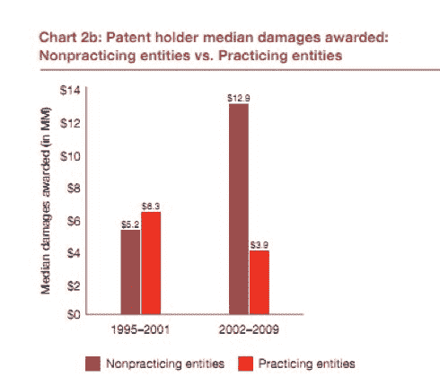
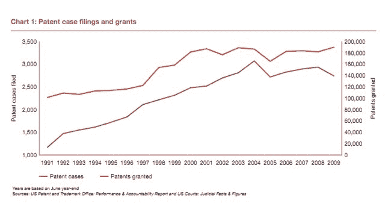

# 专利的可怕成本 

> 原文：<https://web.archive.org/web/https://techcrunch.com/2011/08/19/terrible-cost-patents/>

专利的成本正在上升，这不是一件好事。毕竟，谷歌为摩托罗拉支付 125 亿美元主要是为了其庞大的移动专利组合。7 月，一个反谷歌的财团向 T2 支付了 45 亿美元的北电专利(而 T4 支付了过多的专利费用)。Interdigital、柯达和其他公司正在寻求出售他们的专利组合。我们正处于专利泡沫的中间。

如果你想想这些专利的成本，科技公司在资产上花费了数十亿美元，他们需要这些资产来抵御不断上升的专利诉讼浪潮。这是谷歌、苹果、微软和其他公司不会投资于新产品、新工作、新设施或其他经济生产活动的数十亿美元。总的来说，他们不会利用这些专利来创造新产品。谷歌这么做只是为了保护 Android 免受竞争对手的专利索赔。

看看过去几个月花费的数十亿美元，现在应该很清楚专利的成本(至少对软件而言)超过了它们对社会的价值。最近国会通过的专利改革是[无齿](https://web.archive.org/web/20230203085346/http://www.huffingtonpost.com/2011/08/04/patent-reform-congress_n_906278.html)。风险投资家弗雷德·威尔逊和其他人长期以来一直抱怨软件专利和专利流氓的崛起。专利诉讼成本的上升相当于创新税，尤其是对较小的初创公司而言。但对大型科技公司来说，创新税也变得相当沉重。

反对技术专利的理由主要有两个。一个与科技行业创新的本质有关，它不同于制药等其他行业的发明。另一个与专利钓鱼者的崛起有关，他们收集专利的目的只是为了攻击真正的运营公司。这两个论点不可避免地交织在一起。

技术产品，尤其是软件，从来都不是凭空创造出来的。就其本质而言，它们建立在以前的技术之上，并对其进行改进。但是你和我可能认为是改进的东西，专利律师可能会认为是侵权。弄清楚你的产品*可能会侵犯哪些专利几乎是一项不可能的任务。一部智能手机*可能*涉及 [25 万项专利申请](https://web.archive.org/web/20230203085346/http://googleblog.blogspot.com/2011/08/when-patents-attack-android.html)，这些申请可能有效，也可能无效。专利局批准了如此多的假冒专利，这一事实对事情没有任何帮助。*

专利最初是为了保护发明者——通过创造新产品为社会进步做出贡献的人和公司。但是在过去的十年里，有些事情变得非常糟糕。专利越来越变成了金融和法律武器，被“非实践实体”(即专利流氓)聚集在投资组合中，并被用来从经济高效的公司那里勒索保护费。

我们正处于军备竞赛之中。美国专利局每年授予越来越多的专利，专利案件的数量也随之增加。下面的图表来自普华永道的一项研究，显示了自 1991 年以来两者是如何上升的。2009 年是图表中数据的最后一年，专利案例略有下降。我有预感，当 2010 年和 2011 年的数据出来时，这个数字会再次上升。

专利诉讼的大部分资金都流向了骗子和律师。1995 年至 2001 年间，执业实体在专利诉讼中获得的中值赔偿(630 万美元)高于非执业实体(520 万美元)。这些数字在 2002 年至 2009 年间发生了逆转，当时授予专利流氓的中值奖金攀升至 1290 万美元，而授予运营专利持有者的奖金降至 390 万美元。显然，这些“巨魔”变得非常高效，他们找到了像德克萨斯州东区这样的友好法院区，在那里他们可以推进自己的主张(专利“巨魔”在德克萨斯州东区的案件中有 55.6%的成功率)。不仅仅是网络巨魔将提起诉讼作为一种商业行为，像微软这样的公司也开始行动起来，利用他们的专利作为对抗竞争对手的战略武器。

越来越多原本不应该被授予的专利与专利诉讼行业的兴起相结合，给各种规模的科技公司和整个经济带来了巨大的成本。所有这些花费在辩护有问题的专利诉讼和购买永远不会被用来创造任何新东西的专利上的数十亿美元是一种可怕的金钱浪费。专利系统已经被破坏了很长时间，但是如果我们不尽快修复它，它将会减慢经济中为数不多的仍在运转的引擎之一。

*图片来源:Shutterstock/ [伊戈尔·斯蒂凡诺维奇](https://web.archive.org/web/20230203085346/http://www.shutterstock.com/gallery-191161p1.html)*