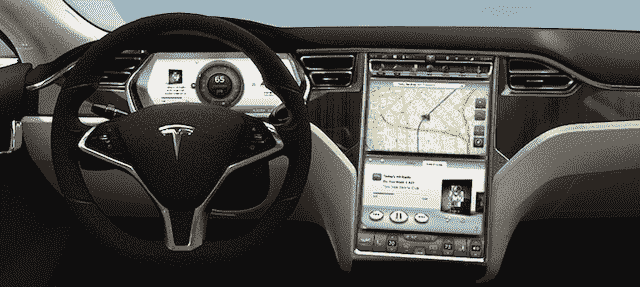
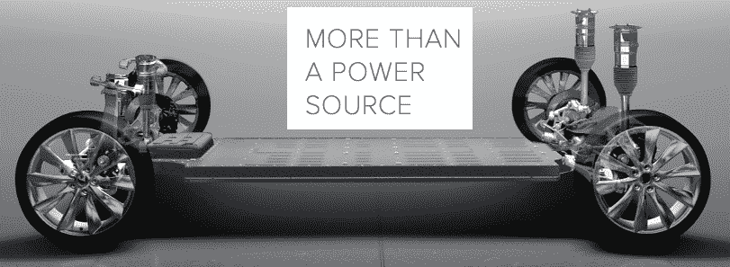

# 7 座？在轿车里？特斯拉的“平板电池”Model S (TCTV) 

> 原文：<https://web.archive.org/web/http://techcrunch.com/2011/11/14/tesla-flat-pack/>

面向后的汽车座椅曾经是以牺牲行李箱为代价的。那是因为一个巨大的内燃机必须去某个地方。但那是在特斯拉发明“扁平电池组电池”之前。扁平包装放在汽车底部，让[特斯拉的新 S 型轿车](https://web.archive.org/web/20230302233522/http://www.teslamotors.com/models)在坐 7 人时保留行李箱，一次充电可行驶 300 英里。哦，它有一个 3G 的 17 英寸触摸屏电脑，用于导航、媒体、互联网和应用程序。Model S 要到 2012 年 7 月才会上市，但在上周的 [GigaOm 路线图](https://web.archive.org/web/20230302233522/http://event.gigaom.com/gigaomroadmap/)会议上，我试玩了 TCTV 视频中展示的 Alpha 版本。

大多数电动汽车实际上只是装有电池的燃烧模型。这意味着更少的客舱或行李箱空间。甚至特斯拉的跑车也是基于双座莲花车身打造的。但是对于 Model S，特斯拉建造了一个全新的框架，电池放在底部，占据了汽车 2/3 的长度和整个宽度。据说，从行李箱中折叠出来的后向座椅是特斯拉创始人埃隆·马斯克的要求，因为他有 5 个 10 岁以下的儿子。扁平包装甚至可以兼作结构元件，增加汽车的强度和刚度。

当摇着 Model S 的家庭自酿音响系统时，扁平包装带来的非凡宽敞感就派上了用场。我发誓这是一个玻色在第一，但特斯拉建立了它的内部，它有一些严重的重击。娱乐系统、汽车控制、导航和新的应用平台都位于仪表板中央的 17 英寸触摸屏中。

这款电脑运行由特斯拉打造的直观定制操作系统，并将配备 3G 或 4G 连接，以实现快速地图下载、媒体同步和网络浏览。甚至是 wi-fi 热点。dash 还支持特斯拉的新应用平台，该平台将允许该公司和潜在的任何开发商创建应用程序，以定位杂货店，预测交通，或提供导游花絮。汽车可能成为下一个大的应用平台，特斯拉已经遥遥领先。

扁平包装内的技术赋予了该型号卓越的范围。基线 57，600 美元的版本每次充电可以行驶相当可观的 160 英里；这是一个 230 英里的中级选项。售价接近 10 万美元，尽管司机可以获得 300 英里的版本，比特斯拉主要竞争对手的汽车多行驶 3 倍多。

特斯拉通讯经理卡米尔·里基茨告诉我，“我们认为扁平包装是我们品牌的未来，我们将在未来的车型中采用它”。在这一点上，特斯拉最大的问题是电动汽车消费者群的增长速度没有它或环保倡导者希望的那么快。迄今为止，日产 Leafs 仅售出 1 万辆。特斯拉对此也有计划。里基茨告诉我，特斯拉现在正计划推出一款 3 万美元的电动汽车，以吸引大众市场..

