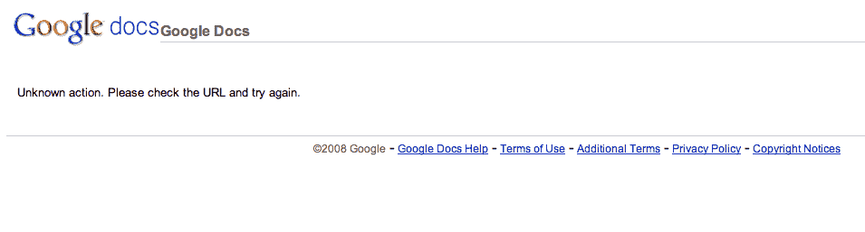

# GDrive 的测试页面出现在 Google 搜索结果中 TechCrunch

> 原文：<https://web.archive.org/web/https://techcrunch.com/2011/10/31/test-page-for-gdrive-appearing-in-google-search-results/>

如果对传闻已久的“GDrive”的存在还有任何疑问，现在出现在谷歌搜索结果中的一个页面提供了一个非常清楚的迹象，表明*有事*正在发生。在 Writely.com——在线文字处理服务[谷歌在 2006 年收购了](https://web.archive.org/web/20230205005022/https://techcrunch.com/2006/03/09/writely-confirms-google-acquisition/)——一个测试页面现在出现了，标题是“鸭嘴兽测试页面(GDrive)”

好了，你知道了。

目前，搜索结果的完整标题为“Writely 网络文字处理器-鸭嘴兽测试页面(GDrive)”，网址为 www.writely.com/BasePage.aspx。当然，当你点击进入时，链接会把你带到一个错误页面，显示一条消息“未知操作”。请检查 URL，然后重试。

应该指出的是，www.writely.com 域名本身重定向到谷歌文档。

对于那些不知道的人来说，鸭嘴兽是谷歌内部使用的 GDrive 的代号，直到 2008 年被取消。但最近的发现暗示，Google Drive 正在回归。例如，9 月的[，MG 报道称在 Chromium(作为谷歌 Chrome 测试平台的开源网络浏览器)中发现的代码引用了非公开的 URL drive.google.com。](https://web.archive.org/web/20230205005022/https://techcrunch.com/2011/09/08/google-drive-pic/)

当月晚些时候，在谷歌赞助的一次活动中，一张展示截图显示了一个看起来非常像谷歌硬盘的东西，上面甚至写着“我的谷歌硬盘”

从 MG 的早期报道来看，即将推出的服务本质上是谷歌文档的重新命名，附带一个桌面软件组件，类似于 Dropbox。经过多年的等待，谷歌最终将于何时推出 Google Drive 仍是未知数。但至少我们知道他们正在努力。

*感谢丹贝洪*

***更新**:好吧，那个测试页从 2006 年就有了，[好像是](https://web.archive.org/web/20230205005022/http://symbii.com/stories.php?sid=355&tid=25)。以前，它指向 Platypus (GDrive)的项目页面，但现在它指向 Google Docs。这里没什么好看的，走开！*

Alex 给出了一个更好的建议，他在下面的评论中指出，在给出 105 分而不是 404 分之前，去 drive.google.com 会把你转到该网站的 https 版本。