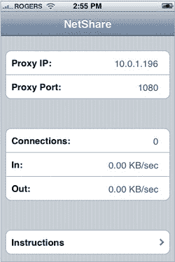

# iPhone 共享回归苹果应用商店 

> 原文：<https://web.archive.org/web/https://techcrunch.com/2008/08/01/tethering-app-returns-to-apples-app-store/>

# iPhone 共享回归苹果应用商店

你现在可以使用 [Nullriver 的](https://web.archive.org/web/20221209123340/http://www.nullriver.com/) NetShare 应用程序，通过这个[直接链接](https://web.archive.org/web/20221209123340/http://phobos.apple.com/WebObjects/MZStore.woa/wa/viewSoftware?id=286541579&mt=8)，你可以使用 iPhone 的数据连接在电脑上浏览网页。你可能想快点拿到它，因为苹果很可能会再次把它拉下来。**注意:你需要使用[直接链接](https://web.archive.org/web/20221209123340/http://phobos.apple.com/WebObjects/MZStore.woa/wa/viewSoftware?id=286541579&mt=8)，该应用不会显示在搜索结果中。**

昨晚，苹果将该应用程序发布到其应用商店，但仅过了大约 20 分钟后[就迅速撤下了](https://web.archive.org/web/20221209123340/http://www.beta.techcrunch.com/2008/07/31/tethering-briefly-comes-to-the-iphone-tempers-flare/)。该应用程序允许原始(EDGE)和 3G iPhones 的用户在移动网络覆盖的任何地方浏览互联网。

许多拥有高速数据计划的手机已经可以捆绑，但大多数运营商向用户收取高额服务费(美国电话电报公司通常每月收费约 30 美元)。iPhone 用户从未享受过这种计划，尽管越狱(被黑客攻击)的 iPhone 用户已经能够限制一段时间，但这违反了美国电话电报公司的服务条款。

NetShare 以 10 美元的一次性价格提供网络共享服务，这可能会让美国电话电报公司大动干戈，因为这完全削弱了他们收取服务费的能力。苹果公司对每个应用程序都有一个漫长的审查过程(或者至少是很长的等待时间)，但看起来这个应用程序可能不知何故被遗漏了。