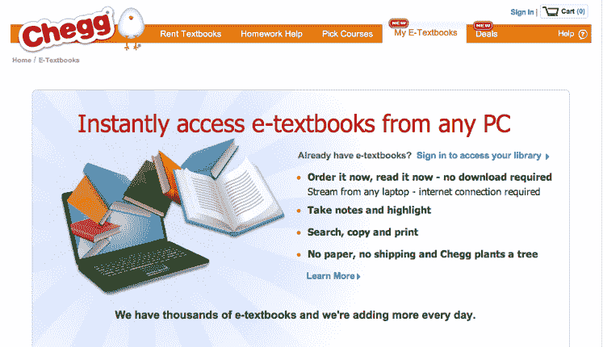

# 教科书租赁巨头 Chegg 现在提供 HTML5 数字图书；购买在线辅导服务财富 TechCrunch 的学生

> 原文：<https://web.archive.org/web/http://techcrunch.com/2011/08/18/textbook-rental-giant-chegg-goes-digital-now-offers-html5-books/>

随着全国各地的大学生开始返回宿舍，购买新学期的书籍，教科书租赁巨头 [Chegg](https://web.archive.org/web/20230205025644/http://www.chegg.com/) 发布了一系列新公告，在这一领域掀起了波澜。首先，Chegg 最终走向数字化，并将在其平台上稳步推出电子教科书，目标是在今年年底前向学生提供数百万本纸质书籍和电子教科书。第二，Chegg 与许多出版商(包括五大教育出版商中的四家)合作，向学生提供电子教科书，如 Cengage Learning、Elsevier、F.A. Davis、Macmillan、McFarland、McGraw-Hill、牛津大学出版社、Rowman & Littlefield、Taylor and Francis 和 Wiley。

作为背景，Chegg 于 2007 年在[成立，现已成为最大的大学生教科书租赁巨头。事实上，7，000 个校园中的数百万学生正在使用 Chegg 进行租赁。但是在同一个空间里还有其他一些](https://web.archive.org/web/20230205025644/https://techcrunch.com/2008/12/17/confirmed-kleiner-perkins-gets-into-textbook-rentals-as-chegg-raises-25-million/)[的竞争对手](https://web.archive.org/web/20230205025644/https://techcrunch.com/2010/12/09/bookrenter-gap-chegg/)，比如 [BookRenter](https://web.archive.org/web/20230205025644/http://www.bookrenter.com/) 、 [CampusBookRentals](https://web.archive.org/web/20230205025644/https://techcrunch.com/2011/08/02/chegg-rival-campusbookrentals-com-closes-20-million-financing-round/) 和 [eCampus](https://web.archive.org/web/20230205025644/http://www.ecampus.com/) 等等；该公司已将其战略扩展到不仅仅是租赁，而是在这一领域展开竞争。

在过去的一年里，Chegg 收购了 CourseRank 和 Cramster，这两个网站帮助学生选择课程并为他们学习。该公司最近还推出了学习指导服务。

该公司还刚刚宣布收购了财富的[学生，这是一个在线辅导市场，面向那些需要帮助或可以帮助他人完成家庭作业的人。财富的学生，成立于 2005 年，允许学生就各种各样的主题提出问题或张贴教程。学生们可以提出一个问题，然后发送给财富专家学生网络，这些专家又会撰写一篇帮助回答问题的教程，并收取费用。学生也可以充当专家，自己挣钱写教程。这项服务已经被 30 多万学生使用。](https://web.archive.org/web/20230205025644/http://studentoffortune.com/)

首席执行官 Dan Rosensweig 简单地说——如果脸书是你的社交图谱，LinkedIn 是你的职业图谱，那么 Chegg 希望成为你的学生图谱的集中平台。它基本上变成了一个一站式商店(该网站也进行了重新设计，以适应这一新战略)，让大学生找到教育资源和服务，从教科书到课程建议，再到笔记。正如 Rosensweig 解释的那样，“我们希望学生一年中有 300 天使用 Chegg，而不是在每学期之前。”

当然，我们都知道数字教科书是未来的发展方向，大大小小的公司都在参与其中。亚马逊现在[在 Kindle 上提供电子教科书](https://web.archive.org/web/20230205025644/https://techcrunch.com/2011/07/18/amazon-launches-kindle-textbook-rental-service-allows-students-to-store-notes-in-the-cloud/)。Kno(实际上是由 Chegg 的联合创始人 Osman Rashid 创建的)也是[的成员](https://web.archive.org/web/20230205025644/https://techcrunch.com/2011/06/04/kno-ipad/)，正如[暗示的那样。但是有一件事对齐格网有利，那就是数百万学生已经知道这个品牌是教科书租赁巨头。](https://web.archive.org/web/20230205025644/http://www.crunchbase.com/company/inkling-inc)

有了数字图书，学生们可以下载 HTML5 格式的基于浏览器的电子教科书，这些教科书可以在任何设备上使用，包括 iPad。每本书都将带有一键主题导航，并包括突出显示、做笔记和直接在书中搜索的功能。此外，电子教科书将包括一个“等待时阅读”工具，学生可以在等待纸质教科书时在线访问教科书。对于那些等到最后一刻才订购教科书的人来说，这是一个非常有用的功能(我知道我在大学和研究生院的时候就是这样)。你也可以选择租赁或购买电子教材。

Rosensweig 说，教科书数字版本的发布将是一个渐进的过程，网站上已经有数万本数字书籍。今年年底，我们的目标是为网站上每两次搜索中的一次提供电子书。他还补充道，齐格网优先考虑的是提供人们想要的流行书籍的数字版本(即必读教材)。

很明显，Rosensweig 对 Chegg 有一个雄心勃勃的计划，在与他交谈时，很明显，他非常乐观地认为该公司将成为大学生及其他人的首选教育资源和平台。根据我们的计算，1 月份的收入大约为 1.5 亿美元，从那以后这个数字可能还在增长。Rosensweig 确认收入“增长良好”，特别是现在该公司已经通过[每日交易](https://web.archive.org/web/20230205025644/http://adage.com/article/digital/netflix-textbooks-chegg-launch-daily-deals/227750/)以及通过该公司收购的技术提供的优质服务增加了新的收入来源。事实上，他说所有的收入渠道都增加了。

除了收入，还有关于 Chegg 计划首次公开募股的传言。Rosensweig 这样评价一次公开募股:*如果有意义，我们会考虑。现在，我们看到了非常好的增长，并且获得了大量的融资。迄今为止，Chegg 已经筹集了 2 . 19 亿美元，最近一次是在去年秋天，为其金库增加了 7500 万美元。*

我有一种感觉，在不久的将来，我们会看到更多来自齐格网的侵略性电影。

