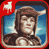
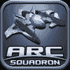
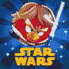
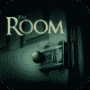

# 2012 年十大最佳 iOS 和 Android 游戏

> 原文：<https://web.archive.org/web/https://techcrunch.com/2012/12/29/the-10-best-ios-and-android-games-of-2012/>

**编者按:** *[斯蒂芬·达诺斯](https://web.archive.org/web/20230328073511/http://drolldrumroll.tumblr.com/)是移动应用探索网站 [Appolicious](https://web.archive.org/web/20230328073511/http://www.appolicious.com/)* 的副主编。在推特上关注他 [@sdanos](https://web.archive.org/web/20230328073511/https://twitter.com/sdanos) 。

今年最吸引人的游戏要么是用最先进的图形和丰富的故事推动了极限，要么是完善了基于触摸的设备已经证明的公式。最佳游戏也弥补了休闲玩家和铁杆玩家之间的差距。

一些开发者(特别是 Phosphor Games 和 Vivid Games)追求逼真的 3D 图形，这些图形通常包含几个小时的基于故事的游戏，类似于主机游戏。其他像 Rovio 和 RocketCat Games，坚持生产重复的，休闲的游戏体验，让我们完全投入。在同等条件下，这些不同的方法产生了真正引人入胜的游戏，充分利用了移动设备的功能和处理能力。

在这个列表中有游戏的开发者应该为他们的创作感到非常自豪。尽管某些类型已经饱和(如“拿起就玩”或侧滚游戏)，以及迫使客户通过应用内购买为内容付费的不受欢迎的货币化趋势，但这些天才设法制作出了无限上瘾和有益的游戏。下面列出的精选是由合适的顾问(最著名的是游戏大师安德鲁·科兹亚拉)和我们用户社区的成员策划的。

我们也有一份单独的 2012 年最佳 iOS 和 Android 应用清单。

** 霍恩** ** (iPhone、iPod touch、iPad、** [ **安卓**](https://web.archive.org/web/20230328073511/http://www.androidapps.com/games/apps/1273202-horntm-zynga?tracking_id=search_results%3A64304640-2847-0130-1abe-4040afb8cd6d)**【6.99 美元】** 角色霍恩是一个年轻铁匠的徒弟，他必须打败被恐怖诅咒改造成村民的巨型怪物。使用类似于 [Infinity Blade](https://web.archive.org/web/20230328073511/http://www.appolicious.com/games/apps/478390-infinity-blade-chair-entertainment-group) 的近战战斗系统，但主要的游戏性增强，如使用十字弓和解谜，在 Horn 的开发过程中，Phosphor Games 团队的开发人员真的很费心思。Horn 是 2012 年最好的游戏，因为它结合了富有想象力的叙事和顶级的图形，证明了尽管 iOS 设备有局限性，但具有可爱故事的手机游戏也可以很美。Horn 对年轻和年老的游戏玩家都有吸引力，这是一个很好的标题，它将启发你智能手机或平板电脑能够处理什么。我们应该注意到，Horn 在早期的 Android 设备和操作系统上确实受到了一些影响。

**ARC Squadron****(iPhone、iPod touch、iPad 免费——仅限限时)**
ARC Squadron 是一款轨道射击游戏，将玩老式任天堂 64 主机游戏的复古体验与专门针对触摸屏设备的最先进图形相结合。由虚幻引擎 3 开发工具包提供动力，ARC 中队让玩家在星际战争中尝试他们的手(和手指)。银河系的每一个区域都有一些关卡，沿途都有额外的挑战关卡，在史诗般的 boss 大战中达到高潮。ARC 中队本质上是非常街机化的，因为每一关的分数都直接转化为货币，让玩家升级和购买新的船只、武器和皮肤。不知何故，ARC 中队设法模仿经典主机游戏，如*星狐 64* ，但在移动媒体环境中感觉新鲜。

** 【愤怒的小鸟】星球大战** ** (iPhone、iPod touch 99 美分、**[**iPad**](https://web.archive.org/web/20230328073511/http://www.appolicious.com/games/apps/1363157-angry-birds-star-wars-hd-rovio-entertainment-ltd)**【2.99 美元、** [ **安卓智能手机** ](https://web.archive.org/web/20230328073511/http://www.androidapps.com/games/apps/1360521-angry-birds-star-wars-rovio-mobile-ltd) **免费、** [ **安卓平板电脑**](https://web.archive.org/web/20230328073511/http://www.androidapps.com/games/apps/1361566-angry-birds-star-wars-hd-rovio-mobile-ltd)**【2.99 美元)**
星球大战商品销售，在迪士尼收购前后均有愤怒的小鸟家族的最新版本简直太棒了。老鸟们被重新装扮成卢克、汉、欧比万、朱伊和其他人。这些鸟也获得了所有新的能力，包括射击爆能枪和挥舞光剑。这款游戏是老派《愤怒的小鸟》力学和《愤怒的小鸟》空间重力力学的完美结合(也是任何“2012 年最佳”榜单 **)** 。添加所有《星球大战》的参考资料和视觉效果(仅来自原三部曲),你就有了一个超越这个世界的游戏。

** 【雷曼丛林快跑】** ** (iPhone，iPod touch，iPad，**[**Android**](https://web.archive.org/web/20230328073511/http://www.androidapps.com/games/apps/1308416-rayman-jungle-run-ubisoft-entertainment)**【2.99 美元】**
苹果将这款育碧命名为 2012 年度游戏，理由充分。在这个游戏变酷之前，我们中的许多人都在称赞它。基于非常出色的*雷曼:起源*(一款基于控制台的平台游戏，甚至可以与*马里奥*相媲美)，这款自动滚动游戏设法保留了其前作的所有创意和奇异魅力，但具有较小的级别和一半的控件。虽然严肃地说，育碧为这个简单的游戏剥离了“起源”的核心，但它仍然很有趣，视觉效果也一如既往地清晰和充满活力。这比其他跑步者更具挑战性，但不要跳过这一项。

** 凸版印刷——文字游戏** **(iPhone、iPad 免费)** 移过去，[与朋友的文字](https://web.archive.org/web/20230328073511/http://www.appolicious.com/games/apps/27773-words-with-friends-free-zynga-mobile)。由 atebits 开发，Letterpress 是一个创造性的多人文字游戏，混合了拼字游戏和国际象棋的策略。这个游戏的虚拟棋盘上覆盖着红色和蓝色的方块，每个方块代表你或你的对手。目标很简单:在拼写单词时，尽可能多的更换瓷砖来匹配你的颜色。当瓷砖用完时，游戏结束。它既有助于拥有大量字母，又知道何时进行防守，通过在字母周围放置瓷砖来阻挡字母。LetterPress 通过 Game Center 支持异步多人游戏，因此你可以同时与来自世界各地的尽可能多的玩家对抗。

** 击败偷袭者** **(iPhone，iPod touch，iPad $2.99)** 
击败偷袭者优雅地将节奏游戏(玩家随着游戏中播放的音乐节拍轻轻敲击)，与益智游戏和潜行动作结合在一起。您将需要点击节拍，使节拍潜行强盗字符采取他的鬼鬼祟祟的步骤，并计时通过游戏的障碍和陷阱。这款游戏是对触摸屏游戏的巧妙运用，有很棒的艺术风格和音乐选择，很容易玩，但很难掌握。

**Punch Quest****(iPhone、iPod touch、iPad)(免费)** Punch Quest 是一款令人印象深刻的侧滚式、无休止的跑步游戏，主要目标是用一连串的上钩拳和刺拳迎面遇到巨大的障碍。敌人包括虚弱的骷髅、持盾的兽人、喷火的小鬼和施法的幽灵。在游戏中，你的完全可定制的主角收集称为“punchos”的硬币，用于购买技能、超级移动、提升和升级。甚至还有奖励等级，你的战士骑着一只从嘴里射出激光的恐龙，或者变成一个翻跟斗的侏儒！RocketCat Games 是 iOS 游戏领域最可靠、最有才华和最棒的开发者之一，负责开发 [Hook Champ](https://web.archive.org/web/20230328073511/http://www.appolicious.com/games/apps/94793-hook-champ-jeremy-orlando) 游戏和优秀的 [Mage Gauntlet](https://web.archive.org/web/20230328073511/http://www.appolicious.com/games/apps/848883-mage-gauntlet-jeremy-orlando) 。

** 真实拳击** **(iPhone、iPod touch、iPad、iPad mini) $4.99** 真实拳击，由 Vivid Games 开发，为触摸屏提供一套设计良好的手势控制，结合漂亮的控制台质量图形。您设备的摄像头使用 V-Motion 手势控制系统捕捉出拳手势。这款游戏有一个惊人有效的职业模式，你可以在其中发展、训练和定制你的职业拳击手。当你建造你的战士，甚至带他在线进入游戏中心的实时多人战斗时，你将很难找到这个游戏的缺点。

**Jetpack Joyride****(Android)免费** Jetpack Joyride，由 Halfbrick Studios 于 9 月在 Android 上发布，是最接近完美的无尽奔跑游戏。虽然它在 2011 年推出并飙升至 iOS 排行榜的首位，但它在 Android 市场的存在是巨大的。在 Jetpack Joyride 中，你扮演暴躁和超级男子汉的 Barry Steakfries，他从实验室偷走了一个绝密的机枪动力喷气背包，却遇到了成千上万的障碍，包括电柱、火箭和惊恐的科学家。你的目标是收集硬币，并在死前走得越远越好。这个游戏有着非凡的幽默感和令人印象深刻的一系列可互换的服装、喷气背包、电源和交通工具。让 Jetpack Joyride 与众不同的是，在它简单的公式背后，有一个非常令人上瘾的任务/挑战系统，促使你一次又一次地玩。难度和学习曲线设置完美，因此即使是休闲游戏玩家也不会感到不知所措。

** 房间** **(iPad，iPad mini) $1.99** 与房间一起，fire Games 推出了今年最耐人寻味的益智游戏。令人难以置信的谜题，超现实的氛围，以及令人惊叹的高清质量的 3D 图形，使这个房间成为每个拥有 iPad 2 或更高版本的游戏玩家的必要应用程序。这个游戏表面上是一个谜，你可以通过华丽的盒子里的谜题用单个手指控制来解开。这绝对是 2012 年发布的看起来最真实的游戏，甚至比 [Zen Bound 系列](https://web.archive.org/web/20230328073511/http://www.appolicious.com/searches/site?term=zen+bound)的游戏还要真实。这个房间被设计成一个游戏，虽然它因不常见的恐怖/恐惧主题而被评为 9+级，但如果你的家人足够冷静并能处理悬念，你可以和他们一起玩这种游戏。