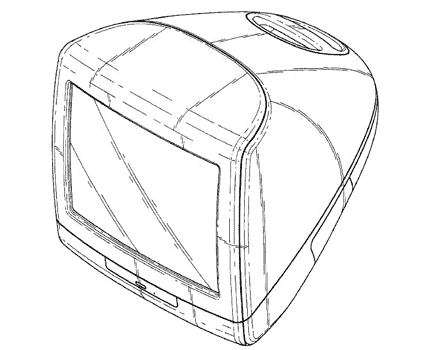

# 定义史蒂夫·乔布斯的 7 项标志性专利 

> 原文：<https://web.archive.org/web/https://techcrunch.com/2011/08/25/the-7-iconic-patents-that-define-steve-jobs/>

史蒂夫·乔布斯是一个注重细节的人。他和他忠诚的员工一起，完善了别人认为完美的东西。他名下有 313 项专利，从 Apple III 到 iPod 的丙烯酸包装。几乎所有的都很著名，但只有少数是标志性的。

**原装一体机，Mac 128K**

专利号 [D285，687](https://web.archive.org/web/20230204234544/http://www.google.com/patents/about?id=eGs9AAAAEBAJ&dq=D285687) 不是史蒂夫的第一个专利，但如果你愿意的话，它是开创这一切的一个。这项专利声称由现在经典的雷德利·斯科特商业公司推出的最初的 Macintosh 128K 的设计。这项专利没有谈到它的图形用户界面，只是简单、桌面友好的一体式电脑设计，这种设计将在 14 年后 Macintosh 的复兴中再次出现。

**每人一台蓝色 iMac】**

史蒂夫·乔布斯在 1996 年收购了他的初创公司 NeXT 后，发现自己又回到了苹果公司的掌舵人的位置。乔布斯随后扼杀了包括牛顿平板电脑在内的许多项目。然后，在 1998 年，半透明的 Bondi Blue iMac ( [专利 D413，105](https://web.archive.org/web/20230204234544/http://www.google.com/patents?id=Pp4ZAAAAEBAJ&printsec=frontcover&dq=D413105&hl=en&ei=S1pWTtOFNKm2sQL634WgDA&sa=X&oi=book_result&ct=result&resnum=1&ved=0CCwQ6AEwAA) )击中了像 SCSI、ADB 和软盘驱动器这样的 sans 标准设备。取而代之的是两个(相对较新的)USB 端口和一个光驱。它与个人电脑领域的任何东西都大不相同。但它也在 139 天内售出了 80 万台，并向苹果忠实用户和新一代粉丝展示了苹果的真正灵魂。

**iMac 圆盘**

并不是每一项史蒂夫·乔布斯的专利都能为苹果带来稳定的现金流。[专利 d418125](https://web.archive.org/web/20230204234544/http://www.google.com/patents?id=kXwYAAAAEBAJ&printsec=frontcover&dq=D418125&hl=en&ei=rFpWTpibN--rsAK4l5zHDA&sa=X&oi=book_result&ct=result&resnum=1&ved=0CCwQ6AEwAA)是光标控制装置。但不是任何一只老鼠。不:这款鼠标上有史蒂夫·乔布斯和乔纳森·伊夫的名字，它是因为臭名昭著的 iMac puck 而被认为是个人电脑历史上最差的鼠标。但它显示了一家试图通过创新设计为自己赢得声誉来重建的公司的成长之痛。虽然它在弯曲的 iMac 旁边看起来很棒，但它不适合人手。

**iPod，你口袋里的一千首歌**

iMac 复兴了 MaciPod 是完全不同的东西。苹果的 MP3 播放器在技术上是在游戏后期推出的，因为在 MP3 播放器领域已经有了主要的玩家。然而，iPod 通过其“[这就是它的工作方式](https://web.archive.org/web/20230204234544/http://www.youtube.com/watch?v=nWqj6OQQOHA)”广告向公众展示了他们所需要做的就是将设备插入 Mac 的 Firewire 端口，iTunes 会完成剩下的工作。史蒂夫的许多专利涉及最初的 iPod 设计和后续。这些范围广泛的专利保护了经典的点拨轮设计，并在苹果推出 iPhone 之前为其提供了全新的收入来源。

**即使是电源适配器也可以是完美的**

专利 D478，310 于 2001 年获得授权，苹果公司至今仍为每台 Mac 电脑配备类似的电源适配器。任何 Mac 用户(不一定是粉丝)都会承认这是对细节关注的缩影。这种双模式、适合旅行的适配器还没有被任何 Windows PC 制造商复制，这让他们对克隆 MacBook Pro 的痴迷感到相当困惑。

**众多 iPhone 专利**

2007 年 iPhone 发布后涌现出大量模仿者，这再好不过地证明了 iPhone 的成功。当然，苹果已经卖出了数百万部手机，但是 iPhone 的成功催生了无数的克隆产品，试图通过相似的硬件和软件复制这一突破性的成功。[2007 年 1 月 5 日提交的专利 D558，756](https://web.archive.org/web/20230204234544/http://www.google.com/patents?id=AsOhAAAAEBAJ&pg=PA1&dq=Patents+D558756&hl=en&ei=N1xWTvGlNeGKsgLjjZHKDA&sa=X&oi=book_result&ct=result&resnum=1&ved=0CCwQ6AEwAA#v=onepage&q&f=false) 、 [D558，757](https://web.archive.org/web/20230204234544/http://www.google.com/patents?id=A8OhAAAAEBAJ&printsec=frontcover&dq=D558757&hl=en&ei=Q1xWTqfNKbDhsQLGnZGFDA&sa=X&oi=book_result&ct=result&resnum=1&ved=0CCwQ6AEwAA) 和 [D580，387](https://web.archive.org/web/20230204234544/http://www.google.com/patents?id=FDCwAAAAEBAJ&printsec=frontcover&dq=D580387&hl=en&ei=T1xWTrqXHOOrsQLuzMWiDA&sa=X&oi=book_result&ct=result&resnum=1&ved=0CCwQ6AEwAA) ，就在最初的 iPhone 发布前四天，为更多保护 iPhone 风格和外观的专利奠定了基础。

**玻璃楼梯**

苹果并没有颠覆平板电脑、手机、MP3 播放器或个人电脑，苹果商店的零售是正确的，史蒂夫·乔布斯拥有两项关于玻璃楼梯的专利。[2003 年的第 478999 号专利](https://web.archive.org/web/20230204234544/http://www.google.com/patents?id=TisPAAAAEBAJ&printsec=frontcover&dq=D478999&hl=en&ei=TmpWTsXEL8ilsQLbnc2dDA&sa=X&oi=book_result&ct=result&resnum=1&ved=0CCwQ6AEwAA)授予史蒂夫·乔布斯和其他人装饰设计。事实上，去苹果的主要地点走一趟，会让你感受到史蒂夫最具标志性的想法之一。

* * *

最受欢迎的照片要归功于 tsevis，他还有十几张史蒂夫·乔布斯的照片。