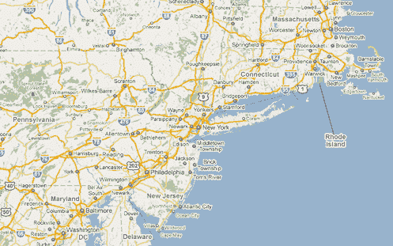

# 谷歌地图惊人的可读性 TechCrunch

> 原文：<https://web.archive.org/web/http://techcrunch.com/2010/12/02/the-amazing-readability-of-google-maps/>

根据我的经验，谷歌地图一直是最易读的在线地图服务，尽管从早期开始，最差的也走过了很长的路。我想这就是谷歌神奇的力量，它能如此快速地返回搜索结果，并在几秒钟内将电子邮件发送到我的手机上。但是，虽然让这些事情发生的动力很大程度上是在幕后，但谷歌对地图界面所做的优化在你每次使用它的时候就在你面前。但是你可能没有注意到他们。

[致力于此类分析的博客 41Latitude](https://web.archive.org/web/20230203002242/http://www.41latitude.com/post/2072504768/google-maps-label-readability) 上的这篇文章对这些优化进行了细致的分析，并分析了如果竞争对手做同样的事情，他们会是什么样子。这听起来很枯燥，但我发现这是一本有趣的书，也是你不能忽视的东西之一。

 
(点击查看大图)

主要区别似乎在于城市标签的放置和加权方式。低对比度的背景和各种层次的白色轮廓使较大的城市显得突出，而城市标签相对于其圆点位置的宽松规则允许项目之间有更好的间距。显然，大城市周围有一种“光环”,抑制了较小项目的标签，以便更好地在地图上突出大城市和路线。帖子里有这些技术的插图，如果你对心理视觉优化和 UI 规划感兴趣，我推荐你去看一看。

我提到它并不仅仅是为了给谷歌一个鼓励(尽管他们值得，我现在也给了他们)，而是为了提出这样一个事实，即像这样的小事确实会积累起来。正如谷歌地图所示，你可以看到的优势对于留住用户非常重要。如果他们知道为什么喜欢你的服务，那很好；如果他们不知道，那也很好。当然，不同的用户可能会更喜欢 Bing 的地图，因为他们的审美不同——只要它对细节的关注相同。

像 Flickr 这样的网站，如果不把照片放在最前面和中间，分辨率高，压缩效果好，导航简单，很快就会被竞争对手挤垮。如果你的潜在用户因为一些他们不太清楚的事情而立刻离开网站，那么世界上最好的功能集也没用。就像 Gladwell 的 Blink 中的想法，你可以在几分之一秒内完成大量的处理，你可以在同样长的时间内对谷歌地图或 Flickr 等服务进行相当全面的评估。

微小的优化为用户创造了一个友好的环境，这是网站不够关心的。许多人甚至没有意识到自己正在这样做，他们会发现糟糕的用户界面和糟糕的表现。所以，给竞争对手的一个教训是:小事情不会自己照顾自己，但是如果你不小心的话，它们可能会照顾你。

如果你对地图的可用性特别感兴趣，[41 纬度](https://web.archive.org/web/20230203002242/http://www.41latitude.com/)有很多关于这个话题的帖子。

[通过[元过滤器](https://web.archive.org/web/20230203002242/http://www.metafilter.com/98128/Seriously-the-Most-You-Will-Ever-Read-About-Map-Labels)，一位评论者指出有趣的[法塔莫甘娜](https://web.archive.org/web/20230203002242/http://s%C3%B3larsteinn.com/)