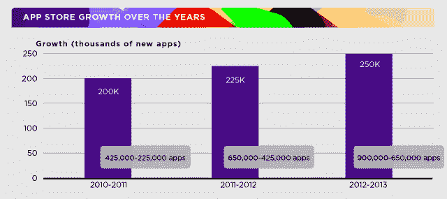

# App Store 淘金热才刚刚开始 

> 原文：<https://web.archive.org/web/https://techcrunch.com/2013/06/10/the-app-store-gold-rush-has-only-just-begun/>

# 应用商店淘金热才刚刚开始

应用生态系统没有放缓的迹象。这就是苹果今天宣布的内容，它透露现在有 900，000 个 iOS 应用程序可用于 iPhone、iPad 和 iPod touch。尽管应用商店[正在被填满](https://web.archive.org/web/20221206011527/https://beta.techcrunch.com/2013/02/20/the-app-stores-are-getting-full-only-2-of-iphone-top-publishers-in-u-s-are-newcomers-3-on-google-play/)，并且将更多的收入转移给顶级出版商，但市场本身并没有因此而减少。

从 2012 年到 2013 年，该公司在其年度 WWDC 发布会期间，在其应用商店增加了 25 万个 iOS 应用程序。一年前，它增加了 22.5 万个应用程序(2011 年至 2012 年)，在此之前，大约有 20 万个新应用程序上线。

实际上，这是令人难以置信的增长，因为你几乎会认为应用程序商店的增长会反过来——当开发者在虚拟货架上放满新应用程序时，会有一个最初的淘金热，然后随着所有“好主意”被采纳，增长会在多年后放缓。

即使是现在，独立开发者也比以往任何时候都更难在应用商店中真正*制作* *it* ，但这似乎并没有影响新应用的数量。虽然一些人现在开始将注意力转移到 Android 和 Google Play 上(Google Play 也开始看到自己的一些成功故事)，但这种转移似乎并没有以苹果 iOS 为代价。

App Store 淘金热显然仍处于早期阶段。

