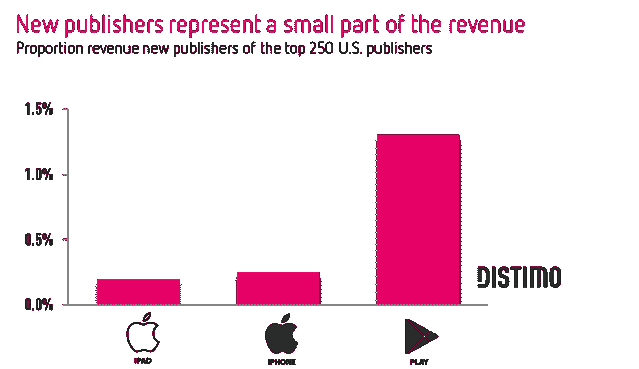
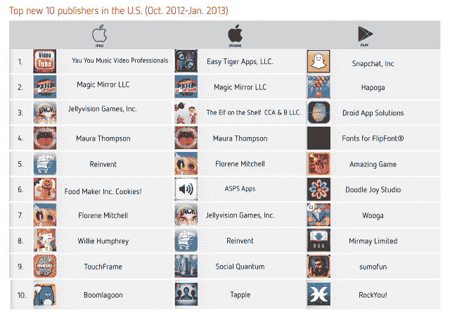
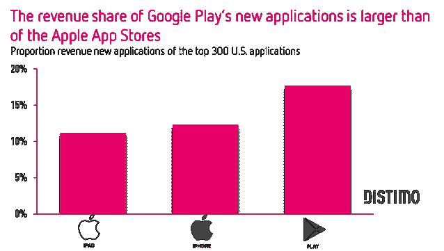
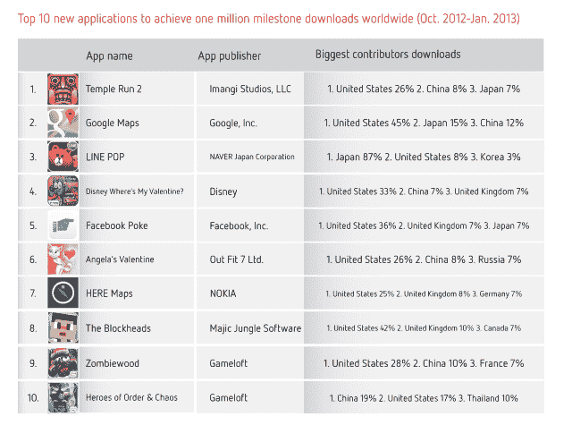
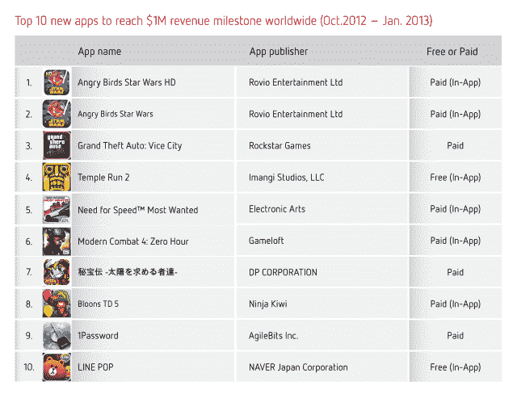

# 应用商店越来越满:在美国，只有 2%的 iPhone 顶级发行商是新用户，在 Google Play TechCrunch 上只有 3%

> 原文：<https://web.archive.org/web/https://techcrunch.com/2013/02/20/the-app-stores-are-getting-full-only-2-of-iphone-top-publishers-in-u-s-are-newcomers-3-on-google-play/>

应用商店分析公司 Distimo [今天](https://web.archive.org/web/20230206164931/http://www.distimo.com/report/download-latest)发布的一份报告显示，在今天的移动应用商店中取得突破是非常非常困难的，iPhone 应用商店中排名前 250 的出版商中只有 2%是“新人”，而 Android 商店 Google Play 中只有 3%。

Distimo 发现，在较小的国家，新发行商的份额往往略高 Google Play 和 iPhone 应用商店的份额均为 6%。

这也表明了当前市场的紧张程度，前 250 个应用程序的总收入中只有 0.25%流向了新的 iPhone 应用程序发行商，而 1.2%流向了 Google Play 上的新 Android 应用程序发行商。

如果你是一个新人，你似乎有更好的机会在 Google Play 上赚钱——至少在开始阶段。这再次向[表明，我们这里开始满负荷运转的可能性](https://web.archive.org/web/20230206164931/http://bits.blogs.nytimes.com/2013/02/15/digital-diary-are-we-suffering-from-mobile-app-burnout/)。iOS 商店历史稍长，比谷歌的安卓商店拥有更多的应用。

为了得出这些结论，该公司研究了从 2012 年 10 月到 2013 年 1 月 iOS 应用商店和 Google Play 的趋势。不幸的是，有一个发生在假期的时间框架稍微扭曲了数据，因为这意味着一些圣诞节相关的应用程序也做得很好，这肯定是一个暂时的情况。例如，从货架上的精灵中找到精灵和从 OfficeMax 中找到 ElfYourself 表现很好——这也表明了假期对应用销售的影响。

以上是 app store (iPad、iPhone 和 Google Play)排名前 10 的新发行商。正如所料，采用反映了游戏的流行和受欢迎程度。少数非游戏应用往往与照片或视频相关，只有 Snapchat 例外，它在 Google Play 中占据了首位。

更有趣的数据之一是，大多数应用商店的新来者——就新流行的应用程序而言——实际上并不是来自新的*发行商*。相反，最成功的新应用来自那些已经成名的出版商。

总体而言，新加入 app store 的公司为 Google Play 发布的应用多于 iOS 应用商店，前者平均发布 6 个应用，后者发布 2 个应用。Distimo 推测，这可能是因为应用商店审批过程中的困难。

**Google Play 上的新应用赚了更多钱**

与此同时，尽管新发行商很难打入应用商店，但看到新书登上排行榜却更为常见。在美国，iPhone 应用商店前 300 个应用中有 17%是新应用，Google Play 中有 12%是新应用。同样值得注意的是，如上所述，新的 Android 应用程序获得的收入(18%，包括应用内购买)比 iPhone 应用程序(12%)多。

【T2

**100 万里程碑**

与调查结果相关的是，有多少新应用达到了“100 万里程碑”在 TechCrunch，我们看到初创公司和应用程序制造商在几乎任何指标——下载量、动作/更新量、用户数等——达到 100 万时，都会发布新闻。但是这年头下载量达到 100 万有多难？

似乎至少对于知名的热门制作人来说，这几乎是小菜一碟。短短几天，神庙逃亡 2、谷歌地图和 LINE POP 就达到了这个里程碑。在该报告的时间段内，下载量达到 100 万的十大新应用包括(按顺序):神庙逃亡 2、谷歌地图、LINE POP、迪士尼《我的情人在哪里》？、脸书·普克、安吉丽娜·瓦伦丁、诺基亚的 HERE Maps、Majic Jungle Software 的 The Blockheads(真正的新人！)，以及 Gameloft 的《僵尸之木》和《秩序与混乱的英雄》。

还有什么比下载更好？钱。

Distimo 还调查了哪些新应用达到了 100 万美元的收入里程碑，发现名单中包括大牌品牌。《愤怒的小鸟》《星球大战》(和高清版)一周就赚了 100 万美元，《侠盗猎车手:罪恶之城》和《神庙逃亡 2》也是如此。前 10 名中有 8 个也是付费应用，其中一半使用应用内购买。其中两个是免费应用，可以在应用内购买。

[ *图片:Distimo*