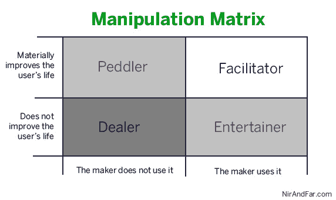

# 操纵的艺术 

> 原文：<https://web.archive.org/web/https://techcrunch.com/2012/07/01/the-art-of-manipulation/>

**编者按:** *[尼尔·埃亚尔](https://web.archive.org/web/20230119203859/http://www.nirandfar.com/about)是两家创业公司的创始人，也是多家湾区公司和孵化器的顾问。他是斯坦福大学商学院市场营销学讲师，并在 NirAndFar.com 大学撰写关于心理学、技术和商业交叉的博客。在 Twitter [@nireyal](https://web.archive.org/web/20230119203859/http://twitter.com/#!/nireyal) 上关注他，并在这里查看他以前在 Techcrunch 上的帖子。*

让我们承认这一点，我们在消费者网络行业是在操纵业务。我们制造产品是为了说服人们做我们想让他们做的事情。我们把这些人称为“用户”，即使我们没有大声说出来，我们也暗暗希望他们每个人都变得极度上瘾。

用户带着我们的技术上床睡觉。当他们醒来时，他们会在向他们所爱的人说“早上好”之前查看通知、推文和更新。伊恩·博格斯，著名的游戏创作者和教授，将成瘾技术的浪潮称为“本世纪的香烟”，并警告说同样会上瘾和具有潜在破坏性的副作用。

## **什么时候操纵是错的？**

操纵是一种精心设计的体验，旨在改变行为——我们都知道那是什么感觉。当我们感觉到有人试图让我们做一些我们不会做的事情时，我们会感到不舒服，比如在汽车经销商处或分时度假演示时。

然而，操纵也不全是坏事。如果是这样的话，如何解释那些严重依赖用户肆意操纵的数十亿美元的产业？如果操纵是为了改变行为而精心设计的体验，那么历史上最成功的大众操纵产品之一的慧俪轻体就符合这个定义。

就像在消费者网络行业一样，慧俪轻体客户的决定是由系统的设计者编程的。然而很少有人质疑慧俪轻体的道德。但是有什么区别呢？为什么通过华而不实的广告或令人上瘾的电子游戏操纵用户被认为是令人厌恶的，而严格的食物配给制度却被认为是值得称赞的？

## 一个更容易上瘾的世界

不幸的是，我们的道德指南针还没有跟上科技发展的步伐。无处不在的网络接入，以前所未有的速度传输大量的个人数据，创造了一个更容易上瘾的世界。上瘾正在加速，根据 Y Combinator 的保罗·格拉厄姆的说法，我们还没有时间开发社会“对上瘾的新事物的抗体”格雷厄姆将责任推给了用户:“除非我们想成为每一种新成瘾的煤矿中的金丝雀——这些人的悲惨例子成为后代的教训——否则我们必须自己找出要避免什么以及如何避免。”

但是那些制造这些操控体验的人呢？毕竟，释放这些令人上瘾的技术的公司是由具有道德是非感的人组成的。我们也有容易上瘾和被操纵的家庭和孩子。我们代码抛接者和行为设计者对我们的用户，对后代，对我们自己有什么共同的责任？

## **操纵矩阵**

我为企业家、雇员和投资者提供了一个简单的决策支持工具，在产品发布或代码编写之前就可以使用；甚至在客户开发开始之前。操纵矩阵并不试图回答哪些企业是道德的，哪些企业会成功。它也没有描述什么能成为什么不能成为[习惯养成技术](https://web.archive.org/web/20230119203859/http://www.nirandfar.com/2012/03/how-to-manufacture-desire.html)。矩阵试图帮助你回答“我能吸引用户吗？”而是“我应该尝试吗？”

要使用操纵矩阵，制造者需要问两个问题。首先，“我会自己使用产品吗？”第二，“该产品会帮助用户实质性地改善他们的生活吗？”

## **主持人**

当你创造一些你会使用并相信会让用户的生活变得更好的东西时，你就在促进一个健康的习惯。值得注意的是，只有你才能决定你是否真的会使用这项服务，以及“实质性地改善用户的生活”到底意味着什么。

如果你发现自己在问自己这些问题时局促不安，或者需要以“如果我是……”开头写一段开场白，停下来！你失败了。你必须真的想使用这个产品，并且相信它会给你和你的用户的生活带来实质性的好处。一个例外是，如果你年轻的时候是一个用户。例如，在一个教育公司的例子中，你可能现在不需要使用这个服务，但是你肯定在不久前会使用它。但是请注意，你离以前的自己越远，成功的几率就越低。

虽然我不认识马克·扎克伯格或 Twitter 的创始人，但我相信从他们有据可查的故事来看，他们会认为自己在这个象限制造产品。还有很多公司创造新产品，通过促进健康习惯来改善生活。无论是让用户[多锻炼](https://web.archive.org/web/20230119203859/http://www.bia-sport.com/)，创造[记日志的习惯](https://web.archive.org/web/20230119203859/http://750words.com/)，还是[改善背部姿势](https://web.archive.org/web/20230119203859/http://lumoback.com/)，这些公司都是由真正的企业家运营的，他们迫切希望自己的产品存在，首先是为了满足自己的需求。

但是，当对一种本意良好的产品上瘾变得极端，甚至有害时，该怎么办呢？对于这个象限中的产品，我同意保罗·格拉厄姆所说的责任落在用户身上。在任何正态分布中，都会有一小部分人处于极端。如果设计者制造了一个他们自己会使用的产品，并且他们相信它改善了用户的生活，那么他们就已经履行了他们的道德义务。为了自由地对待圣雄甘地，主持人“建立他们想在世界上看到的变化。”

## **小贩**

但是令人兴奋的利他主义野心有时会超越现实。操控技术的设计者常常有强烈的动机去改善他们用户的生活，但是当被施压时，他们承认他们实际上不会使用他们自己的创造。他们的假仁假义的产品经常试图通过插入对用户没有实际价值的徽章或积分等陈腐的激励手段，将一些没有人真正想做的任务“游戏化”。

健身应用程序、慈善网站和声称能突然将努力变成乐趣的产品通常都在这个象限内。但最常见的例子可能是小贩广告。无数公司说服自己，他们正在做用户会喜欢的广告活动。他们希望他们的视频能像病毒一样传播，他们的品牌应用能每天被使用。他们的[现实扭曲力场](https://web.archive.org/web/20230119203859/http://www.scientificamerican.com/article.cfm?id=opting-out-of-overoptimism)阻止他们问关键问题:“我真的会发现这有用吗？”这个令人不安的问题的答案几乎总是“不”，所以他们把大脑转向他们认为可能会发现广告价值的用户。

从物质上改善用户的生活是一项艰巨的任务。但是，试图创造一种有说服力的技术，而你自己又觉得这种技术没有足够的价值来使用，这几乎是不可能的。兜售没有什么不道德的；只是成功的几率低得令人沮丧。你将缺乏创造用户真正想要的东西所需的[同情心和洞察力](https://web.archive.org/web/20230119203859/http://luxr.posterous.com/persona-cheat-sheet-0)。小贩的项目往往以浪费时间的失败告终，因为从根本上说，没有人觉得它有用或有趣。如果是的话，小贩会使用它而不是叫卖它。

## **艺人**

其实有时候创客只是想玩玩而已。如果一个潜在上瘾技术的创造者制造了一些他们会使用，但不能凭良心说改善了用户生活的东西，他们就是在制造娱乐。

娱乐是艺术，它本身就很重要。艺术带来快乐，帮助我们以不同的方式看待世界，并将我们与人类的处境联系起来。这些都是重要而古老的追求。然而，娱乐有特殊的属性，企业家、雇员和投资者在使用操纵矩阵时应该意识到这一点。

艺术往往转瞬即逝；围绕娱乐而形成沉迷的产品往往会很快从用户生活中淡出。一首热门歌曲，在脑海里一遍又一遍的重复，换成下一首单曲后就变成了怀旧。像这样的博客文章被阅读，分享，思考几分钟，直到下一个有趣的大脑糖果出现。像 Farmville 和 Angry Birds 这样的游戏吸引了用户一段时间，但随后就和其他超级上瘾的游戏如 Pac Man 和 Tetris 一样被扔进了游戏垃圾箱。

娱乐是一个受点击量驱动的行业，因为大脑适应刺激。艺术是创造持续的新鲜感，在短暂的欲望上建立企业是一个不断运转的跑步机。在这个象限中，可持续发展的业务不是游戏、歌曲或书籍，而是将这些商品趁热推向市场的分销系统。

## **经销商**

创造一个设计者不相信会改善用户生活，制造商也不会使用的产品是剥削。在没有这两个标准的情况下，大概你吸引用户的唯一原因就是赚钱。当然，这里有[钱可以赚](https://web.archive.org/web/20230119203859/http://www.cbsnews.com/video/watch/?id=7403018n)让用户沉迷于除了提取现金之外的行为；而且哪里有现金，哪里就有人愿意拿。

问题是:那个人是你吗？赌场和毒贩给使用者提供了一段美好的时光，但是一旦上瘾，乐趣就停止了。

伊恩·博戈斯特创造了一个脸书应用程序 Cow Clicker ，用户什么也不做，只是不停地点击虚拟奶牛，就能听到令人满意的“哞哞”声，这是对 Zynga 的 Farmville 系列产品的讽刺波哥大打算通过公然实施相同的游戏机制和病毒黑客来讽刺 Farmville，他认为这对用户来说是显而易见的。但是在这款应用的使用量爆炸式增长，一些人对这款游戏痴迷到令人恐惧的程度之后，Bogost 关闭了它，带来了他所谓的“Cowpocalypse[T9”](https://web.archive.org/web/20230119203859/http://www.bogost.com/blog/cowpocalypse_now.shtml)

## **自己判断**

波哥大是正确的比较上瘾的技术和香烟。当然，曾经的大多数成年人对烟的不断需求已经被一种几乎同等的不断检查我们的设备的冲动所取代。但是与尼古丁上瘾不同，新技术提供了一个机会来极大地改善使用者的生活。很明显，像所有技术一样，网络创新在习惯形成潜力方面的最新进展既有积极的影响，也有消极的影响。

但是，如果创新者问心无愧地认为产品在物质上改善了人们的生活——首先是创造者的生活——那么唯一的道路就是前进。用户对他们的行为负有最终责任，制造商不应该因为误用或过度使用他们的产品而受到指责。

然而，随着技术的进步让世界变得更加令人上瘾，创新者需要考虑自己的角色。可能需要几年甚至几代人的时间，社会才能发展出针对新成瘾的抗体。与此同时，用户将不得不自己判断未知的后果，而创作者将不得不承受他们如何度过职业生涯的道德后果。

我希望操纵矩阵能帮助创新者考虑他们创造的产品的含义。或许读完这篇文章后，你会开始新的事业。也许你会加入一家现有的公司，带着你相信的使命。或者，也许在读完这篇文章后，你会决定是时候辞职了，你现在意识到这不再符合你的道德准则。

感谢[艾米·乔·金](https://web.archive.org/web/20230119203859/https://twitter.com/#!/amyjokim)、J[ess·巴克曼](https://web.archive.org/web/20230119203859/http://www.byjess.net/)、[麦克斯·奥格尔斯](https://web.archive.org/web/20230119203859/https://twitter.com/#!/mgogles)阅读本文的早期版本。

图片来源:[byJess.net](https://web.archive.org/web/20230119203859/http://byjess.net/)、[莎拉 G…](https://web.archive.org/web/20230119203859/http://www.flickr.com/photos/96526303@N00/3567686803/) 、[NirAndFar.com](https://web.archive.org/web/20230119203859/http://www.nirandfar.com/)