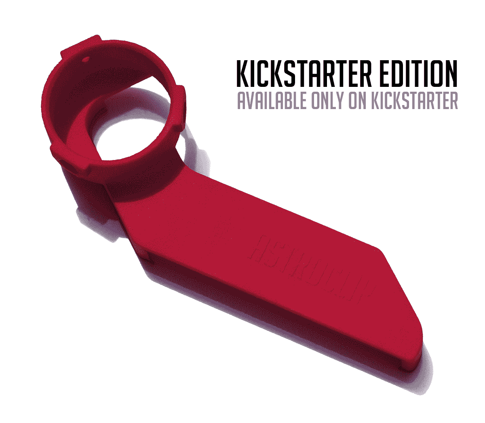

# Astroclip 是一款用于天体摄影的 iPhone 4 夹子 TechCrunch

> 原文：<https://web.archive.org/web/http://techcrunch.com/2011/07/25/the-astroclip-is-a-iphone-4-clip-for-astrophotography/>

# Astroclip 是一款用于天体摄影的 iPhone 4 夹子

业余天文爱好者和偷窥者，这是给你的。AstroClip 承诺将 iPhone 4 安装到任何带有 1.25 英寸目镜的望远镜上，以便轻松进行天文摄影。iPhone 4 只需扣入注塑外壳，然后用三个固定螺丝将外壳固定在大多数望远镜目镜上。这开启了各种有趣的摄影项目:拍摄月亮和星星，隔壁大楼的女士等等！

上周在 Kickstarter 上启动的[项目似乎在启动时遇到了一点麻烦。这是设计师马修·盖斯特的第三个 Kickstarter 项目。他的第一个项目，【iPad 和 Kindle 3](https://web.archive.org/web/20230203152820/http://www.kickstarter.com/projects/mgeyster/astrocliptm-photograph-the-cosmos-with-your-iphone) 的乡村外壳，最终获得了资金，但他的第二个项目，双头电容式手写笔，没有筹集到足够的资金。这一次 Geyster 要求合理的 15，000 美元，这将涵盖所有的成本，同时保持在美国的生产。

 
最低承诺是 1 美元，但 25 美元附带一个 AstroClip 和全球运费。认捐 40 美元，Geyster 就会给你送一件特别版的红色 AstroClip 和一件 AstroClip t 恤。认捐水平继续高达 500 美元，每一个净支持者更多的天文夹子。任何级别都不包括望远镜。

说说你对手机取代传统相机的看法。随着越来越多的配件制造商开始迎合这个市场，这种情况正在发生。AstroClip 只是最新的一个。

类似的坐骑已经问世多年；这个想法并不新鲜。但是其他的支架通常都很贵，特别是对于某个相机，并且需要一个更坚固的望远镜三脚架，这取决于附加相机的重量。AtroClip 通过与非常流行和轻便的 iPhone 4 配合使用，解决了所有这些问题。这个项目只需要一点启动。