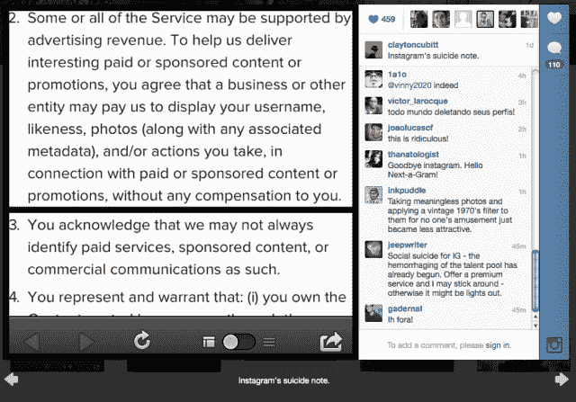
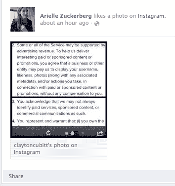
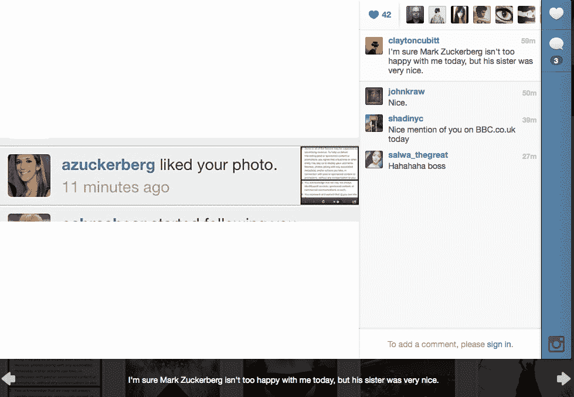

# 反弹仍在继续:扎克的妹妹似乎也不喜欢 Instagram 的变化 

> 原文：<https://web.archive.org/web/https://techcrunch.com/2012/12/18/the-backlash-continues-zucks-sis-doesnt-seem-to-like-the-instagram-changes-either/>

# 反弹仍在继续:扎克的妹妹似乎也不喜欢 Instagram 的变化

如果你现在还没听说，昨天 [Instagram](https://web.archive.org/web/20221207014627/http://www.instagram.com/) [宣布更新其服务条款和隐私政策](https://web.archive.org/web/20221207014627/https://beta.techcrunch.com/2012/12/17/instagram-will-share-users-data-with-facebook-according-to-its-new-privacy-policy/)，将于下月生效。今年早些时候，[脸书](https://web.archive.org/web/20221207014627/http://www.facebook.com/)[以 10 亿美元的价格](https://web.archive.org/web/20221207014627/https://beta.techcrunch.com/2012/04/09/facebook-to-acquire-instagram-for-1-billion/)收购了 Instagram，新的 ToS 表面上是为了让照片分享应用程序与社交网络巨头更好地整合。

新条款最值得注意的一点是，Instagram 将保留向希望在赞助帖子等广告中使用用户照片的公司出售这些照片的权利——不需要用户知情或同意，当然也不需要给他们一部分钱。

如果这听起来对你来说是一个不公平的交易，你有好公司。看起来就连脸书首席执行官马克·扎克伯格的妹妹也不喜欢这些变化。

今天， [Arielle Zuckerberg](https://web.archive.org/web/20221207014627/http://ariellezuckerberg.com/) [公开“喜欢”](https://web.archive.org/web/20221207014627/https://www.facebook.com/arielle.zuckerberg/activity/4280498055615)一张来自纽约的[时尚摄影师](https://web.archive.org/web/20221207014627/http://www.claytoncubitt.com/) [Clayton Cubitt](https://web.archive.org/web/20221207014627/http://instagram.com/claytoncubitt/) 的 [Instagram 照片](https://web.archive.org/web/20221207014627/http://instagram.com/p/TWPsv6JXga/)，这基本上是新 Instagram ToS 最有争议的部分的截图，标题是“Instagram 的自杀笔记”

丘比特没有注意到这个手势——他接着发布了扎克伯格“喜欢”的截图，并配以说明:“我肯定马克·扎克伯格今天对我不太满意，但他的妹妹很好。”(实际上，克莱顿，扎克是个大忙人，我会把钱押在你身上，不一定会引起他的关注……但谁知道呢。)

【T2

现在，当然值得一提的是，Arielle Zuckerberg 是一个普通公民，根本不代表脸书。她实际上是谷歌野火互动部门的一名员工。但是，作为一个曾经数次登上科技行业头条的人——她的[脸书更新](https://web.archive.org/web/20221207014627/https://www.facebook.com/arielle.zuckerberg)有超过 14000 名公共订户——公开表明自己的立场(她对任何登录脸书的人都表示‘喜欢’，而不仅仅是她的朋友或订户)是有趣的。我认为，她甚至在引起注意和呼吁后仍不撤回，至少是有新闻价值的——或有博客价值的。这表明这些新的 Instagram 术语有多么分裂。

事实上，反弹可能才刚刚开始。CNN 主播安德森·库珀似乎今天早上才得到消息，显然也很不高兴。他在推特上向他的 340 万粉丝询问他们是否可以推荐一款不同的照片分享应用程序:

这些变化要到一月中旬才会生效，所以有可能会根据公众反馈进行调整——鉴于这是一个相对缓慢的新闻周，可能会有更多的变化。