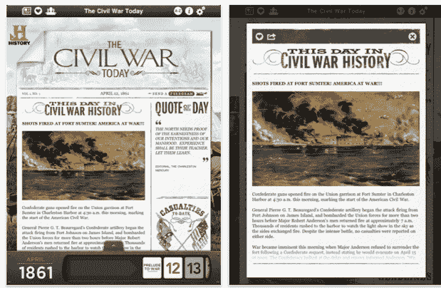

# 今日内战:我很久以来见过的最酷的 iPad 应用之一 

> 原文：<https://web.archive.org/web/http://techcrunch.com/2011/06/21/the-civil-war-today-one-of-the-coolest-ipad-apps-ive-seen-in-a-long-time/>

# 今日内战:我很久以来见过的最酷的 iPad 应用之一

这篇文章是关于一个两个多月前的 iPad 应用程序，它已经被选为 App Store 的一周应用程序。但是我从来没有听说过它，而且，鉴于这款应用只有大约 95 条评论，我猜很多 TechCrunch 的读者也没有看过它。这真是太酷了。

它被称为 *[《今日内战》](https://web.archive.org/web/20230203144821/http://itunes.apple.com/us/app/the-civil-war-today/id428812156?mt=8)* ，由一家& E 电视网(它拥有历史频道)组织，由[瓶子火箭](https://web.archive.org/web/20230203144821/http://www.bottlerocketapps.com/blog/civil-war-today-named-ipad-app-of-the-week)开发。它不是游戏或社交网络应用，也不是其他任何一点都不性感的东西。

这是一份有 150 多年历史的日报。

前提很简单:当内战展开时，你可以重温它。每天，你打开应用程序，就会看到一些实际上在 150 年前就出现在报纸上的新闻故事，还有照片、地图、引文和迄今为止的伤亡人数统计。该应用程序将在接下来的四年里每天更新。

这是一个令人难以置信的概念，但它也将考验你的耐心:虽然你可以跳回之前的报纸版本(现在大约有两个月的价值)，但你不能向前跳。当然，你可以通过在维基百科上查找重大事件来作弊，但那会破坏乐趣。

我们已经听说了很多关于 iPad 将会或不会给报纸行业带来革命性变化的消息，比如《每日邮报》和苹果公司为现有出版商提供的 iOS 订阅等纯平板出版物。我们将拭目以待——随着免费新闻在网络上无处不在，我仍然持怀疑态度。但是今天的内战似乎是一个必然的赢家。这不是你在别处能轻易找到的内容。它非常适合平板电脑的外形。

当然，该应用不一定是 iPad 专用的——内容可能也可以移植到 Android、RIM 或 WebOS 平板电脑上(实际上，将应用移植到 HTML5 可能更有意义)。但暂时只在 iPad 上。如果你对历史有一点点兴趣，这个应用程序是必备的。这将花费你 8 美元，但请记住，这是四年的内容。

**更新**:如果你喜欢这个，你可能也会对 NYT 的内战博客[分裂](https://web.archive.org/web/20230203144821/http://opinionator.blogs.nytimes.com/category/disunion/)感兴趣。