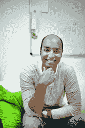

# 柏林 ResearchGate | TechCrunch 的协作力量

> 原文：<https://web.archive.org/web/http://techcrunch.com/2013/09/30/the-collaborative-power-of-berlin-based-researchgate/>

你很少会遇到一个创始人用某一天获得诺贝尔和平奖来衡量初创企业的成功。当几年前 [ResearchGate](https://web.archive.org/web/20230324110601/http://www.researchgate.net/) 创始人[伊贾德·马迪士](https://web.archive.org/web/20230324110601/http://www.crunchbase.com/person/ijad-madisch) [对基准合伙人](https://web.archive.org/web/20230324110601/https://techcrunch.com/2012/03/01/armed-with-new-funding-a-global-mission-researchgate-adds-paypal-co-founder-to-board/)[马特·科勒](https://web.archive.org/web/20230324110601/http://www.crunchbase.com/person/matt-cohler)说的时候，他知道他的初创公司已经开发了一个交流和众包平台，科学家可以通过这个平台分享和发布他们的研究，这将有可能改变我们通过科学合作解决现实世界问题的方式。一晃两年过去了，总部位于柏林的 ResearchGate 实际上看到了在疾病、恐怖主义等领域取得的进展，这些进展来自于其平台上的合作和知识共享。

10 月下旬，马迪士在柏林参加了我们在 [Disrupt Europe](https://web.archive.org/web/20230324110601/https://techcrunch.com/events/disrupt-europe-berlin-2013/disrupteurope2013/) 的演讲，并与他的董事会成员和早期投资者苛勒进行了交谈。

困扰科学研究和创新的主要挑战之一是冗余。一个致力于蛋白质数据分析的科学家小组公布了他们的结果，却发现世界另一端的一个小组也做了同样的事情。协作网络改变了这一点。作为一名医生和研究人员，Madisch 认为减少研究冗余的最佳方式是创建一个在线专业网络，科学家可以在其中轻松共享数据、信息和结果。

投资者已经嗅到了 ResearchGate 的力量，到目前为止，该公司已经从 Benchamrk，微软创始人比尔盖茨，Tenaya Capital，Dragoneer 投资集团，Thrive Capital，Accel Partners，Simon Levene，Bebo 联合创始人迈克尔伯奇，Founders Fund 和 Yammer 首席执行官大卫萨克斯等人那里筹集了超过 3500 万美元的资金。盖茨很少用自己的个人财富投资初创公司，但他押注于 ResearchGate 是一件大事。

 [马特·苛勒](https://web.archive.org/web/20230324110601/http://www.crunchbase.com/person/matt-cohler)
普通合伙人，[标杆](https://web.archive.org/web/20230324110601/http://www.crunchbase.com/financial-organization/benchmark)

马特·科勒是 Benchmark 的普通合伙人。除了与公司投资组合中的公司密切合作之外，他还负责识别互联网相关公司的投资机会。

在 Benchmark，Matt 与来自全球各地的社交、移动和云行业的企业家合作，如 Instagram、Dropbox、Quora、Asana、Domo、Edmodo、Baixing、CouchSurfing、Peixe Urbano、ResearchGate、1stdibs 和 Zendesk。

在加入 Benchmark 之前，他在脸书担任产品管理副总裁，领导公司新战略计划的开发。作为脸书的第七名员工，Matt 在团队的许多关键成长阶段发挥了重要作用。此前，Matt 是 LinkedIn 的副总裁兼总经理，他是 LinkedIn 创始团队的成员之一。Matt 也曾是麦肯锡公司(McKinsey & Company)硅谷办公室的顾问，并在中国初创公司亚信(AsiaInfo)驻北京工作，亚信在 mainland China 建设互联网基础设施。马特关于创业经济的文章已经发表在《哈佛商业评论》上。他拥有耶鲁大学荣誉学士学位。

 [伊贾德·马迪士](https://web.archive.org/web/20230324110601/http://www.crunchbase.com/person/ijad-madisch)
联合创始人兼首席执行官，[研究之门](https://web.archive.org/web/20230324110601/http://www.researchgate.net/profile/Ijad_Madisch/)

Ijad Madisch 是 ResearchGate 的联合创始人兼首席执行官，ResearchGate 是科学家和研究人员分享论文、提问和回答问题以及寻找合作者的社交网站。

Ijad 拥有医学博士和哲学博士学位，曾在汉诺威的哈佛大学学习医学和计算机科学。2005 年，他因在组织工程骨生长的超高分辨率 CT 成像方面的工作获得了 RSNA 青年研究员奖。在波士顿的马萨诸塞州总医院担任放射学研究员几年后，Ijad 搬到了柏林，并于 2008 年创立了 ResearchGate。该公司现在总部设在柏林，并在马萨诸塞州的剑桥设有办事处。伊贾德表示，他希望通过这个网站打破科学研究的方式来获得诺贝尔奖。

 

正如我们上面提到的，ResearchGate 的真正力量在于通过这个平台在科学上的实际发现和进步。这里只是 ResearchGate 如何改变科学合作的众多例子中的几个。

*   Emmanuel Nnadi(尼日利亚)和 Orazio Romeo(意大利)最近一起发现了一种致命的致病植物酵母。这种酵母在伊曼纽尔的家乡尼日利亚杀死了一名 38 天大的女婴。这是首次报道由这种病原体引起的死亡。奥拉齐奥和伊曼纽尔将酵母送到荷兰的一个实验室，目前正在那里进行进一步的研究。这个不太可能的团队通过 ResearchGate 相互了解，他们之前在尼日利亚首次发现了另一种致病酵母，并在同行评审期刊上发表了一篇论文。
*   科尔多瓦大学的有机化学教授拉斐尔·卢克和来自菲律宾的研究生里克·阿内尔·阿拉康也是在一个论坛上认识的。这对看似不太可能的搭档发现，玉米芯的下脚料可以成为由旧食用油制成的生物燃料的高效环保催化剂，并就这一技术发表了一篇论文。
*   David Chau 无意中卷入了一场讨论，这场讨论对他目前的项目产生了巨大影响。通过 ResearchGate，他设法与大学不同部门的同事建立了联系，并因此获得了他正在进行的实验的设备。他现在正在研究一种新技术来检测生物样本中的微量水。
*   墨西哥韦拉克鲁斯大学的应用数学教授赫克托·瓦兹奎·里尔正在 ResearchGate 上寻找研究伙伴。在这里，他找到了吉列尔莫·费尔·安德斯·安纳亚。他们合作发现了一种解决 Troesch 问题的新方法，这种方法可以更好地确定受限环境中气体的运动。他们在同行评审期刊上发表了他们的结果。瓦兹奎-里尔目前正与他在网络上找到的研究伙伴在同一领域进行另外两个项目。
*   Sohail Malik(巴基斯坦政治科学与工程)在 ResearchGate 上找到了 Michael Sandholzer(放射学家，英国),当时他正在寻求统计学方面的帮助。他们一起致力于马利克的项目，以确定在巴基斯坦产生恐怖主义和叛乱的风险因素。他们的文章已被一家同行评审期刊接受，并将于 2014 年发表。

“研究之门将改变我们未来进行科学研究的方式，”马迪士说。他说，类似于开发人员可以在整个工作中对工程项目进行编码的方式，在科学界也有同样的机会。

马迪士告诉我们，2013 年发表的研究论文中，有 56%的作者在 ResearchGate 上。从 2008 年到 2011 年，140 万篇论文被添加到 ResearchGate 上的科学家简介中。现在，该网络每月增加 140 万篇论文，总共上传了 2700 万篇论文。合作的力量主要在于科学家之间共享原始数据，Madisch 说，每两天就有 1300 个数据集被上传。“参与度正呈指数级增长，”他说。

然而，ResearchGate 并不是唯一一家认识到这种合作力量的公司——Academia.edu 也在这一领域展开竞争。

马迪士将如何继续发展 ResearchGate 作为一个网络，并为此目的使用技术，这将是与科勒在 Disrupt 舞台上讨论的一部分。我们还将听到他讲述在欧洲创办和维持一家初创公司的挑战和好处(苛勒[认为](https://web.archive.org/web/20230324110601/https://techcrunch.com/2013/06/04/berlins-network-effect-will-make-it-a-global-startup-center/)柏林将是下一个大型初创公司生态系统)。

扰乱欧洲将于 10 月 26 日至 29 日举行(黑客马拉松于 26 日至 27 日举行；28-29 日的主要活动)和更多信息可以在[这里](https://web.archive.org/web/20230324110601/https://techcrunch.com/events/disrupt-europe-berlin-2013/disrupteurope2013/)找到。

*如果您想了解有关赞助机会的信息，请在此联系我们的赞助团队[sponsors@beta.techcrunch.com](https://web.archive.org/web/20230324110601/mailto:sponsors@beta.techcrunch.com)或[在此获取更多信息](https://web.archive.org/web/20230324110601/https://techcrunch.com/events/disrupt-europe-berlin-2013/disrupteurope2013sponsors/)* 。