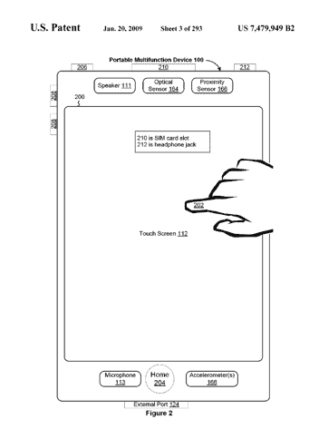

# 投诉:苹果对 HTC 的专利诉讼完全是关于 Android TechCrunch 的

> 原文：<https://web.archive.org/web/https://techcrunch.com/2010/03/02/the-complaint-apples-patent-lawsuit-against-htc-is-all-about-android/>

# 投诉:苹果对 HTC 的专利诉讼完全是关于 Android 的

今天早些时候，苹果发布了一份新闻稿，称其已经[起诉](https://web.archive.org/web/20230116000139/https://techcrunch.com/2010/03/02/apple-goes-after-htc-in-lawsuit-over-20-iphone-patents/)手机制造商 HTC 侵犯专利。新闻稿中没有提到安卓或谷歌。但实际的法律投诉，我们已经获得并嵌入以下，使它没有骨头。不出所料，这场官司是关于安卓的。当然，HTC 是最大的 Android 手机制造商之一。

提交给特拉华州美国地方法院的诉状针对:“某些移动通信设备，包括手机和智能手机，至少包括采用 Android 操作系统的手机(统称为“被控产品”)。”向美国国际贸易委员会提交的诉状特别指出了各种 HTC Android 手机(包括 Nexus One、Magic/myTouch 3G、Dream/G1、Hero 和 droid 厄里斯)是主要的违规产品。通过追逐最大的安卓制造商，苹果让所有的安卓手机制造商——以及谷歌——都注意到了。现在对谷歌首席执行官埃里克·施米特去年不得不从苹果董事会辞职还有什么疑问吗？战线已经划定。

至少一个专利(第 7，479，949 号)将 Steve Jobs 列为发明人，并描述了一种使用触摸屏作为图形用户界面的方法，“检测手指与触摸屏显示器的一个或多个接触”(即多点触摸)。诉状称被侵犯的专利的完整列表包括:

*   专利号 [7，362，331](https://web.archive.org/web/20230116000139/http://www.google.com/patents/about?id=XTKpAAAAEBAJ&dq=7,362,331) :“用户界面对象在状态间基于时间的、非恒定的翻译”
*   专利号 [7，479，949](https://web.archive.org/web/20230116000139/http://www.google.com/patents/about?id=dCKzAAAAEBAJ&dq=7,479,949) :“通过应用试探法确定命令的触摸屏设备、方法和图形用户界面”
*   专利号 [7，657，849](https://web.archive.org/web/20230116000139/http://patft.uspto.gov/netacgi/nph-Parser?Sect1=PTO2&Sect2=HITOFF&p=1&u=/netahtml/PTO/search-bool.html&r=1&f=G&l=50&co1=AND&d=PTXT&s1=7,657,849&OS=7,657,849&RS=7,657,849) :“通过在解锁图像上执行手势来解锁设备”
*   专利号 [7，469，381](https://web.archive.org/web/20230116000139/http://www.google.com/patents/about?id=n7WxAAAAEBAJ&dq=7,469,381) :“触摸屏显示器上的列表滚动和文档平移、缩放和旋转”
*   专利号 [5，920，726](https://web.archive.org/web/20230116000139/http://www.google.com/patents/about?id=S0AZAAAAEBAJ&dq=5,920,726) :“管理数码相机设备内电源状况的系统和方法”
*   [专利号 7，633，076](https://web.archive.org/web/20230116000139/http://www.google.com/patents/about?id=4czKAAAAEBAJ&dq=7,633,076) :“便携式设备中用户活动的自动响应和感知”
*   专利号[5848105](https://web.archive.org/web/20230116000139/http://www.google.com/patents/about?id=lqYZAAAAEBAJ&dq=5,848,105):“提高通信容量和质量的 GMSK 信号处理器”
*   专利号 [7，383，453](https://web.archive.org/web/20230116000139/http://www.google.com/patents/about?id=tEaqAAAAEBAJ&dq=7,383,453) :“通过降低提供给处理器指令处理部分的电压来节能”
*   专利号[5455599](https://web.archive.org/web/20230116000139/http://www.google.com/patents/about?id=HrobAAAAEBAJ&dq=5,455,599):“面向对象的图形系统”
*   专利号 [6，424，354](https://web.archive.org/web/20230116000139/http://www.google.com/patents/about?id=zIwLAAAAEBAJ&dq=6,424,354) :“面向对象的事件通知系统，带有兴趣和方法的监听器注册”

另一项投诉提交给了美国国际贸易委员会，可能包括其他专利，因为这里只有 10 项专利，而苹果声称总共侵犯了 20 项专利。