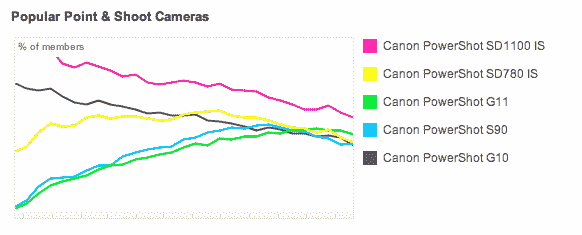
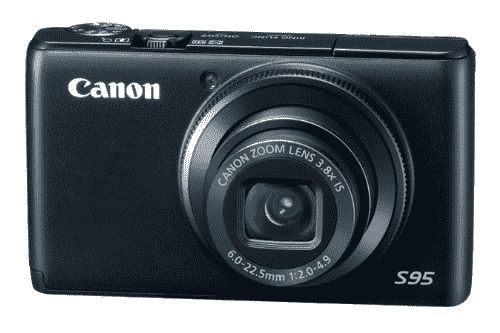

# 在联网相机时代，傻瓜相机会切腹自杀

> 原文：<https://web.archive.org/web/https://techcrunch.com/2010/11/21/the-connected-camera/>

大品牌相机公司正在我们眼前切腹自杀。太迷人了。

上周，我买了一台全新的佳能 S95 相机。这是一个伟大的点&拍摄。也许是现在最棒的。它捕捉美丽的 1000 万像素的图像。在弱光下很棒。它很快。它拍摄高清视频。我预计在接下来的一年里，我会用它拍大约 5%的照片。其余的 95%将用我的 iPhone 来拍。我哪里知道？因为我去年买了 S90，这正是我的使用模式。

显然，与 500 万像素、200 美元(有补贴)的 iPhone 4 相比，1000 万像素、400 美元的 S95 是更好的相机。但事实上，我总是带着我的手机很容易超过规格。但对我来说，除了便携性因素之外，还有其他因素导致我如此倾向于使用 iPhone:连接性。

智能手机总是连接的。点射从来都不是。当我拍了一张很酷的照片时，我经常想马上分享出来。用我的智能手机，只需要 20 秒。以我的观点，这是不可能的。我得等到我回家，把它上传到我的电脑上，然后上传到网上。

当谈到上传到 Flickr 等网站的图片的百分比时，智能手机正在吃 point & shoots 的午餐，这一点都不奇怪。目前，[Flickr 社区中最受欢迎的相机](https://web.archive.org/web/20230404105436/http://www.flickr.com/cameras/)是 iPhone 3G。下面是几款专业级的 DSLRs。没有点&射在最上面的名单上。

如果你看看流行的点击率排行榜，你会发现它们都呈下降趋势。很快。与此同时，照相手机正走向相反的方向。很快，我想几款安卓手机将会加入 iPhones 的行列，成为最受欢迎的手机。

有点令人哭笑不得的是，point & shoots 在连接性和社交方面的进步如此之慢。iPhone 现在已经有三年半的历史了，在那之前的几年，很多人都在用他们蹩脚的 RAZR 手机拍照并上传到网上。这种迹象已经在墙上挂了*长*时间了。

显而易见，随着智能手机相机的不断改进，它们无论如何都会挤掉傻瓜相机。我们正在走向这样一个世界:智能手机是日常相机，而 DSLR 是特殊场合的相机。但我们还没到那一步。我仍然需要一个好的拍摄点。许多其他人也是如此 S95 目前是亚马逊上第 19 大畅销电子产品[，即将迎来假日购物季。](https://web.archive.org/web/20230404105436/http://www.amazon.com/gp/bestsellers/electronics/ref=pd_ts_e_bcrm_)

但是像佳能这样的大相机公司似乎希望 T6 加快相机拍摄的进程。他们似乎就是不明白。

Twitter 的 Josh Elman [早些时候在 Twitter 上发布了](https://web.archive.org/web/20230404105436/http://twitter.com/#!/joshelman/status/6403959996547073)“指向并拍摄已经变成了指向并拍摄并分享”。"*令人遗憾的是，相机没有发展成联网的，也没有让分享变得更容易。我现在正在购买一台新相机，非常失望。*

Elman 一定经历了和我几周前经历的一样的过程。由于没有更好的解决方案，我最终决定采用一种拼凑的解决方案:S95，带有来自 [Eye-Fi](https://web.archive.org/web/20230404105436/http://www.eye.fi/) 的 SD 卡，可以为你的设备添加 WiFi 功能。没事的。它确实允许你在拍照时分享照片——前提是你连接了 WiFi。WiFi，你必须事先通过你的电脑在你的卡上配置。换句话说，除非你在家，否则这不是一个好办法。

此外，考虑到世界上的其他一切都在地理定位潮流中跳跃，你可能会认为傻瓜相机制造商至少会带着 GPS 芯片去那里。没有。同样，大多数相机的唯一解决方案是 Eye-Fi 卡。再说一次，这是一个非常蹩脚的解决方案。EyeFi 卡不是像大多数智能手机那样使用 GPS 和 WiFi 的组合来获得你的位置并将其固定在照片上，而是简单地记录最近的 WiFi 路由器地址，只有当你回家后通过他们的(相当蹩脚的)软件运行它，它才会将它标记在你的照片上。

呃。

不要误解我的意思，鉴于他们正在做的事情，Eye-Fi 正在做的事情相当令人惊讶。他们从根本上破解了存储卡的输入，让这些摄像头有点联系。但是确实需要某种本地硬件/软件解决方案。

我知道有一些“社会”点&拍摄有，像柯达的 EasyShare 产品。但是对这些东西的评论褒贬不一。如果我要花额外的钱，我希望花在最好的地方&出手。比如 S95。可悲的是，我不能两全其美。我不确定我是否能做到，除非智能手机已经消灭了这种类型。

在现在的智能手机世界里，我们已经进化到了下一个阶段。我们看到，人们对完全围绕摄像头构建的社交应用的兴趣正在激增。Instagram，Hipstamatic，Picplz，Path，DailyBooth，CameraBag，Treehouse，IncrediBooth，Diptic，Burstn 等。每天都有数百个新的应用程序推出。点射还没有进入第一阶段。真的挺可怜的。