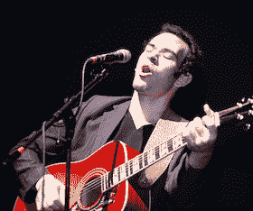

# 视频:脆饼干之歌！

> 原文：<https://web.archive.org/web/http://techcrunch.com/2011/01/22/the-crunchies-song/>

# 视频:脆饼干之歌！

昨晚参加了[嘎吱嘎吱嘎吱声](https://web.archive.org/web/20230203003346/http://crunchies2010.beta.techcrunch.com/)或者观看了现场直播的人有幸看到 [Jonathan Mann](https://web.archive.org/web/20230203003346/http://www.rockcookiebottom.com/) 演唱了一首他专门为这次活动创作的新歌。“嘎吱嘎吱的歌曲”很好地总结了这一事件。找到曼恩的现场表演和他的官方视频。

你会注意到这其实是曼恩在 YouTube 上的第 750 首歌。是的，两年多来他每天都创作一首歌。你可能还记得其中的一些，因为我们已经发布了其中的一些——比如他写的关于我的，他写的关于史蒂夫·乔布斯的，他写的关于 iPhone 4 天线的(苹果甚至[在他们的新闻发布会上播放了](https://web.archive.org/web/20230203003346/https://techcrunch.com/2010/07/16/apple-kicks-of-iphone-4-press-conference-with-antenna-song/))，史蒂文·斯莱特的[歌曲](https://web.archive.org/web/20230203003346/https://techcrunch.com/2010/08/11/steven-slater-song/)，以及第一次让他进入我们视线的 [Bing 叮当](https://web.archive.org/web/20230203003346/https://techcrunch.com/2009/08/05/bing-has-succeeded-in-finding-the-worst-jingle-ever/)(以及[曼恩甚至写了一首歌来祝贺美国在线的交易。](https://web.archive.org/web/20230203003346/https://techcrunch.com/2009/10/31/meta-bing-jingle-guy-writes-song-for-students-who-sang-bing-jingle/)

【YouTube = http://www . YouTube . com/watch？v=36IwajSHweE&w=640&h=390]