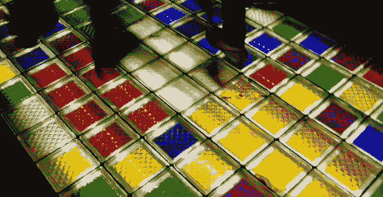

# 创业故事 Flowtab 的衰亡 

> 原文：<https://web.archive.org/web/https://techcrunch.com/2013/08/31/the-decline-and-fall-of-flowtab-a-startup-story/>

它始于一个想法:我们如何能更快地在酒吧拿到我们的饮料？凌晨 2 点，在洛杉矶的联合办公空间 Coloft，未来创始人迈克·汤森(Mike Townsend)设计了一个 iPad 应用程序模型，他称之为 Apptini 来回答这个问题。

Apptini 是应用和马提尼的结合体，它不会持续太久，但后来被称为 [Flowtab](https://web.archive.org/web/20221225225142/http://flowtab.com/) 的产品已经诞生。它的人生变成了一个大多数人都不会讲述的创业故事:一家没有成功的公司。技术作为一个行业崇拜成功——越大越引人注目越好。那些经常没有说出来或者被掩盖起来或者以小额贷款的名义被掩盖起来的就是失败。很多很多。

在硅谷，成百上千的年轻公司死去，但是你很难通过阅读你当地的博客了解到这一点。现在已经关闭的产品 Flowtab，在其消亡后做了一些我以前从未见过的事情——发布了各种各样的[死亡编年史](https://web.archive.org/web/20221225225142/http://alpha.flowtab.com/)。他们的时间表和笔记展示了该公司在其短暂的生命中所犯的错误。合同，失败的电视露面，失败的交易，还有更多被出版。如果你从事技术工作，这是一组引人注目的文件。

我知道 Townsend，也去过曾经使用过 Flowtab 技术的酒吧，所以当现在的前创始人发布他们的材料时，我和他们两个聊了聊他们的历史。接下来的故事讲述了他们的梦想，他们的公司，奋斗，失败的支点和一个澳大利亚矿业巨头。

**开始**

理由很简单:Flowtab 将是点餐和支付饮料的更好方式。它将加快服务速度，因为调酒师不再处理付款，这是软件为酒吧处理的事情。没有更多的酒吧标签，没有更多的丢失或遗忘的信用卡和身份证，或潮湿的收据和干笔。所有这些都被吧台后面的 iPad 所取代，它显示人们在智能手机上点击记录的饮料订单。顾客们准备好了就可以拿起他们的饮料。简单。

这个想法类似于你现在坐的酒吧的实时 GrubHub。Flowtab 将展示菜单，并允许在应用程序内直接给小费。创始人 Townsend 和 Kyle Hill 想帮助你喝醉。

Townsend 带着他的 iPad 模型和一个简短的演示去了圣莫尼卡地区的 12 个酒吧，推销一个完全未建成的产品。希尔和汤森重新计票公司的反应很好，足以继续推进这个项目。在离线测试阶段之后，2011 年 5 月中旬，Flowtab 制作了一个登陆页面。随着互联网公司的发展，Flowtab 已经插上了自己的旗帜。两个月后，用 HTML5 编码的第一版 Flowtab 完成了。

然而，Flowtab 人员严重不足，需要比目前内部更多的开发能力。钱很少，Flowtab 想要一个真正顶尖的人。这造成了一些问题。希尔的一个朋友曾经和一个名叫阿历克斯·库兹涅佐夫的开发人员合作过一个应用程序。希尔飞到旧金山去看他。库兹涅佐夫拥有计算机科学博士学位，当时在奥克兰工作，作为该公司的首席技术官，他开始在晚上和周末做出贡献。

Flowtab 的第一个版本极其有限。你可以选择你所在的酒吧，选择一种饮料，设置小费金额，点击订单。但仅此而已。

最终，Kouznetsov 帮助 Flowtab 的工作人员将他们的 HTML5 封装到一个原生外壳中(使用 Appcelerator)，并将其放入 Android 和 iOS 应用商店。事实证明，2012 年 2 月的那次发布为时过早，因为 Flowtab 使用其技术的用户实际访问次数为零。因此，应用程序的用户看到的是一个空的应用程序。嗯，有一些假的酒吧。

具有讽刺意味的是，苹果公司在一周内推出了 Flowtab，让 it 用户实际上无法使用该应用程序。然而，在这个阶段，Flowtab 仍然更注重与酒吧老板交谈，而不是获取用户。用 Townsend 的话来说，这种关注背后的想法是，“地理密度对于任何移动支付应用来说都是绝对关键的。”

苹果注意到这个应用的事实是一个好兆头。Flowtab 的男孩们现在准备去开酒吧了。

**棒材采集:开始**

Flowtab 在圣莫尼卡的 Copa d'Oro 酒吧举行了首次聚会，整个晚上处理了大约 1200 美元的交易。市长甚至出现了，并使用该应用程序点了一杯可乐。对汤森和希尔来说，得到市长并不容易，他们承认给他发了大约 20 封电子邮件，恳求他出现。成功了。整个晚上，顾客下了 150 份订单。这是一次真正的成功，尽管是适度的成功。

 * **左起:Flowtab 联合创始人迈克·汤森、圣塔莫尼卡市长理查德·布鲁姆、联合创始人凯尔·希尔和首席技术官亚历克斯·库兹涅佐夫***

为了让人们进门，Flowtab 正在为晚上的狂欢买单。但这是次要的，因为这一事件证明，当它的技术正确流动时，Flowtab 已经建立了一些工作和人们似乎喜欢的东西。

发布会结束后，Flowtab 受邀参加一年一度的洛杉矶创业大赛。他们赢了，击败了其他 14 家初创公司，但拒绝了 VoiVoida Ventures 提供的投资。VoiVoida 的位置离 Flowtab 在圣莫尼卡的住所很远，公司不想搬家。尽管如此，胜利感觉很好。汤森称之为“信心提升”

还在创业的学习阶段，团队 Flowtab 就去了拉斯维加斯的夜总会和酒吧大会。该公司没有因为其技术而获得新的酒吧客户，但这次旅行确实让他们相信，他们正在考虑的商业模式想法是行不通的:Flowtab 不能通过与销售销售点(POS)系统的公司合作来分销。

因此，Flowtab 意识到必须建立自己的销售团队。对于这个资金严重不足的小公司来说，这意味着更多的开销、更多的员工和更多的工作。

到目前为止，Flowtab 已经在洛杉矶开了三家酒吧，但是没有看到临界质量或有机增长。在 Flowtab 还很小的时候，它就已经决定需要知识产权保护。

**我的 IP 是我的 IP 不是你的 IP**

你想保护你的知识产权，对吗？嗯，也许不是。Flowtab 申请了一项专利，该专利涉及“酒店设施中的商家卖家和服务器使用销售点应用程序向其客户的移动设备发送一键式/一触式订单状态通知的能力。”这不是一个好的举动。

回过头来看，创始人希尔和汤森形容这种努力是浪费时间，消耗他们的财力。他们告诉我，这消耗了“大量的能量”，除了“投资者的话题”之外，什么也没产生。希尔解释说，“[Flowtab]从专利中获得的最大价值是让投资者相信它确实有意义。”

在其公司生活的早期阶段，其平台上只有几个酒吧，用户群有数百人，Flowtab 将稀缺的资源投入到一些最终不会给它带来任何回报的东西上。

**更好的应用，让我们尽情狂欢吧**

2012 年 7 月 1 日登陆，Flowtab 第二版完成。第二次迭代仍然是用 HTML5 编码，并被打包成本机代码，这是对其前身的一个巨大改进。面向酒吧的 iPad 应用程序现在可以异步加载饮料订单，限制无意义的刷新。与之前的两个版本一样，新版本的 Flowtab 更侧重于回应酒保的请求，而不是满足用户的需求。

有了新的应用程序，Flowtab 希望提高用户数量，这意味着它计划再开一次派对。在安装了 Flowtab 的酒吧里，它本身并没有吸引很多用户，所以它想把更多的东西带到它的位置，并以非常公开的方式进行。最终的结果是一场滑稽的混乱。

Flowtab 与优步和 Thrillist 合作进行三杠爬泳。安装了 Flowtab 的每个酒吧都将处于运行状态。Thrillist 卖票，优步运送乘客，Flowtab 负责确保饮料源源不断。

“在这一点上，”希尔说，“我们认为我们是热狗屎。”三百人受到邀请。这一事件是一场灾难。

这个应用程序失败了，酒吧人手不足，饮料订单堆积如山，在这个团队去的第二家酒吧，一次就有 35 人排队。那个酒吧只有一个酒保。里面挤满了 150 名顾客，他们被告知 Flowtab 可以很快为他们提供饮料。

### 出去被揍一顿感觉真好。

最后，Flowtab 的服务器瘫痪了，整个操作都被打乱了。希尔开始大量分发玛格丽塔酒，让每个人都开心。Flowtab 团队在压力下屈服了。流产的酒吧狂欢结束后，希尔穿着他的 Flowtab 衬衫去了海滩，独自坐了一个小时。该应用在失败后获得了许多一星评价。

回想起来，希尔和汤森对这次经历有一点积极的看法:他们告诉我，出去被人踢屁股的感觉太棒了。他们并不想经历这样的痛苦:当他们的服务器再次出现故障时，要管理数百名想要喝酒的人，但这就像中学时代一样:做一次就好了。希尔声称，这种情况提供了继续前进的“燃料”。

这一事件确实导致了产品的改进，包括限制一次可以放入 iPad 应用程序队列的饮料数量。这减少了调酒师的困惑，有助于人们排队取酒。如果队列已满，你就必须等待。

另一个教训是:有时你需要慢慢地涉入新的领域，而不是炮轰进来，枪炮开火，服务器崩溃。

**钱**

Flowtab 现在需要两样东西:钱和指导。在申请了洛杉矶地区的许多孵化器后，Flowtab 找不到一扇敞开的门。当地团体觉得奇怪的是，他们的首席技术官在湾区兼职。人们还对 Flowtab 选择的市场的规模和可接近性表示担忧。

然而，位于洛杉矶的孵化器和工作室[科学](https://web.archive.org/web/20221225225142/http://www.crunchbase.com/company/science)的首席执行官迈克·琼斯，通过将它介绍给在黄页上销售广告的 DexOne，帮助了这家小公司。这是一家上市公司，市值超过 1 亿美元。因此，Flowtab 与每年在你公寓外打印并留下大量电话簿的人联系起来。DexOne 有一个实验部门，这对 Flowtab 来说很重要，因为这是解决其分销问题的一个潜在答案。

### 技术专家不总是推销员，但创始人应该是。

大约在这个时候，希尔和汤森参加了电视投资真人秀节目《鲨鱼坦克》。用希尔斯的话说，这是一个“非常复杂”的“漫长而漫长的过程”这个节目想要戏剧性，最终不仅 Flowtab 没有达成协议，而且他们的推销会议也没有上电视，剥夺了该集团可能希望的任何免费广告。

在加速器不起作用，而 Shark Tank 也只是轻咬一口之后，Flowtab 决定向北搬到旧金山，他们希望在那里能获得更多资金。

洛杉矶的酒吧怎么样？好吧，在暴乱的酒吧爬行事件之后，他们对 Flowtab 产品并不感兴趣。该公司摆脱束缚，跟随其他公司无休止的浪潮，在海湾地区登陆。

该公司在该市的第一个月内筹集了 5 万美元。

德索恩:一个需要的朋友

黄页公司 DexOne 在 2012 年销售了近 20 亿美元的该产品，是 Flowtab 的分销渠道。DexOne 有一个 12 人的团队，与小型科技公司合作，尝试新事物。对于一家如此传统的公司来说，DexOne 有点前卫，或许也很有趣，它拥有 Flowtab 所没有的东西:资金和人力。

DexOne 开发了一个试点项目，在科罗拉多州销售 Flowtab。它安排了六名全职销售人员在现场推销新产品。这种合作关系使丹佛最大的脱衣舞俱乐部 Shotgun Willies 成为现实，这种模式在那里运作得相当不错。然而，文化似乎对他们不利。脱衣舞俱乐部的人们似乎对用手机点餐不太感兴趣。

DexOne 的交易也获得了其他一些酒吧，但与洛杉矶一样，增长缓慢，只有通过坚定的努力才能获得。回到旧金山，Flowtab 团队正在尝试新的方法来抓取酒吧，并希望能够吸引付费客户。

**三藩市**

众包可能是一个死气沉沉的时髦词，但出租繁重的工作一如既往地受欢迎。为了接触更多的酒吧，Flowtab 在菲律宾雇佣了一个呼叫中心，给旧金山的潜在酒吧打电话。这个想法是大规模扩大他们最初的服务范围，然后派创始人去锁定呼叫中心将为他们建立的交易。

Flowtab 给出的教训是:技术专家不总是推销员，但创始人应该是。
在呼叫中心表现不佳后，Flowtab 雇佣了特雷弗·比塞特(Trevor Bisset ),后者在上班的第一天就迅速解雇了呼叫中心。几周后，他在城里开了该乐队的第一家酒吧，麦克梯格酒吧。

麦克梯格的一个简短的笔记。这家酒吧位于旧金山的波克街。周一到周四，这是一个不错的地方，一个低调的体育酒吧，不会太拥挤，除非巨人队连胜。但是麦克梯格餐厅的周五和周末完全是个动物园。来自四个县的业余爱好者来到这个地方，把它变成了一个部分俱乐部，部分酒吧，和完整的山羊竞技表演。你去不了酒吧，更别说喝酒了。

因此，如果说有哪家酒吧是 Flowtab 应该去的，那就是麦克梯格酒吧。任何打破僵局的事情都会受到欢迎。据我所知，麦克梯格酒吧是旧金山唯一一家在浴室里挂有禁止吸毒标志的酒吧，酒吧工作人员会进行检查以确保物品保持干净。人们可能还在吸可卡因，但如果不吸的话，这个地方会更愿意吸。

麦克梯格是 Flowtab 的目标，但他们的目光投向了更大的目标:旧金山万豪侯爵酒店。有 1500 个房间，很大。它有三个小节。拿下酒店本来会是一个妙招。该团队设计并提出了一个[演示文稿](https://web.archive.org/web/20221225225142/https://www.dropbox.com/s/calmrqnv38g1cec/Marriott%20Proposal.pdf)。但最终，Flowtab 缺乏与侯爵的销售点系统(Micros)集成的功能，打消了这个想法。

创业是人类的努力，大约在这个时候，公司的一个朋友布兰登·扎卡里开始为啤酒和披萨做贡献。该团队归功于 Zacharie 让他们离开 FTP，进入了他们应该去的 Git。根据 Hill 的说法，Zacharie 特别帮助该团队“集成用户应用程序和[bar]iPad 应用程序之间的 web socket 连接”。

同时在丹佛

三藩市有三家酒吧被封锁，但没做什么，科罗拉多州的 DexOne 工作正在加速。小 Flowtab 发现自己有点力不从心。该团队后来将这一时刻比作将木头扔到小火上，使其窒息。

Flowtab 在核心团队附近的酒吧表现不佳。DexOne 如何成功推销该产品？尽管人们并没有在酒吧里有机地涌向这款应用，但 DexOne 希望继续推进，让 Flowtab 进入更多地方。在丹佛双倍下注？是的。奥兰多？德索恩想去那里。波特兰？是啊。

但是，远离落基山脉的 Flowtab 没有足够的资金来支持这么多城市，并且对其商业模式有所担忧，当时向用户收取 1 美元的订单费用。

通过 DexOne 交易在丹佛注册的几家酒吧支付了 1200 美元开始使用 Flowtab。这不是一笔小数目，但这笔钱用于为他们提供运行服务所需的硬件(iPad 等)。).

由于担心资金和消费者对当前形式产品的反应，Flowtab 拒绝了 DexOne 想要的扩张。

**Lyft**

具有讽刺意味的是，Flowtab 发现的积累新用户的最成功的努力之一被拼车服务 Lyft 扼杀了。别担心，Lyft 完全有权这么做。Flowtab 招募 Lyft 司机向前往安装该软件的酒吧的乘客发放免费饮料券。每次有乘客注册并点餐，司机就能得到 5 美元，而新用户可以免费获得这种饮料。大约 30 名司机参加了活动，并赠送了 1000 多份饮料。

请求原谅，而不是允许是这里的想法。它一直工作到它不工作，当 Lyft 礼貌地要求他们停止工作时，它没有工作。不过，连续三个月，Flowtab 都在以不错的速度增加新用户，这是该公司难得的令人鼓舞的增长时刻。

**空配送**

凭借帕洛阿尔托一家风险投资集团的一名技术投资者新注入的 2.5 万美元，截至 2013 年 1 月，Flowtab 在三个城市拥有 12 家活跃酒吧，但活跃用户数量很少。该公司设定了一个小目标:到 3 月 1 日，他们希望至少有 50 名活跃用户，他们每个月都会使用 Flowtab 几次。

作为一家公司，Flowtab 被不一致的用法所困扰；大多数人只是不会每周都去同一个酒吧，所以新用户可能会喜欢 Flowtab，但在几个月内不会再次使用该服务，直到他们回到他们注册的酒吧。

订单量很低，作为一家公司，Flowtab 开始怀疑自己的模式。他们只能通过噱头来吸引新用户吗？他们是不是总要出现在酒吧里才能让人们注册？如果 Flowtab 出现在酒吧，一天的订单量可能会超过 60 个。但是当他们不在的时候，它就会下降，有时会下降到个位数。

是时候证明 Flowtab 可以扩展了。该公司有 12 个酒吧，有足够的市场份额来测试其服务。它会把用户带到酒吧，然后看看是否能留住他们。希尔和汤森想出了 12 种获得用户的新方法，包括脸书广告。根据希尔的说法，每一次努力都“以失败告终”没有什么刺激有机增长，Flowtab 没有资金继续购买用户，这些用户充其量是不经常的收入来源。

作为最后一次尝试，Flowtab 决定举办一个小得多的聚会。麦克梯格餐厅和附近的梅斯餐厅被迫为超级碗主题活动服务。大约 100 名与会者在两个酒吧之间穿梭。与洛杉矶酒吧爬行灾难不同，该活动花费了 Flowtab 500 美元。

他们获得了 92 个新用户，相当于每人 5.5 美元。这比 Lyft 的努力要便宜，后者为司机支付 5 美元，为新用户提供一杯饮料。

经济学很难发挥作用。Flowtab 每单收取 1 美元的费用，这意味着即使每个新账户收费 5.5 美元，普通用户在他们的用户历史上也要下 6 单才能让 Flowtab 达到收支平衡。人们没有喝足够的酒来实现这一点。

**更多的钱和新的商业模式**

DexOne partnership 已经证明，一些酒吧愿意为 Flowtab 买单，但几张每张 1200 美元的支票不会让公司上市。Flowtab 希望筹集 30 万美元，但面对挑战，这个数目令人望而生畏。

由于目前的商业模式举步维艰，Flowtab 决定是时候转型了。因此，Flowtab 没有向使用其服务的用户收取额外费用，而是决定在其应用程序中向酒类公司出售广告。想点威士忌吗？为什么不是吉姆梁？

这有一定的道理:酒吧和用户并不富裕，但百加得和约翰尼·沃克背后的企业利益肯定是富有的。他们被禁止在酒吧里做广告。

Flowtab 认为，由于这是一个移动应用程序，法律并不适用于他们。然而，在与六家大大小小的酒类和啤酒公司会面后，很明显 Flowtab 根本不具备达成足够大的交易所需的规模。

**酒精启示录**

2013 年 2 月对于其他寻求执行类似 Flowtab 的小公司来说是一个残酷的月份。融资超过 150 万美元的 BarTab 基本上下线了。用 Flowtab 的话说，当地竞争对手 Coaster “开始失去酒吧。”

资金更雄厚的竞争对手的重组让 Flowtab 感到不安:如果那些比自己更有钱、分销能力更强的人都无法让这种模式奏效，他们还有什么机会？

这是盘点时间。据 Flowtab 自己估计，它的有机增长率为零，固定用户也很少，而且它找不到一个可以扩展的新用户渠道。新的努力将导致小幅上涨，一旦货币流入停止，这将对蛋奶酥不利。

这个过程进行了六周，鉴于对其模式的怀疑，Flowtab 暂停了融资。他们的银行存款还剩 20，000 美元，该公司实现其酒吧模式的希望正在破灭。

是时候进行另一次转向了。

**枢轴 2.0**

现在是 2013 年 3 月。Flowtab 总共花掉了 11 万美元。它只有不到 2000 名用户，团队得出的结论是他们的产品不适合市场。我怀疑这个团队如果在一年前就知道他们在三月份知道的事情，他们会更早得出这个结论。

最终，团队认为他们的问题是距离。滑稽成功的 GrubHub，给你带来了离你很远的东西。Flowtab 没有为你节省足够的时间和精力来使它成为一个令人信服的体验。

然而，这个团队已经建立了一个技术栈，并且银行里还剩下一些钱。他们开始为他们的软件寻找新的应用。在逛了高尔夫球场、酒店和其他潜在的场地后，Flowtab 认为体育场是其技术的最佳选择。啤酒作为一种服务？差不多吧。

【T2

在创业风格中，希尔和汤森打电话给加州的每一个体育场——如果你想知道的话，有 114 个——并与一些人面对面，包括巨人队、勇士队和运动家队。然而，就在他们开始对体育场的前景(太多的监管和其他问题)感到不满时，另一家名为 Bypass 的公司筹集了 350 万美元，其中一部分来自 AEG，该公司管理着 50 个体育场。易贝旗下的 StubHub 也参与了此次融资。

如果有一扇稍微敞开的门可以将 Flowtab 应用到体育场业务中，那它已经关上了。

据创始人说，Flowtab 当时“就像……他妈的”。

**迈克·琼斯，最后一轮**

曾帮助 Flowtab 获得 DexOne 交易的《科学》杂志的迈克·琼斯再次与该公司会面。团队需要顾问。在解释了他们在体育场的壮举后，琼斯认为这对公司来说没有意义。该公司也几乎破产了。

### “过去两年是一次巨大的学习经历，我们认为真正的失败是没有与世界分享我们的故事。”

4 月 17 日，在 Bypass 宣布提价七天后，Flowtab 被关闭。销售人员特雷弗去了波特兰的一家初创公司。该公司的朋友扎卡里在另一家初创公司做全职工作，而这位前首席技术官则继续他的日常工作。

琼斯提议聘请希尔和汤森进入科学界——这是一种非货币收购——他们在那里工作，最近[推出了 HomeHero](https://web.archive.org/web/20221225225142/http://www.homehero.org/) ，这是一个老年人家庭护理市场。

作为科学交易的一部分，希尔和汤森都回到了洛杉矶，从他们开始的地方兜了一圈。这是一段漫长、多事、常常很可笑、而且总是令人紧张的经历。但听创始人说，这是一个过山车，但几乎所有的曲折都让他们笑逐颜开。

**后文:澳大利亚矿业巨头**

Flowtab 历史上最奇怪的一段是从一封几乎被删除的随机邮件开始的。澳大利亚的一个家伙喜欢这个产品和想法，想和他聊聊。这是 2013 年 2 月。

这位靠采矿发家的澳大利亚人非常喜欢 Flowtab，他飞去见了这家羽翼未丰的公司。三个月后，也就是公司关闭、团队解散的一个月后，有人提出了收购要约。

但是在科学领域有了新的角色，没有团队可言，他们拒绝了。Flowtab 已经不存在了。“最终，Flowtab 失败了，因为我们从未上市或出售该公司，”希尔总结道。“但过去两年是一次巨大的学习经历，我们认为真正的失败是没有与世界分享我们的故事。”

阅读、检查他们的文件，不要重复他们的错误。

顶级形象奖:[约翰·皮肯](https://web.archive.org/web/20221225225142/http://www.flickr.com/photos/picken/)麦克梯格的形象:[汤姆·希尔顿](https://web.archive.org/web/20221225225142/http://www.flickr.com/photos/tomhilton/)。Lyft 图片:[阿尔弗雷多门德斯](https://web.archive.org/web/20221225225142/http://www.flickr.com/photos/bootleggersson/)空栏:[亚历山德拉扎哈罗娃](https://web.archive.org/web/20221225225142/http://www.flickr.com/photos/zalexandra/)吉姆梁:[杰米](https://web.archive.org/web/20221225225142/http://www.flickr.com/photos/jbcurio/)巨人的球场:[乔恩李克拉克](https://web.archive.org/web/20221225225142/http://www.flickr.com/photos/jon-clark/) *其他图片:Flowtab*