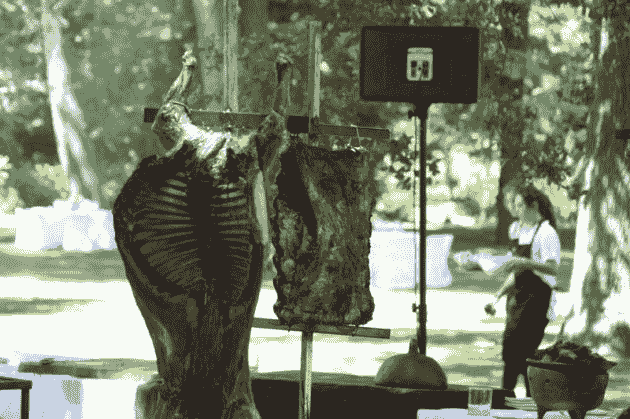

# 超过 10 亿美元的退出与“成功”之间的区别

> 原文：<https://web.archive.org/web/https://techcrunch.com/2009/12/20/the-difference-between-1-billion-plus-in-exits-and-%e2%80%9csuccess%e2%80%9d/>

早在 2008 年，当我开始研究新兴市场的创业精神时，我有很多理论，我有一个大而明显的问题:对于那些敦促我去看看他们在以色列、东欧、中国、印度、非洲部分地区甚至冰岛的公司的著名风投，几乎没有人提到最热门的新兴国家之一:巴西。事实上，硅谷只有一个人鼓励我去拉丁美洲的任何一个国家，那不是风险投资。SGN T2 公司的首席执行官谢文·皮舍瓦在布宜诺斯艾利斯拥有研发中心的核心部分。

怎么可能呢？我们地理位置更近，时区差异更小，虽然拉丁美洲很少有国家像中国甚至卢旺达那样快速增长，但巴西经济刚刚登上了《经济学人》的封面，并在《金融时报》上发表了一篇[特别报道](https://web.archive.org/web/20230401211916/http://www.ft.com/reports/invest-brazil-2009)。见鬼，今年最大的 IPO 是一家巴西公司。那么是什么呢？这不仅仅是因为进入巴西比进入哈佛更难。

硅谷以精英统治著称，四分之一的成功科技企业家是移民。但对于我这些年来在硅谷权力的各个席位上采访过的所有印度人、中国人、以色列人、伊朗人，甚至非洲人来说，有一个群体显然缺席了:拉丁美洲人。甚至皮舍瓦也不是阿根廷人，他是一个伊朗人，最近几年才爱上了阿根廷。鉴于许多早期的印度拥护者都是在硅谷发迹的印度移民，我想知道对拉丁美洲缺乏关注的部分原因是否在于硅谷缺乏引人注目的、超级成功的拉丁榜样。

在我开始写这本书后不久，我在伍德赛德偶然发现了一个这样的榜样，实际上是在我自己的后院。(我是个记者。)他的名字叫文塞斯·卡萨雷斯，在美国南部，他几乎是马克·安德森级别的名人。但是尽管他取得了巨大的成就——咳咳，以超过 10 亿美元的价格卖掉了三家公司——他在硅谷却鲜有建树。

他的第一家公司 Patagon 是拉丁美洲的网上银行。2000 年 3 月，在市场崩溃前一个月，它以 7 . 5 亿美元的价格卖给了桑坦德银行。事后，该公司最终注销了大部分价值，但卡萨雷斯在拉丁美洲和投资他的富有投资者中的声誉得到了巩固。这些投资者包括乔治·索罗斯、微软、英特尔和弗雷德·威尔逊，他最近告诉我卡萨雷斯是他支持过的最好的企业家之一。

此后，卡萨雷斯出售了另外两家公司:将 Wanako Games 出售给威望迪，将 Lemon Bank 出售给巴西银行。他不能评论价格，他们比 Patagon 小得多，但回报却好得多。他现在正在建立他的最新公司，Bling Nation，该公司已经筹集了 3300 万美元。他在 10 月份筹集了其中的 2000 万美元，因为许多初创公司都在努力筹集资金。Bling Nation 正在为实物商品建立一个移动支付系统，可以绕过昂贵的信用卡系统。卡萨雷斯正在通过小型社区银行推广这一系统。

卡萨雷斯得不到关注，部分原因是他并不渴望得到关注。在他卖掉帕塔贡的第二年，他和家人在一艘船上消失了三年。但是他不声不响地做了很多事情来鼓励拉丁美洲的企业家。他投资。他指导。他是 [Endeavor 的](https://web.archive.org/web/20230401211916/http://www.endeavor.org/)董事会成员——事实上，他是该非营利组织选出的第一批企业家之一。每年，他都会在自己智利的家中举办一场典型的 asado ,邀请一群来自拉丁美洲的企业家和一些来自硅谷的人来吃他们体重的肉和肉馅卷饼。

今年的 asado 是在几周前，由于我在智利，而且我肯定不是素食主义者(如果你是，对不起上面的美味图片)，我抓住了这个机会。我很快意识到，卡萨雷斯所说的“典型的阿萨多”指的是数百人的奢华聚会，而他所说的“房子”指的是城堡。我不是在开玩笑——卡萨雷斯实际上在智利拥有一座城堡。(图在你的左边。)作为一个精明的商人，他把房子出租给一个制作团队，在那里拍摄一部关于吸血鬼的电视剧，实际上每天能赚几千美元。

你和卡萨雷斯在一起的时间越长，你就会发现越多像这样有趣的事情。但这可能是他最有趣的一点:他认为他已经卖掉了三家公司——并在此过程中为自己和他的投资者赚了数亿美元——是一件令尴尬的事情。没错。在硅谷，每个人都沉迷于投资“连续创业者”，卡萨雷斯认为，他不能让自己的公司走得更远是一种失败的迹象。

他把那些自称只是“创业者”的流水线式企业家，比作一个 40 岁的男人，他仍然泡在迪斯科舞厅里，试图泡妞。他认为，这在某种程度上是好的，但在某种程度上，一个真正优秀的企业家会成长起来。事实上，最成功的科技公司是那些创始人一直呆在公司生活中的公司，如甲骨文、苹果、亚马逊、谷歌或惠普。

卡萨雷斯在这里并不孤单。这是许多新兴风险公司的核心投资理念，这些公司是由互联网时代的资深人士创立的，他们看到了用所谓的“成熟的首席执行官”取代创始人的负面影响。突出的例子包括彼得·泰尔的创始人基金或马克安德里森的安德里森霍洛维茨风险投资公司(T4)。

卡萨雷斯是 Endeavor 最近在巴塔哥尼亚举行的遴选小组会议的专家，我偷听了他的几次会议，听到他给出了一些直白的建议，这些建议值得任何考虑出售自己公司的人分享，无论是在拉丁美洲、美国还是世界其他任何地方。

“我不认为有人只是更擅长创业，”他说。“我觉得那是性格缺陷，我也有。我已经卖掉了我所有的公司，我希望我一个也没卖掉。不管你赚了多少钱，你都会惊讶地发现自己后来的感觉有多糟糕。我把它们卖了，因为真的很难。但很多时候，你可以做一些简单的事情来解决这个问题，而不用卖掉公司。”

这个评论会让《珠光宝气的国家》在未来几年变得更有看头。