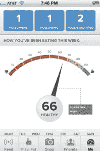

# The Eatery:一款承诺改善健康的照片应用 

> 原文：<https://web.archive.org/web/http://techcrunch.com/2011/11/01/the-eatery-a-photo-app-that-promises-to-improve-your-health/>

# The Eatery:一款承诺改善健康的照片应用

人们一直用手机拍食物的照片。但是，除了在 Instagram 和 Twitter 上获得美食点评或吹嘘你的美食之外，还有什么目的呢？[餐馆](https://web.archive.org/web/20230203092543/http://itunes.apple.com/us/app/the-eatery/id468299990?ls=1&mt=8)是一种不同类型的照片应用。它是关于你的，通过拍照让你自己意识到你在吃什么，这样你就可以改变你的行为，吃更健康的食物。

这家餐馆是来自 [Massive Health](https://web.archive.org/web/20230203092543/http://massivehealth.com/) 的第一款应用，联合创始人 Sutha Kamal's 和阿萨·拉斯金的初创公司希望[通过向人们提供关于他们对自己身体所做的事情的更好数据，让他们变得更健康。iPhone 应用程序很简单。你给你吃的所有东西拍照，并按照从“健康”到“肥胖”的等级来评定](https://web.archive.org/web/20230203092543/https://techcrunch.com/2010/12/14/aza-raskin-mozilla-massive-health/)

你与你的朋友分享这些照片，然后他们可以给它一个大拇指(合适)或一个大拇指(肥胖)。你收集的食物数据会在一个健康刻度盘上显示出来，它会记录你饮食的好坏。还有一个你的朋友在吃什么的提要，有图片和评论。

你不必去猜测每顿饭含有多少卡路里或者做其他任何事情。这个应用程序的全部意义就是让你不断地意识到你在吃什么，什么时候你在吃健康的食物，什么时候你在吃高脂肪的食物。你也可以查看你吃饭的地方，比如咖啡店和餐馆。
 
你使用这款应用的次数越多，它显示给你的数据就越多，以非常系统的方式记录你的饮食习惯。社交方面有助于保持你的诚实，游戏机制让它充满乐趣。

尽管餐馆很简单，但它要求很多用户:拍下每一顿饭和每一份小吃。“每个人都认为你在拍食物色情照片，”拉斯金指出。他想给人们足够的动力来拍摄他们正在吃的东西，以此来跟踪你的摄入量。有些人会对此念念不忘，但对许多人来说，这可能是太多了。别拍照了，吃你的东西吧！

这个数据真的能让你更健康吗？这款应用遵循这样一条格言:除非你衡量某样东西，否则你无法改变它，至少它在尝试衡量正确的东西。“这只是回答一个简单的问题，”拉斯金说，“你今天吃得比昨天好吗？”