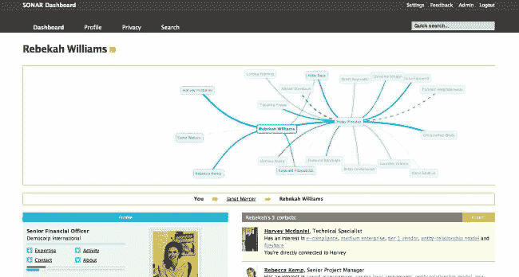

# 自动生成和可视化映射的企业社交网络 TechCrunch

> 原文：<https://web.archive.org/web/https://techcrunch.com/2008/04/24/the-enterprise-social-network-auto-generated-and-visually-mapped/>

# 自动生成和可视化映射的企业社交网络

  让社交网络在公司内部发挥作用是一项艰巨的任务。谁想更新他们的“状态”来告诉每个人他们正在做什么，或者必须手动标记东西？我们会为脸书的朋友这样做，但会为公司安装的糟糕的"知识管理"系统中的同事这样做？没有那么多。

但是空间正在升温。BEA Systems [最近推出了面向企业平台的社交网络](https://web.archive.org/web/20230203091957/http://www.bea.com/framework.jsp?CNT=pr01919.htm&FP=/content/news_events/press_releases/2008)，Oracle 的 AppsLab [正在内部开发社交网络](https://web.archive.org/web/20230203091957/http://oracleappslab.com/2007/08/07/oracle-gets-social/)。但是系统中的许多智能需要员工去做繁重的工作，这很无聊。

因此，在本周的 [Web 2 Expo](https://web.archive.org/web/20230203091957/http://en.oreilly.com/webexsf2008/public/content/home) 上，英国初创企业 [Trampoline Systems](https://web.archive.org/web/20230203091957/http://www.trampolinesystems.com/) 发布了其新的 Sonar Dashboard 工具，旨在成为“企业的脸书”。这使得员工可以创建个人资料，观看同事活动的新闻，并使用联系人列表。Dashboard 自动跟踪员工的日常工作活动，如电子邮件。他们的 Sonar 服务器产品分析隐藏在公司内部的社交图、信息流和专业知识，允许用户跨部门和地理位置找出公司中谁可以帮助他们。Sonar Dashboard 使网络可搜索，并通过一个简单的可视化工具来绘制用户的社交图，从而为合适的人提供可见性。用户可以完全控制他们分享的内容(系统会自动过滤掉明显的个人内容)，还可以让他们找出自己最关注的内容。到目前为止，我还没有见过这样的产品，可视化工具非常令人惊讶。参见 [TechCrunch UK](https://web.archive.org/web/20230203091957/http://uk.beta.techcrunch.com/2008/04/22/trampolines-dashboard-cracks-the-enterprise-social-network-nut/) 获取更长的评论。蹦床从都铎私募融资 680 万美元。

