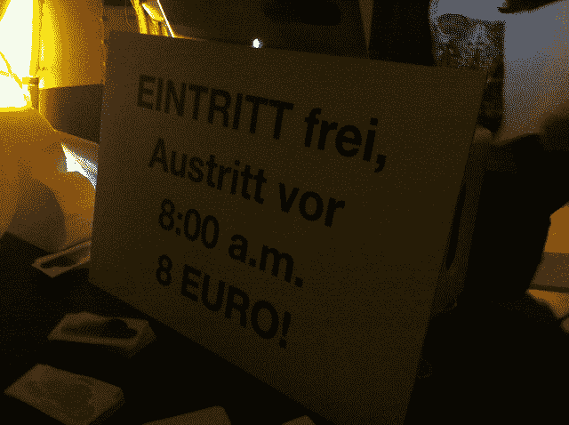
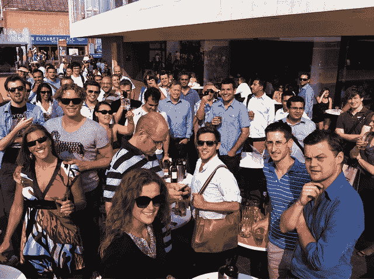

# 欧洲初创企业爱情之夏-伦敦、柏林和其他地方 

> 原文：<https://web.archive.org/web/https://techcrunch.com/2011/09/04/the-european-startup-summer-of-love-london-berlin-and-beyond/>

# 欧洲创业项目“爱的夏天”——伦敦、柏林和其他地方

2011 年夏季，伦敦:当你在伦敦一个温暖的夏夜，在一个停车场里聚集了 1500 名创业者时，你就知道有事发生了。当你在柏林的一个联合创业派对上告诉 800 个人，如果他们在早上 8 点前离开派对*，他们将不得不付钱，你就知道有事发生了。*

伦敦和柏林也是如此。其他欧洲中心——巴黎、哥本哈根、巴塞罗那、贝尔格莱德等——显然正在形成自己的创业集群。但现在，伦敦和柏林正成为欧洲科技领域的天然重心。当一位风投对你说——就像他们前几天对我说的那样，“我整天都在伦敦和柏林之间的飞机上度过”——你就会意识到，事情真的发生了。这是欧洲目前的“纽约-旧金山红眼”(没有红眼)。

原因显而易见。伦敦非常国际化，是欧洲最大的金融中心，也是硅谷游客的天然登陆点。它在东伦敦也有自己的自然创业集群，或称[硅环岛](https://web.archive.org/web/20230205042015/http://eu.beta.techcrunch.com/2011/03/28/londons-tech-startup-investors-start-taking-offices-in-silicon-roundabout/)(我们已经在这里的一系列[电影中记录了这一点](https://web.archive.org/web/20230205042015/http://eu.beta.techcrunch.com/tag/roundabout/))。

与此同时，柏林的生活和工作成本低廉，对吸引欧洲各地的人才有着天然的吸引力(尤其是拥有丰富工程人才库的中欧和东欧)，而且科技创始人的国际视野越来越广。它也正在摆脱作为克隆工厂的枷锁，最近一场“[反山寨革命](https://web.archive.org/web/20230205042015/http://www.6wunderkinder.com/blog/2011/08/09/founders-stand-up-the-anti-copycat-revolution-starts-now/)”的宣言就是明证。

因此，本周上周四晚上，一年一度的 [Moo](https://web.archive.org/web/20230205042015/http://moo.com/) 派对——伦敦一年一度的固定节目——吸引了 1500 人来到伦敦，而就在三周前 [SoundCloud](https://web.archive.org/web/20230205042015/http://soundcloud.com/) 和 [EyeEm](https://web.archive.org/web/20230205042015/http://eyeem.com/) 还吸引了 800 人参加他们的派对。

让我们不要忘记我们自己的 [TechCrunch 欧洲夏季新闻发布会](https://web.archive.org/web/20230205042015/http://www.flickr.com/photos/mbites/sets/72157627229468535/)。

今年九月将会有新的活动，比如科隆的[高级会议](https://web.archive.org/web/20230205042015/http://www.advance-conference.com/)和[海盗峰会](https://web.archive.org/web/20230205042015/http://www.thepiratesummit.com/)，中欧的[如何建立网络](https://web.archive.org/web/20230205042015/http://how-to-web.net/)…下周是伦敦的 [Seedcamp](https://web.archive.org/web/20230205042015/http://seedcamp.com/) 周，维也纳的 [StartupWeek](https://web.archive.org/web/20230205042015/http://www.startupweek2011.com/) ，都柏林的[DWS](https://web.archive.org/web/20230205042015/http://www.dublinwebsummit.com/)/f . founders 秋季，巴黎的[Le Web](https://web.archive.org/web/20230205042015/http://leweb.net/)…不胜枚举。想要走向世界的创新型欧洲创业公司正以前所未有的方式蓬勃发展，他们拥有展示自己的平台。

如果欧洲创业公司的历史上有一个 [1967 年的爱情之夏](https://web.archive.org/web/20230205042015/http://en.wikipedia.org/wiki/Summer_of_love)，那就是 2011 年夏天。你当时在场吗？

欢迎加入革命。

**柏林，2011 年夏天**

