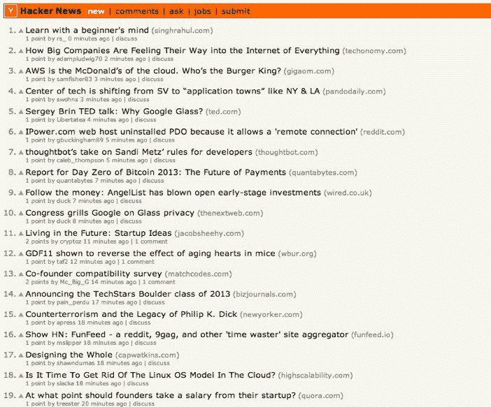

# 黑客新闻的演变|技术危机

> 原文：<https://web.archive.org/web/https://techcrunch.com/2013/05/18/the-evolution-of-hacker-news/>

2007 年，风险投资拥有自己的新闻聚合器的想法有点古怪。但无论如何，Y Combinator 在那些日子里处于一个不同寻常的位置。初创企业孵化器是互联网崩溃中一个非常明显的部分，近十年后，硅谷仍对这个概念持怀疑态度。所以 YC 开始变得不同——一群黑客按照自己的方式建立公司。

黑客新闻最初是由 YC 的联合创始人保罗·格拉厄姆创建的，作为他一直在研究的一种新编程语言 Arc 的演示。他很快意识到，这可以帮助他所支持的公司和其他想加入的人走到一起。在一个特定的工作日，有 160 万的页面浏览量和 20 万的独特访客，这是这家风险投资公司成功的关键因素。

但该网站很快就起飞了，因为前红色编辑蜂拥而至谈论科技和初创公司(该网站当时被称为“创业新闻”)。

**退伍军人社区**

正如格雷厄姆所解释的，当网站开始立即看到牵引力时，他意识到这不仅仅是测试 Arc 的一种方式。他想让黑客新闻成为一个地方，重现红迪在过去的美好时光里的感受，那时红迪的大部分社区都是由黑客组成的。随着红迪吸引更多的流量，该网站的黑客焦点发生了变化。随着社区的发展，它的用户群逐渐被稀释，黑客新闻成为一些早期红迪黑客的新家。

格雷厄姆在 2007 年 2 月写道:

> 红迪曾经有很多与创业相关的链接，但那是因为很多红迪的初始用户都以某种方式与 Y Combinator 联系在一起。现在，红迪网更受欢迎了，最热门的链接往往是图片、视频或政治新闻。

格雷厄姆说，黑客新闻的另一个目标是成为创始人分享想法和交流的地方。本着 Y Combinator 自己孵化器的精神，Hacker News 专注于成为一个面向科技社区企业家和创始人的社区:一个他们可以自由发表文章的地方，也是 Y Combinator 可以认识科技界潜在创始人和领导者的地方。

格雷厄姆解释道:“从一开始，我们就有一个真正的社区，一些来自红迪网的核心难民群体在今天的黑客新闻中仍然很突出。”。黑客新闻吸引许多人的部分原因是它的简单和投票系统。该产品的用户界面、设计和配色方案在过去六年里保持相对稳定。

该网站的首批用户之一托马斯·普塔切克(Thomas Ptacek)解释说，他是 Slashdot 用户，后来又是 Reddit 用户，他蜂拥至黑客新闻网站(当时为 Startup News)，因为该网站与科技和创业社区更为相关。他发现黑客新闻与过去评论质量下降的论坛相比是一个令人耳目一新的变化。

黑客新闻是这样运作的:用户提交故事的链接，故事根据投票系统进行排名，类似于 Reddit。然而，黑客新闻和 Reddit 的区别在于投票系统。虽然你可以投票支持故事，但是你不能投票反对故事(但是你可以标记故事)。根据 Graham 的说法，100 次投票将使一个故事出现在网站首页的顶部。如果你在网站上有足够的“因果报应”，你只能否决一条评论，这是黑客新闻的另一个引人注目的因素。因果系数由用户提交和评论的投票数减去投票数决定。

就设计而言，Graham 说他希望黑客新闻看起来像终端窗口中的进程列表。该网站的外观和感觉是针对熟悉表格数据的黑客本身的。

Graham 偶尔会添加新功能，其中一些功能在网站的后端。例如，随着评论在交流方面越来越深入和激烈，回复链接需要更长时间才能出现。格雷厄姆说，这是有目的的拖延，因为深度嵌套的讨论很少有趣。

另一个微妙的功能增加:火焰战争探测器。格雷厄姆一直在不断部署和更新专有软件，以确定是否存在人们激烈争论的火焰战争。当这些激烈的争论发生时(格雷厄姆说，这往往会变得丑陋和个人化)，评论发生的故事在页面上移动得更远。

格雷厄姆还开发了复杂的垃圾邮件检测软件，六个月前刚刚用新代码更新。格雷厄姆说，随着更新，垃圾邮件在网站上停留超过 10 分钟的情况非常罕见。如果用户向网站发送垃圾邮件或进行个人恶意行为，他们就有被禁止的风险。但是在一个有趣的转折中，叫做“地狱禁令”，用户可能实际上并不知道他们被禁止了。

在后端，黑客新闻运行在一个核心上，格雷厄姆称这是“非凡的扩展壮举”

就人类的适度性而言，格雷厄姆本人每天花 3 到 4 个小时只是为了调节网站。这是除了他的所有职责运行 Y Combinator。虽然其他一些 YC 校友也有调节能力，但格雷厄姆一直是该网站的主要人文因素。“它正在成为我的生活，”他说。大约六个月前，格雷厄姆请了另一个人来管理这个网站，但他选择不指名道姓。他说，这个人隶属于 Y Combinator，是一个“谨慎和深思熟虑的人”，从那以后一直做得很好。

黑客新闻也与 Y Combinator 有着密切的联系。格雷厄姆解释说，创始人通常在申请时都会创建一个黑客新闻账户，用户名是 Y Combinator 创始人的身份。黑客新闻还提供了一个就业页面，显示 Y Combinator 公司的任何职位。他补充道，这个就业门户对 Y Combinator 非常有用，因为该网站的大多数受众都是程序员和工程师。

如果您是 YC 创始人，您的用户名将以橙色显示给其他 YC 创始人，以便这些企业家能够相互识别和认识。

格雷厄姆说，黑客新闻收到了很多抱怨，说它偏向于报道 Y Combinator 初创公司的故事，但他说没有这种偏向。相反，孵化器的文化是使用黑客新闻。有 1000 多名 YC 校友从孵化器毕业，其中许多创始人仍然活跃在新闻网站上，并发布他们创始人同伴发布会和新闻的链接。

“那是一个小小的知识村，现在却是一座巨大的城市。”

增长也有其负面影响。让格雷厄姆彻夜难眠的是对《黑客新闻》质量下降的担忧。他解释道，该网站是黑客世界的内部人士社区，它已经[逐渐被](https://web.archive.org/web/20230316000510/http://www.paulgraham.com/hackernews.html)稀释。“这就是我花所有时间思考的事情，”他说。

他担心黑客新闻会变成他所说的“一座摇摇欲坠的老房子”

“这个社区一直在持续但缓慢地衰落，因为这个网站正在成长，”他说。

普塔切克同意黑客新闻的价值已经有所改变。“我没有获得太多的社区感觉，而在开始时，这是一小群人都互相认识，”他说。"现在不太可能从一个线程到另一个线程看到相同的人."

格雷厄姆最大的痛点之一是他每天在网站上发现的“校园争吵”，并希望“用户停止不当行为。”他举了一个例子，用户组织投票圈，有目的地为故事投票，这导致格雷厄姆开发了额外的软件来检测这一点。他补充说，越来越多的用户在新创建的账户下钓鱼，并故意在网站上发起火拼。

“我希望我能让人们停止发布愚蠢或刻薄的评论，”他说。"只要一两条负面评论，一场讨论就会变成一场激烈的战争."

格雷厄姆补充说，他收到了很多来自用户个人的尖酸刻薄的指责，指责他有偏见或审查。他澄清说，他和其他人类编辑很少关闭链接，除非他们被骗了。即使有小报或八卦新闻浮出水面，格雷厄姆也不会把它们记下来。他补充道，拥有高因缘点数的用户倾向于标记这些故事，然后它们可以被删除。

“黑客新闻让我很难过，”格雷厄姆说。"我希望这个社区能像它还是个小村庄时那样行事。"

用户注意到了格雷厄姆的挫折。普塔切克说，他观察到格雷厄姆小心翼翼地不告诉人们该说什么或想什么，但很明显，他希望人们更好地对待彼此，随着时间的推移，他变得更加悲伤。

这能成为一笔生意吗？

虽然格雷厄姆公开表示不想成为下一个 Reddit，但很难忽视黑客新闻可能是一门生意的事实。据报道，Reddit 正在以 4 亿美元的估值筹集现金[。虽然 Hacker News 的流量只有 Reddit 的一小部分，但作为一家没有任何资金或员工的企业，这个较小的网站实际上可能有令人印象深刻的估值。](https://web.archive.org/web/20230316000510/https://techcrunch.com/2013/01/06/reddit-rumored-to-be-raising-money-at-a-400-million-valuation/)

格雷厄姆本人将该网站作为他的主要新闻来源。他甚至通过黑客新闻找到了 Y Combinator 公司。该社区的一名用户发布了 Watsi 的链接，Watsi 是一家非营利组织，允许急需医疗保健的人筹集手术和医疗保健资金。他第二次注意到 Watsi 是在 Hacker News 上发布的，并认为这是一个惊人的想法。他给创始人打电话，说服他们成为第一个 YC 支持的非营利组织。Graham 最近在 Watsi[获得了第一个董事会席位，这是他有史以来的第一个董事会席位。](https://web.archive.org/web/20230316000510/https://techcrunch.com/2013/04/19/paul-graham-watsi/)

但是格雷厄姆坚持认为，黑客新闻不是一门生意，也不会成为一门生意。网站上没有广告，他也没有兴趣通过广告赚钱。他承认，通过招聘页面，他间接赚了钱，因为他是 Y Combinator 公司的投资者，如果公司的招聘有助于业务，他必然会获利。他也不会对出售网站感兴趣。

虽然很明显 Graham 对这个社区感到失望，但当他谈到这个网站的决定性时刻时，他听起来像是在谈论自己的孩子。他对该网站最清晰的记忆之一是史蒂夫·乔布斯去世后的第二天，当时首页上的所有故事都是关于这位苹果创始人的。

“用户集体这么做是为了表达敬意，我发现这是一种展示社区力量的非凡方式。我以为这真的是一个活生生的东西。这就像一群鸟在天空中飞行，形成一个 s 形。”

“有很好的理由参与黑客新闻，”普塔切克说。“没有什么地方比留言板更适合与黑客社区保持联系了……。拥有一个可以接触到人群并与之交谈的地方是一个重要的概念。”

至于黑客新闻的未来，很明显，格雷厄姆专注于保持质量，并确保社区以尊重和善意对待彼此。“我希望大多数黑客新闻的读者知道我这样做是为了他们，”他说。