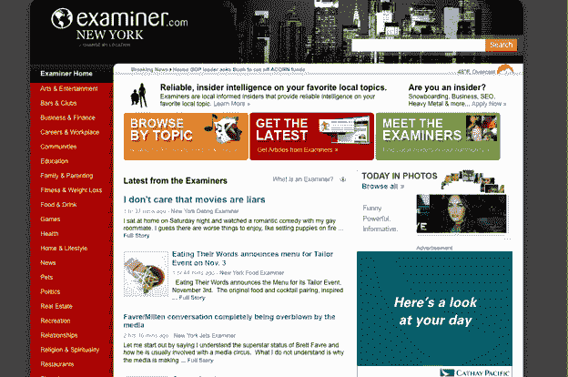

# Examiner.com 现在希望成为公民新闻的堡垒 

> 原文：<https://web.archive.org/web/https://techcrunch.com/2008/10/22/the-examinercom-now-wants-to-become-a-bastion-of-citizen-journalism/>

Examiner.com T2 并不像它看起来那样。它不是亿万富翁 Philip Anschutz 拥有的*审查员*报纸(旧金山审查员、*巴尔的摩审查员*和*华盛顿特区审查员*)的在线渠道。然而，它属于拥有这些报纸的安舒茨支持的同一家公司，丹佛的 Clarity Media Group。它就是这样得到网址的。

但是 Examiner.com 不需要职业记者。相反，这是纯粹公民新闻的一次实验。现在，考官网站已经在五个城市正式推出测试版——旧金山、芝加哥、巴尔的摩、丹佛和西雅图。尽管纽约等其他城市也在崛起。根据 comScore 的数据，这些网站已经在没有任何推广的情况下上线了几个月，在美国每个月已经吸引了 130 万访问者(比 7 月份增加了近一倍)。首席执行官迈克尔·谢罗德说内部数据显示每月有 300 万个 uniques。

每个网站都提供由被称为“审查员”的投稿人撰写的超本地新闻。谢罗德曾为美国在线管理全球社区，并在 20 世纪 90 年代中期为数字城市工作，他已经招募了 800 名审查员，并希望在今年年底达到 1000 名。这些考官可能有自己的博客，但考官为他们提供了一个更大的平台，让他们的声音被听到。然而，重点不是写他们自己，而是写他们的社区正在发生的事情。

“我们不寻找内向的人，”谢罗德说。相反，他想要的是在各自领域都是专家的人，无论是房地产、餐饮、育儿、体育、科技还是商业。

这些作者是根据他们的文章能产生多少浏览量和广告点击量来审查和支付的。报酬不是很多。每 1000 次浏览量起价 2.5 澳元。尽管谢罗德开出了一张高达 1700 美元的支票，但每位考官目前的月收入中位数是 25 美元。安舒兹正在筹划整个项目。他是唯一的投资者(金额没有透露)。

这种方式让我想起了氦对一般参考话题所做的事情，但它关注的是本地新闻。理论上讲，是有道理的。报纸不像过去那样有足够的人员报道当地新闻，可以说，最关心某个特定社区发生的事情的人是住在那里的人。那么为什么不让他们告诉其他人发生了什么呢？

实际上，我不能说我已经浏览过的任何一篇文章会让我回来看更多。写作并不可怕，但它是业余的方式并不可爱。也许这是因为该网站被设计成看起来像一个权威的新闻网站。最后你会读到一篇文章，如果是在一个单独的博客上的话，它永远不会被链接到。(我不会用链接来挑剔任何一个作者，但你可以查看网站，自己判断)。也许一旦它正式推出，它将吸引更多的观众和更好的审查员，并在当地新闻中引起轰动。

