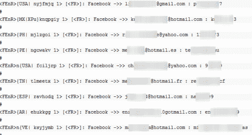

# 不是脸书黑客吗？脸书称 1 万个被黑账户不是我们的 TechCrunch

> 原文：<https://web.archive.org/web/http://techcrunch.com/2011/10/19/the-facebook-hack-that-wasnt-facebook-says-the-10000-hacked-accounts-arent-ours/>

# 不是脸书黑客吗？脸书说这 10，000 个被黑的账户不是我们的

一个自称“ [Team 纳粹党所用的十字记号](https://web.archive.org/web/20230203164531/https://twitter.com/TeamSwastika/)”的黑客组织向 [Pastebin](https://web.archive.org/web/20230203164531/http://pastebin.com/u/TeamSwastika) 发布了他们声称的超过 10，000 个脸书账户，Pastebin 是一种在线剪贴板服务。然而，根据脸书公关公司的声明，这些电子邮件和密码组合实际上并不代表真实的脸书账户。相反，黑客似乎是使用常见的网络钓鱼技术获得了这些账户，用户被诱骗泄露了他们的个人信息。

趋势科技的 [Rik Ferguson](https://web.archive.org/web/20230203164531/http://countermeasures.trendmicro.eu/over-10000-facebook-account-details-hacked-and-published/) 首先发现了这一进展，他指出，这个黑客组织之前曾通过[发布来自印度驻尼泊尔大使馆和不丹政府网站的](https://web.archive.org/web/20230203164531/http://pastebin.com/u/TeamSwastika)数据库表和用户凭证来引起人们的注意。

他能够在脸书账户被删除前查看这些账户，发现这些账户来自世界各地，而且大多数用户没有使用复杂的密码。许多密码只是用户名、喜爱的运动队或短数字密码的派生。

弗格森说，没有迹象表明这些账户数据是如何被盗的。

脸书说:

> 这并不代表脸书或任何人的脸书个人资料遭到黑客攻击。我们的安全专家审查了这些数据，发现这是一组电子邮件和密码组合，与任何脸书帐户都没有关联。
> 
> 事实上，这些电子邮件/密码是标准的网络钓鱼活动的结果，人们被诱骗给出他们的凭证。

尽管这些账户可能不是真正的脸书登录账户，但假设它们确实是合法的电子邮件/密码组合，它们可能代表了许多其他服务。由于用户经常在网上重复使用相同的密码，登录可能会打开对其他帐户的访问，而这些帐户不是网络钓鱼计划的目标。好消息是它们已经从 Pastebin 上撤下来了。

***更新**:费格森现在有了关于被入侵账户的新信息。他说黑客组织公布的两份名单之前已经在网上看到过。一份名单已经存在大半年了，而第二份名单可能实际上是另一个黑客组织的作品，是在 19 天前发布的。更多细节在这里。*

*图片:[对策](https://web.archive.org/web/20230203164531/http://countermeasures.trendmicro.eu/over-10000-facebook-account-details-hacked-and-published/)*