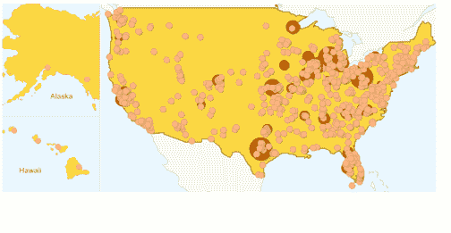

# 最终统计:超过 1100 个城市申请谷歌的光纤网络

> 原文：<https://web.archive.org/web/https://techcrunch.com/2010/03/27/the-final-tally-more-than-1100-cities-apply-for-googles-fiber-network/>

# 最终统计:超过 1100 个城市申请谷歌的光纤网络

昨天，谷歌产品经理詹姆斯·凯利[发布了一篇博客文章](https://web.archive.org/web/20230311034612/https://techcrunch.com/2010/03/26/google-receives-more-than-600-community-requests-for-broadband-network/)称 600 个社区申请成为搜索巨头[实验光纤网络的试验品。](https://web.archive.org/web/20230311034612/https://techcrunch.com/2010/02/10/google-fiber-optic-network-home/)190，000 个人写信支持他们的社区被选中。但是这个帖子是在截止日期前 5 个小时写的，所以预计在周五结束前会有更多的城市申请被选中。昨天晚上，Kelly [更新了帖子](https://web.archive.org/web/20230311034612/http://googleblog.blogspot.com/2010/03/next-steps-for-our-experimental-fiber.html)的最终统计结果:1100 个社区提交了申请，194，000 个人张贴了支持他们社区的信件。

谷歌还发布了一张地图，显示了申请和支持信的位置。每个小点代表政府的回应，每个大点代表超过 1000 名居民提交提名的地点。申请似乎集中在东西海岸，美国中部的一些地区明显缺乏参与。

我们[写了](https://web.archive.org/web/20230311034612/https://techcrunch.com/2010/03/25/what-lengths-will-cities-go-to-be-googles-broadband-guinea-pig/)许多城市和城镇为了引起谷歌的注意，希望这个搜索巨头会选择他们的社区作为光纤网络。所选城市的宽带网络将完全免费(只有使用服务的消费者需要付费)，1Gb/秒的光纤速度将比大多数美国人今天获得的互联网速度快 100 倍左右。谷歌的计划是让这个实验覆盖 50，000 到 500，000 人。

就申请流程而言，谷歌要求感兴趣的市政当局填写一份信息请求书，以帮助确定该实验的最佳社区。谷歌估计，每个城市的表格/请求需要大约 4 个小时才能完成。个人和市民也可以提交支持城市的信件。谷歌表示，下一步是审查所有的城市申请和个人支持函，进行实地考察，咨询第三方组织，并与感兴趣的城市的当地官员沟通。最终的城市/城镇预计将在年底宣布。

谷歌的宽带计划旨在补充美国政府的十年宽带计划，该计划的目标之一是补贴农村地区的宽带连接，并为美国的每个社区带来 1 千兆连接。但政府的战略有一些[缺陷](https://web.archive.org/web/20230311034612/https://techcrunch.com/2010/03/21/google-national-broadband-plan/)，即这些计划不够雄心勃勃。例如，在新的计划下，大约 85%的家庭在供应商方面没有选择，由于缺乏竞争，可能会将用户锁定在更高的价格上。

因此，最终，谷歌代表了一盏小小的希望之灯，因为它可以为其他社区或宽带提供商提供一个具体的榜样。虽然谷歌的最初计划涉及一个非常非常小规模的光纤网络，但如果一切顺利，谷歌最终可能会在全国范围内扩展该项目。