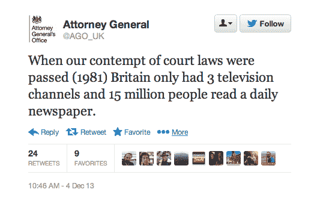

# 英国社交媒体用户从高层获得避免藐视法庭的法律建议 

> 原文：<https://web.archive.org/web/https://techcrunch.com/2013/12/04/the-fine-blue-line/>

我们现在都是出版商，多亏了社交媒体和 Twitter 这样的数字广播网络，我们闲散的沉思可以接触到大量的全球观众，比在众所周知的厕所门上涂鸦更能吸引眼球。

但社交媒体的即时性显然让一些用户很容易忘记他们的观点可以传播多远——导致一小部分人因为他们在网上发布的东西而陷入法律困境。或者从当权派的角度来看，通过可能妨碍起诉来威胁司法程序。

英国政府的首席法律顾问、司法部长多米尼克·格里夫(Dominic Grieve)的职责包括努力确保公平审判的进行，他决定是时候向推特和脸书用户提供免费的法律咨询了(他称之为“[咨询](https://web.archive.org/web/20221202073153/https://www.gov.uk/government/news/attorney-general-to-warn-facebook-and-twitter-users-about-contempt-of-court)”)，以帮助教育他们使用“大众传播工具”的责任。

从今天起，Grieve 将发布法庭咨询记录，这些记录以前只提供给主流媒体。这些笔记将发布在 [gov.uk](https://web.archive.org/web/20221202073153/https://www.gov.uk/) 网站上，并通过司法部长办公室的 Twitter feed[@ AGO _ UK](https://web.archive.org/web/20221202073153/https://twitter.com/AGO_UK)(目前 Twitter 关注者不到 4000 人)发布。

“我希望我们能够用简单的语言和术语来表达，”格里夫在接受独立报的视频采访中讨论公共建议时说。“我们很可能会在 Twitter 上发布与平面媒体略有不同的通知，例如，我们有时会私下说一些事情。这将是一份公开文件，但我认为它会有教育价值 。”

“人们会意识到这是一个问题。如果他们开始认为有大量关于某个特定案件的评论，他们也可以把它作为一个参考点。“我们现在有了一个非凡的大众传播工具，这是一件了不起的事情。但我认为，孩子们尤其需要在学校得到提醒，他们有责任。”

除了努力确保社交媒体用户不践踏法院进行公平审判的能力，Grieve 还指出，指导方针旨在帮助人们避免说出本身可能是刑事犯罪的事情。

例如，就在上周，一名男子无视法庭指示，张贴据称是乔恩·维纳布尔斯的照片，他在 1993 年谋杀了蹒跚学步的詹姆斯·巴尔杰，当时他自己也是一个孩子，被判 14 个月缓刑。

另一个最近的例子是歌手鲍勃·盖尔多夫的女儿皮驰斯·盖尔多夫，她因在推特上发布两名母亲的名字而道歉，这两名母亲的孩子被威尔士摇滚歌手伊恩·沃特金斯虐待。

当然，使用社交媒体公开讨论他人也有诽谤的风险——例如，10 月份，下议院议长的妻子莎莉·伯科同意向麦卡尔平勋爵支付 15000 英镑的赔偿金。

“我认为需要在这方面进行一些教育，因为你对另外两个人说的话和你对成千上万人说的话将会得到不同的评价，”Grieve 补充道。

尽管这是英国的一个历史性举措——将藐视法庭咨询扩大到任何和所有社交媒体用户——但格里弗继续强调，Twitterers 等人给刑事司法系统带来的问题不是一个大问题。

“我不想夸大问题。这个国家的绝大多数刑事案件——大约有 18，000 起刑事法庭审判——都没有遇到任何困难。造成困难的是极少数人。通常，那些吸引大量公众注意力的问题——也是我想尝试解决的问题。因为如果我能减少它…在我们的经历中，大多数发错微博的人会回来说‘我不知道我做错了什么’。

“所以我认为，我们首先需要提醒他们，并试图让他们理解这个问题的重要性。”

让那些“先发推特，后思考”的人有先见之明，在发泄对某某案件的不满之前，检查司法部长的推特信息，并解析其对法庭建议的蔑视，可能会证明是相当具有挑战性的。但是，随着时间的推移，将更多关于如何避免越过法律界限的信息放入公共领域，将允许这些信息通过最初可能造成麻烦的网络传播——至少让它有机会过滤到更多社交媒体用户的泡沫中。

司法部长此举旨在更新远远落后于社交媒体大众化的法律。但它自己的数据也表明，通过社交媒体分享的信息正在影响主流媒体发布更多信息。司法部长表示，今年到目前为止，他已经发布了 10 份媒体公告，这是 AGO 发布的最多的公告，平均每年发布 5 份。