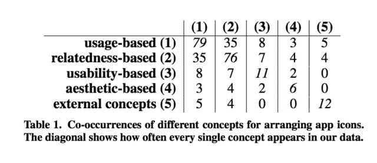

# 用户组织应用的五种方式以及应用设计者可以从 TechCrunch 中学到什么

> 原文：<https://web.archive.org/web/https://techcrunch.com/2013/02/10/the-five-ways-users-organize-their-apps-and-what-app-designers-can-learn-from-this/>

德国研究人员的一份新报告揭示了人们在智能手机上组织应用程序的五种主要方式。尽管像这样的研究有点深奥，但由此产生的分析对我们的数字生活有着更广泛的影响。移动应用商店中的内容正以指数速度增长。iOS 上有超过 80 万个应用程序，仅次于 Android，应用程序下载量[接近歌曲下载量的两倍。*歌曲！*](https://web.archive.org/web/20221004201122/https://beta.techcrunch.com/2013/02/06/charting-the-itunes-stores-path-to-25-billion-songs-sold-40-billion-apps-downloaded-and-beyond/)

然而，即使我们即将进入一个即将拥有超过 100 万个应用程序的世界，发现应用程序、将其下载到我们的设备并在设备上管理它们的方法仍然是桌面时代的遗留物。请注意，桌面时代已经结束了。根据跟踪个人电脑市场份额的主要分析公司的最新数据，如果你开始把平板电脑算作电脑——有些确实如此——那么台式机时代就结束了。目前，苹果正在赢得这场战斗，如果你想把 iPad 称为个人电脑的话，它已经成为领先的“个人电脑”制造商。这就是“后 PC”的样子。

智能手机也是个人电脑——它们只是小东西。这使得管理我们主屏幕和应用托盘上的应用变得更加重要。我们再也没有空间扩展了。我们无法在一个屏幕上安装这么多应用程序。我们必须理解不同的收藏，不相关的物品——地图、游戏、社交工具和通讯工具——并排摆放在一起。

因为我发现这种向移动的转变很有趣——并且因为我现在意外下载了超过 600 个移动应用程序(是的，其中许多是出于“测试”目的)——我对这项新研究[很感兴趣](https://web.archive.org/web/20221004201122/http://matthiasboehmer.de/2013/01/study-on-icon-arrangement/)，它揭示了用户在智能手机上排列应用程序的许多方式。

来自德国人工智能研究中心的研究人员 Mattias Bö hmer 和 Antonio Krüger 将于 2013 年 5 月在巴黎举行的 ACM SIGCHI 计算系统中人的因素会议上展示他们的发现。两人分析了 130 多名用户在 iPhone 和 Android 设备上的 1400 多个屏幕，并要求研究参与者回答一系列与他们的行为有关的问题。

从收集的数据中，该团队发现，人们已经采用了五个高级概念来组织他们手机上的应用程序。它们是:

*   *基于使用的图标排列*:该组根据应用的使用频率来组织应用图标。
*   *基于关联性的图标排列:*这个小组(顺便说一句，我发现自己也在其中)根据功能将应用程序组织成集群。例如，如果你有一个照片应用程序屏幕，这将是你。
*   *基于可用性的图标排列:*有些人组织他们的应用程序，这样他们就可以用拇指找到他们最需要的，而不必过多滑动或意外点击其他图标。
*   *基于审美的图标排列:*这些人以自己喜欢的方式组织图标。例如，他们可能会保持第一个屏幕稀疏，以便看到他们女朋友的背景图像，或者他们按照颜色或图案组织图标。
*   *图标排列的外部概念*:其他人报告使用外力强加给他们的系统。例如，它们的图标按照下载的顺序排列，或者它们保持硬件制造商建议的默认排列模式。一个用户按字母顺序组织他的图标。

当然，正如下面的图表所示，这五个概念并不相互排斥。

但是你可以看到，最流行的组织方式包括使用和关联。常见的重叠涉及三个概念区域——最常用的应用程序在第一个屏幕上，相关应用程序的文件夹在后面的屏幕上，很少使用的应用程序在最后一个屏幕上。

对于应用程序发行商来说，这种数据很重要，因为它关系到应用程序在下载后被打开和使用的几率，或者用开发者的话说，是重复使用和参与的几率。一些用户告诉研究人员，他们将应用程序屏幕的最后一页留给了“愚蠢的应用程序”，或者那些他们“有一天”可能会使用的应用程序他们还把任何不适合他们偏好的组织系统的应用推到最后一个屏幕上。

有人称这部分为“不适合应用的土地”如果你有这样的屏幕，请举手。我们很多人都这样。

这一点很重要，因为这可能意味着真正独特的应用程序可能会被隐藏起来并被遗忘，因为它们不符合我们心目中关于应用程序应该如何组织的结构。从个人经验来看，我知道包含在一个经常使用的文件夹中意味着我有更大的机会再次打开那个应用程序(例如“照片编辑”)

这项研究还检查了一些 iPhone 特有的结果，发现那些按用途组织应用程序的人往往比其他人在手机的第一个屏幕上有更多的应用程序。与此同时，那些根据关联性组织的人更有可能在他们的第一页放上文件夹。这些人也更频繁地排列他们的应用程序。那些使用外部概念的人根本不太可能使用文件夹。文件夹通常用于对相关应用程序进行分组，或者用于对共享类似工作流程的应用程序进行分组，如购物应用程序和支付应用程序，或者带有相机应用程序的照片编辑应用程序。

就特定于 Android 的发现而言，数据更加有限。这可能是因为，在某种程度上，Android 的操作系统设计更多的是建立功能界面，而不是组织应用程序的页面，其中一些包括以小部件形式存在的实时数据，如天气、股票、社交更新、新闻等。然而，该报告确实研究了应用程序和微件的位置，发现 Android 用户倾向于将微件放在屏幕顶部，图标放在下方，可能是为了方便访问。

这项研究告诉应用程序设计者和开发者，了解你的应用程序周围有哪些其他类型的应用程序是很重要的，因为它可以反映用户的需求。例如，如果用户将你的照片编辑应用程序放在 Instagram 或脸书旁边，也许你应该在你的应用程序中添加“分享”功能。(当然，这是一个基本的例子——大多数照片编辑应用程序都内置了分享功能。)

这种研究似乎更适用于非游戏应用，因为这些应用往往遵循不同的使用模式。游戏通常被用户视为一次性应用。

今天的应用程序制造商已经在研究他们自己的应用程序的参与度指标，并希望通过推送通知和其他提醒来最大化重复使用。但是，通过更多地了解他们的应用程序如何在用户的主屏幕上运行，它们周围是什么样的环境，以及它们在用户工作流程中的位置，他们可以通过成为更成熟的例行程序的一部分来增加参与度。